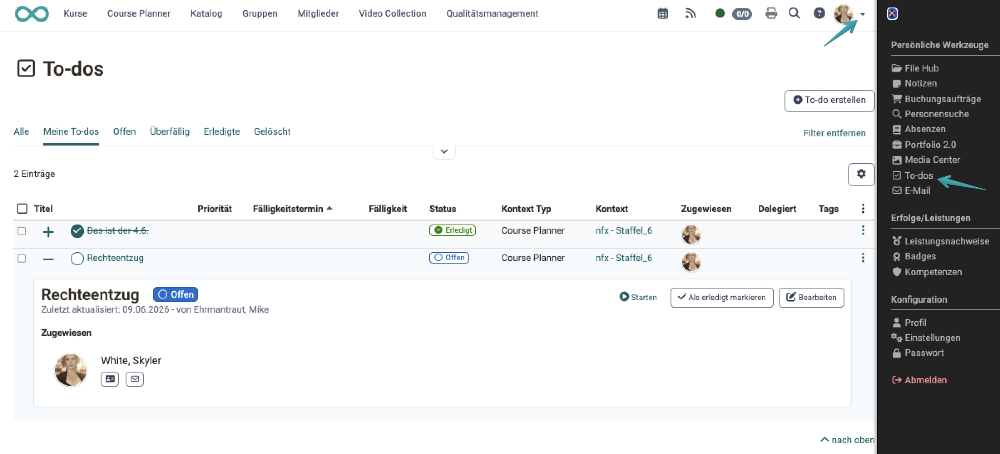

# To-dos: Grundlagen {: #to_dos_basics}

Ein To-do ist eine Aufgabe mit einer verantwortlichen Person und einem Termin. OpenOlat führt To-dos in mehreren Modulen, überall mit denselben Feldern und demselben Statusmodell. Diese Seite beschreibt, was für alle To-dos gilt. Wie Sie in einem Modul damit arbeiten, steht auf der Seite des Moduls.

{ class="shadow lightbox" title="Persönliche To-do-Liste" }

## Wo gibt es To-dos?

Aufgaben werden dort erfasst, wo sie anfallen. Im persönlichen Menü laufen sie zusammen.

| Ort | Was dort erfasst wird |
|---|---|
| [Persönliches Menü](../personal_menu/To-Dos.de.md) | Alle Ihre To-dos aus allen Modulen in einer Liste, dazu eigene To-dos ohne Modulbezug |
| [Projekt](../area_modules/Project_Todos.de.md) | Aufgaben innerhalb eines Projekts, verknüpfbar mit Dateien, Terminen und Entscheidungen |
| [Kurs](../learningresources/Course_todos.de.md) | Aufgaben zum Kurs, erstellt unter `Kurs > Administration > To-dos` |
| [Kursbaustein Aufgabe](../learningresources/Course_Element_Task.de.md) | To-dos, die der Kursbaustein automatisch zuweist. Sie dienen der Information und lassen sich nicht bearbeiten oder löschen |
| [Course Planner](../area_modules/Course_Planner_Todos.de.md) [:octicons-tag-16:{ title="ab Release 21.0 (OO-9417)" }](https://track.frentix.com/issue/OO-9417){:target="_blank"} | Aufgaben auf jedem Element eines Produkts, dazu eine zentrale Übersicht über alle Produkte |
| [Qualitätsmanagement](../area_modules/Quality_Management_To-dos.de.md) | Massnahmen, die aus einer Datenerhebung hervorgehen |

## Die Felder eines To-dos [:octicons-tag-16:{ title="ab Release 18.0 (OO-6852)" }](https://track.frentix.com/issue/OO-6852){:target="_blank"} {: #to_do_fields}

Wer ein To-do anlegt, findet in jedem Modul dieselben Felder vor. Zwei Angaben gibt es nur in einem Modul.

| Feld | Bedeutung | Verfügbar |
|---|---|---|
| Titel | Bezeichnet die Aufgabe. Vergeben Sie einen selbsterklärenden Titel | überall, Pflichtfeld |
| Zugewiesen | Die Person, die für die Erledigung verantwortlich ist | überall, Pflichtfeld ausser im Course Planner; bei persönlichen To-dos nur, wenn die Administration die Zuweisung an andere Personen zulässt |
| Delegiert | Die Ausführung kann an andere Personen delegiert werden, auch phasenweise an wechselnde. Die Verantwortung bleibt bei der zugewiesenen Person | überall; bei persönlichen To-dos nur, wenn die Administration die Delegierung an andere Personen zulässt |
| Status | Der Bearbeitungsstand der Aufgabe | überall |
| Priorität | Dringend, Hoch, Mittel oder Tief | überall |
| Startdatum | Ab wann die Aufgabe läuft. Kann für Erinnerungen verwendet werden | überall |
| Fälligkeitstermin | Das Datum, bis zu dem die Aufgabe erledigt sein soll | überall |
| Zeitaufwand | Der geschätzte Aufwand in Wochen (w), Tagen (d) und Stunden (h), Eingabeformat `3w 1d 6h`. Die Angabe kann für Berechnungen verwendet werden | überall |
| Tags | Frei vergebbare Schlagwörter | überall |
| Beschreibung | Ergänzende Informationen zur Aufgabe | überall |
| Kontext | Modul und Objekt, aus dem das To-do stammt. In der Liste als Spalten «Kontext Typ» und «Kontext» | überall |
| Metadaten | «Erstellt» und «Letzte Änderung», je mit Datum und Person. Der aufklappbare Abschnitt erscheint im Dialog, sobald das To-do besteht. Im Projekt und im Qualitätsmanagement führt er zusätzlich alle Änderungen auf | überall |
| Links | Verknüpfung des To-dos mit Dateien, Terminen und Entscheidungen | nur im Projekt |
| Relative Datumsangaben | Startdatum und Fälligkeitstermin bezogen auf den Durchführungszeitraum statt als festes Kalenderdatum | nur im [Course Planner](../area_modules/Course_Planner_Todos.de.md#relative_date) |

Einmal erstellte Tags stehen auch in anderen To-dos zur Auswahl. Es handelt sich dabei nicht um eine hierarchisch strukturierte Verschlagwortung, wie sie die Taxonomie an anderen Stellen in OpenOlat bietet.

## Status und Schnellaktionen [:octicons-tag-16:{ title="ab Release 21.0 (OO-9563)" }](https://track.frentix.com/issue/OO-9563){:target="_blank"} {: #status_quick_actions}

| Status | Bedeutung |
|---|---|
| Offen | Die Aufgabe ist erstellt, aber noch nicht begonnen |
| In Bearbeitung | Die Arbeit an der Aufgabe hat begonnen |
| Erledigt | Die Aufgabe ist abgeschlossen |
| Gelöscht | Das To-do ist entfernt und nur noch über den Filter «Gelöscht» sichtbar |

In der Liste steht der Status als farbiger Kreis neben dem Titel. Über das Pluszeichen am Zeilenanfang klappen Sie den Detailbereich auf. Dort ändern Sie den Stand, ohne den Dialog zu öffnen:

* **«Starten»** setzt den Status auf «In Bearbeitung». Die Aktion erscheint nur beim Status «Offen».
* **«Als erledigt markieren»** schliesst die Aufgabe ab. Die Aktion erscheint bei den Status «Offen» und «In Bearbeitung».
* **«Bearbeiten»** öffnet den Dialog mit allen Feldern.

Sind Startdatum und Fälligkeitstermin gesetzt, zeigt die Liste zusätzlich einen Fortschrittsbalken.

Das Bild am Seitenanfang zeigt die Statuskreise und den aufgeklappten Detailbereich mit den Schnellaktionen.

## Wer ein To-do bearbeiten darf

Bearbeitungsrechte haben die Person, die das To-do erstellt hat, die zugewiesene und die delegierte Person. Welche Rollen darüber hinaus bearbeiten dürfen, legt das Modul fest: im [Projekt](../area_modules/Project_Todos.de.md) die Projektleitung. Im [Course Planner](../area_modules/Course_Planner_Todos.de.md#todo_permissions) bearbeiten Administrator:innen, Kursplaner:innen, Produktbesitzer:innen und Elementbesitzer:innen die To-dos; zugewiesene und delegierte Personen ändern dort nur den Status.

To-dos löschen Sie dort, wo sie erstellt wurden. In der persönlichen To-do-Liste löschen Sie Ihre persönlichen To-dos und die To-dos, bei denen das Modul der zugewiesenen Person das Löschen erlaubt.

## Wann OpenOlat E-Mails zu To-dos verschickt [:octicons-tag-16:{ title="ab Release 18.0 (OO-7006)" }](https://track.frentix.com/issue/OO-7006){:target="_blank"} {: #notifications}

Wer ein To-do übernehmen soll, erfährt das per E-Mail und muss nicht erst in der To-do-Liste nachsehen. OpenOlat verschickt E-Mails zu To-dos in zwei Fällen:

* Die E-Mail «Neues To-do» erhält, wer bei einem To-do neu unter «Zugewiesen» oder «Delegiert» eingetragen wird. Sie nennt den Titel des To-dos und enthält einen Link darauf. Wechselt eine Person von «Zugewiesen» zu «Delegiert» oder umgekehrt, geht keine E-Mail los.
* Die E-Mail «To-do erledigt» erhalten die Person, die das To-do erstellt hat, sowie die zugewiesenen und die delegierten Personen, sobald das To-do den Status «Erledigt» erhält. Wer das To-do erledigt, erhält keine. To-dos aus dem Kursbaustein «Aufgabe» lösen diese E-Mail nicht aus.

Im Course Planner, im Projekt, im Qualitätsmanagement und bei persönlichen To-dos erhält keine E-Mail, wer sich selbst einträgt. E-Mails zu To-dos gehen nur an Personen mit aktivem Konto.

Im Course Planner fasst OpenOlat die Zuweisungen eines Vorgangs zusammen. Weist eine Kopie mit «Element kopieren» oder die Sammelaktion «To-dos erstellen» derselben Person mehrere To-dos zu, erhält sie eine einzige E-Mail «Neue To-dos». Diese nennt die Anzahl der To-dos und führt je To-do eine Zeile mit Titel und Link. Bei mehr als 20 To-dos zeigt sie die ersten 20 und darunter die Zeile «… und N weitere», wobei N für die Zahl der übrigen To-dos steht. Erhält eine Person aus dem Vorgang nur ein To-do, kommt die E-Mail «Neues To-do». OpenOlat verschickt die E-Mails erst, wenn der Vorgang abgeschlossen ist. [:octicons-tag-16:{ title="ab Release 21.1 (OO-9731)" }](https://track.frentix.com/issue/OO-9731){:target="_blank"}

Eine Einstellung, die E-Mails zu To-dos abschaltet, gibt es nicht. Beim Kopieren einer Durchführung entstehen keine E-Mails, wenn Sie bei «To-dos» die Option «Nur To-dos» oder «Nicht kopieren» wählen: [To-dos beim Kopieren übernehmen](../area_modules/Course_Planner_Implementations.de.md#copy_todos)

[Zum Seitenanfang ^](#to_dos_basics)

---

## Weiterführende Informationen {: #further_information}

**Auf dieser Seite erwähnt** 
[Persönliche Werkzeuge: To-dos >](../personal_menu/To-Dos.de.md) 
[Projekte: To-dos >](../area_modules/Project_Todos.de.md) 
[To-dos im Kurs >](../learningresources/Course_todos.de.md) 
[Kursbaustein "Aufgabe" >](../learningresources/Course_Element_Task.de.md) 
[Course Planner: To-dos >](../area_modules/Course_Planner_Todos.de.md) 
[Qualitätsmanagement: Massnahmen (To-dos) >](../area_modules/Quality_Management_To-dos.de.md) 
[Course Planner: Durchführungen >](../area_modules/Course_Planner_Implementations.de.md)

**Weiterführend** 
[Modul To-do (Admin) >](../../manual_admin/administration/Modules_ToDo.de.md) 
[Persönliches Menü >](../personal_menu/index.de.md)

[Zum Seitenanfang ^](#to_dos_basics)
