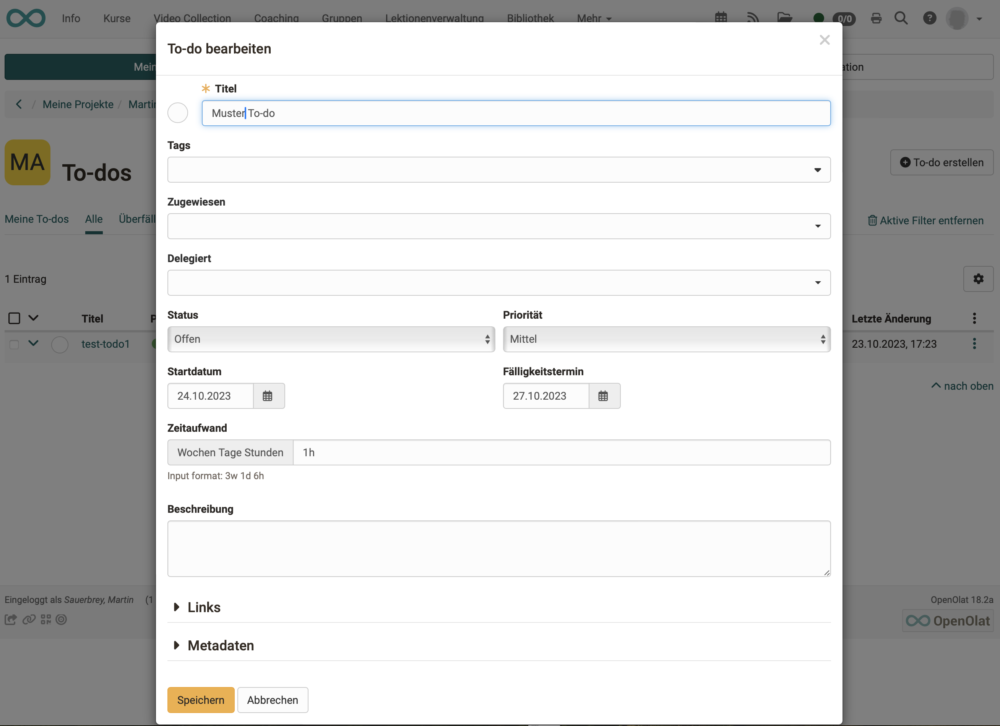

# To-Dos

## Wo gibt es in OpenOlat To-Dos?

Die zu erledigenden Aufgaben (To-Dos) finden sich an mehreren Stellen in OpenOlat:

* im [persönlichen Menü](../personal_menu/To-Dos.de.md) 
Hier finden Sie alle Ihre persönlichen To-Dos zusammengefasst in einer Übersicht.
* innerhalb eines [Projektes](../area_modules/Project_Todos.de.md) 
Hier handelt es sich um Aufgaben, die im Rahmen des Projektes zu erledigen sind.
* im [Kurs](../learningresources/Course_todos.de.md) 
Im Kursmenü **Administration > To-dos** können To-dos erstellt werden, die den aktuell editierten Kurs betreffen.
(ab Release 18.2)
* im [Kursbaustein Aufgabe](../learningresources/Course_Element_Task.de.md) 
(ab Release 18.2)

## Bestandteile eines To-Dos

Ein To-Do ist eine Art Karteikarte, auf der es verschiedene Felder hat. 

{ class=" shadow lightbox" }

* **Titel** 
Ein Pflichtfeld. Vergeben Sie möglichst einen selbsterklärenden Titel.
* **Tags** 
Es können Tags zur Verschlagwortung erstellt werden. Einmal erstellte Tags können auch in anderen To-Dos verwendet werden. Beachten Sie, dass es sich hier jedoch nicht um eine systematisch (hierarchisch) strukturierte Verschlagwortung (Taxonomie) handelt, wie sie an anderen Stellen in OpenOlat angelegt werden kann.
* **Zugewiesen**  
Ein Pflichtfeld. Hier wird die Person ausgewählt, die für die Erledigung des To-Dos verantwortlich ist.
* **Delegiert**  Die Arbeit kann an eine andere Person delegiert werden, auch phasenweise immer wieder an andere Personen. Gesamtverantwortlich bleibt trotzdem die Person, die im Feld "Zugewiesen" eingetragen ist.
* **Status** 
Der Status kann hier im Dropdown brstimmt werden. Durch Klick auf den kleinen Kreis ganz links oben im Popup kann der Status ebenfalls auf "erledigt" gesetzt werden.
* **Priorität** 
Es kann klassifiziert werden nach: Dringend - Hoch - Mittel - Tief.
* **Startdatum** 
Das Startdatum kann für Erinnerungen verwendet werden.
* **Fälligkeitstermin** 

* **Zeitaufwand** 
Ein Feld für den vermuteten Zeitaufwand. Die Angabe kann für Berechnungen verwendet werden. 
Es können Wochen (w), Tage (d) und Stunden (h) angegeben werden. Beispiel: 3w 1d 6h
* **Beschreibung** 

* **Links** 
Hier kann dieses To-Do mit Dateien, Terminen und Entscheidungen des Projektes verlinkt werden.
* **Metadaten** 
Erstellungsdatum des To-Dos und alle Änderungen (wer, wann) können in den Metadaten nachvollzogen werden.

## To-Dos verwalten

Sie können

* neue To-Dos erstellen (1)
* Ihre To-Dos nach Status sortiert anzeigen (2)
* durch Klick auf den kleinen Pfeil am Zeilenanfang die Details eines To-Dos aufklappen (3)
* die To-Dos bearbeiten (4)
* To-Dos löschen (Nach Selektion eines To-Dos in der ersten Spalte wird der Löschen-Button angezeigt) (5)

{ class=" shadow lightbox" }

!!! note "Hinweis"

    Wenn Sie Ihre To-Dos statt im persönlichen Menü lieber in der Kopfzeile angezeigt haben möchten, können Sie die Menüoption vom persönlichen Menü dorthin verschieben. Die Einstellung dazu nehmen Sie vor unter 
    **Persönliches Menü > Einstellungen > Tab System > Abschnitt Persönliche Werkzeuge** 
    Alle Werkzeuge, die Sie hier markieren, werden statt im persönlichen Menü in der Kopfzeile rechts oben angezeigt und sind so schneller erreichbar.