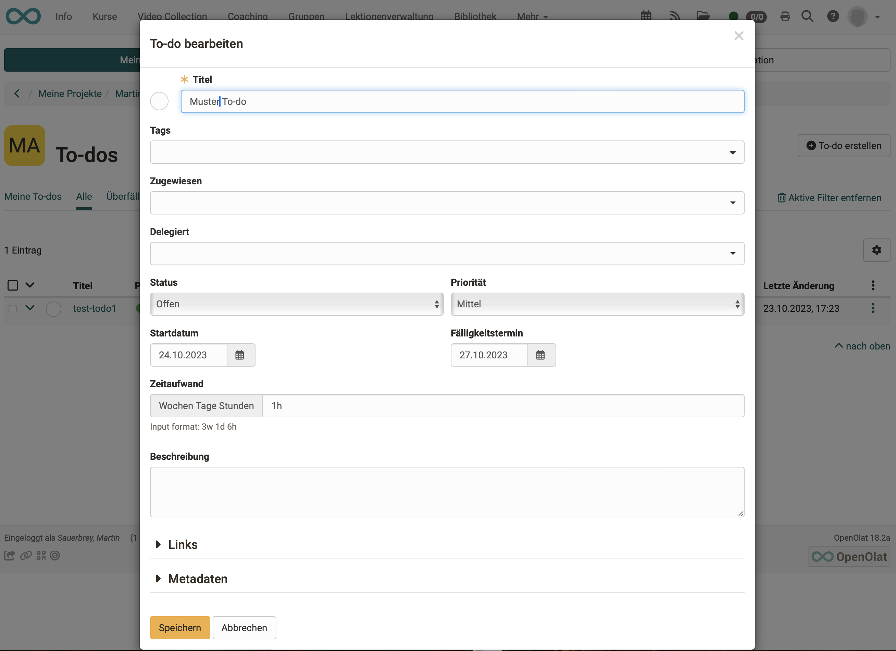
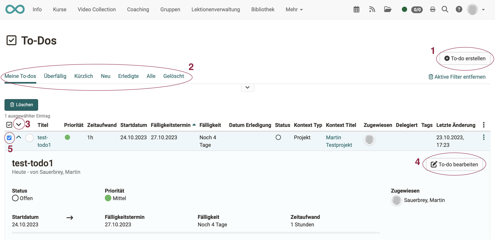
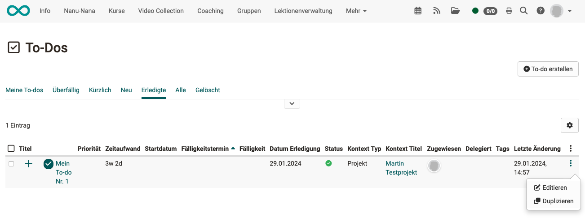

# To-Dos

## Where are to-dos in OpenOlat?

The tasks to be completed (to-dos) can be found in several places in OpenOlat:

* in the [personal menu](../personal_menu/To-Dos.md) 
Here you will find all your personal to-dos summarized in an overview.
* within a [project](../area_modules/Project_Todos.md) 
These are tasks that need to be completed as part of the project.
* within a [Course](../learningresources/Course_todos.md)
In the course menu **Administration > To-dos**, to-dos can be created that relate to the currently edited course.
* in the [course element "Task"](../learningresources/Course_Element_Task.md)
(as of Release 18.2)

## Components of a to-do

A to-do is a kind of index card on which there are various fields. 

{ class=" shadow lightbox" }

* **Title** 
A mandatory field. If possible, enter a self-explanatory title.
* **Tags** 
Tags can be created for keywording. Once created, tags can also be used in other to-dos. Please note, however, that this is not a systematically (hierarchically) structured indexing (taxonomy), as can be created elsewhere in OpenOlat.
* **Assigned**  
A mandatory field. The person responsible for completing the to-do is selected here.
* **Delegated**  The work can be delegated to another person, even in phases to different people. The person entered in the "Assigned" field still has overall responsibility.
* **Status** 
The status can be set here in the dropdown. The status can also be set to "completed" by clicking on the small circle at the top left of the pop-up.
* **Priority** 
Can be classified by: Urgent - High - Medium - Low.
* **Start date** 
The start date can be used for reminders.
* **Due date** 
  
* **Time required** 
A field for the estimated time required. The information can be used for calculations. 
Weeks (w), days (d) and hours (h) can be specified. Example: 3w 1d 6h
* **Description** 

* **Links** 
Here you can link this to-do with files, deadlines and decisions of the project.
* **Meta data** 
Creation date of the to-do and all changes (who, when) can be tracked in the metadata.

## Manage To-Dos

You can

* create new to-dos (1)
* display your to-dos sorted by status (2)
* click on the small arrow at the beginning of the line to open the details of a to-do (3)
* edit the to-dos (4)
* Delete to-dos (after selecting a to-do in the first column, the delete button is displayed) (5)

{ class=" shadow lightbox" }

To **copy** a to-do, select the **Duplicate** option under the 3 dots at the end of a line. The tabs above the list help you to select the desired copy template. For example, by preselecting to-dos that have already been completed.

{ class=" shadow lightbox" }

!!! note "Note"

    If you prefer to have your to-dos displayed in the header instead of the personal menu, you can move the menu option from the personal menu to the header. You can make the settings for this under 
    **Personal menu > Settings > Tab System > Section Personal Tools** 
    All tools that you select here are displayed in the header at the top right instead of in the personal menu and can therefore be accessed more quickly.