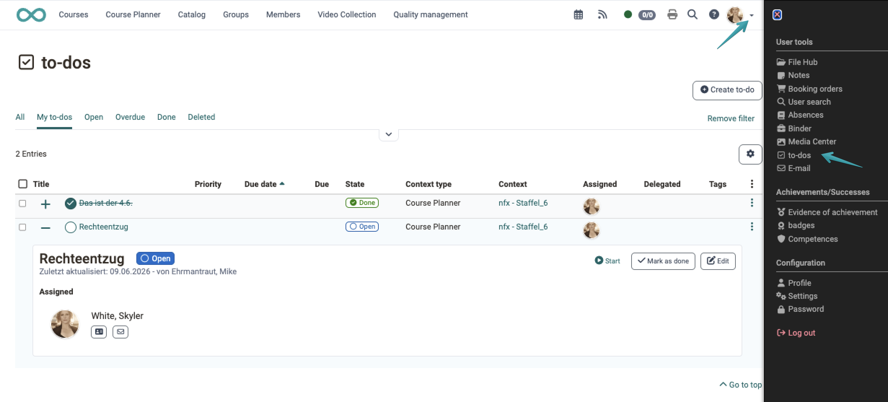

# To-dos: basics

A to-do is a task with a responsible person and a date. OpenOlat provides to-dos in several modules, everywhere with the same fields, the same status model and the same notification. This page describes what applies to all to-dos. How you work with them in a module is described on that module's page.

{ class="shadow lightbox" }

## Where are to-dos available?

Tasks are recorded where they arise. In the personal menu they come together.

| Place | What is recorded there |
|---|---|
| [Personal menu](../personal_menu/To-Dos.md) | All your to-dos from all modules in one list, plus your own to-dos without a module reference |
| [Project](../area_modules/Project_Todos.md) | Tasks within a project, linkable with files, dates and decisions |
| [Course](../learningresources/Course_todos.md) | Tasks concerning the course, created under `Course > Administration > To-dos` |
| [Course element Task](../learningresources/Course_Element_Task.md) | To-dos that the course element assigns automatically. They serve as information and cannot be edited or deleted |
| [Course Planner](../area_modules/Course_Planner_Todos.md) [:octicons-tag-16:{ title="from Release 21.0 (OO-9417)" }](https://track.frentix.com/issue/OO-9417){:target="_blank"} | Tasks on every element of a product, plus a central overview across all products |
| [Quality management](../area_modules/Quality_Management_To-dos.md) | Actions that result from a data collection |

## The fields of a to-do

All modules use the same card. Three entries exist in one module only.

| Field | Meaning | Available |
|---|---|---|
| Title | Names the task. Choose a self-explanatory title | everywhere, mandatory field |
| Assigned | The person responsible for completing the task | everywhere, mandatory field |
| Delegated | Execution can be delegated to other persons, also to changing persons over time. Responsibility remains with the assigned person | everywhere |
| Status | The processing state of the task | everywhere |
| Priority | Urgent, High, Medium or Low | everywhere |
| Start date | When the task starts. Can be used for reminders | everywhere |
| Due date | The date by which the task should be completed | everywhere |
| Expenditure of work | The estimated effort in weeks (w), days (d) and hours (h), input format `3w 1d 6h`. The value can be used for calculations | everywhere |
| Tags | Freely assignable keywords | everywhere |
| Description | Additional information about the task | everywhere |
| Context | Module and object the to-do originates from. In the list as the columns "Context type" and "Context" | everywhere |
| Links | Links the to-do with files, dates and decisions | project only |
| Metadata | Creation and all changes with person and date | project only |
| Relative dates | Start date and due date based on the implementation period instead of a fixed calendar date | [Course Planner](../area_modules/Course_Planner_Todos.md#relative_date) only |

Tags you have created once are available for selection in other to-dos as well. They are not a hierarchically structured classification like the taxonomy that OpenOlat offers elsewhere.

## Status and quick actions [:octicons-tag-16:{ title="from Release 21.0 (OO-9563)" }](https://track.frentix.com/issue/OO-9563){:target="_blank"}

| Status | Meaning |
|---|---|
| Open | The task has been created but not yet started |
| In progress | Work on the task has begun |
| Done | The task is completed |
| Deleted | The to-do is removed and only visible via the "Deleted" filter |

In the list, the status appears as a coloured circle next to the title. Use the plus sign at the start of a row to expand the detail area. There you change the state without opening the dialog:

* **"Start"** sets the status to "In progress". The action only appears with the status "Open".
* **"Mark as done"** completes the task. The action appears with the statuses "Open" and "In progress".
* **"Edit"** opens the dialog with all fields.

If start date and due date are both set, the list additionally shows a progress bar.

The image at the top of the page shows the status circles and the expanded detail area with the quick actions.

## Who may edit a to-do

Editing permissions are held by the person who created the to-do, by the assigned and by the delegated person. Which roles may edit in addition is determined by the module: in the [Course Planner](../area_modules/Course_Planner_Todos.md#todo_permissions) these are course planners and element owners, in the [project](../area_modules/Project_Todos.md) the project management.

To-dos can only be deleted where they were created.

## Notifications

When to-dos are created or edited and other persons are affected, OpenOlat notifies them by email. If several changes occur within a short time, OpenOlat combines them into one mail.
