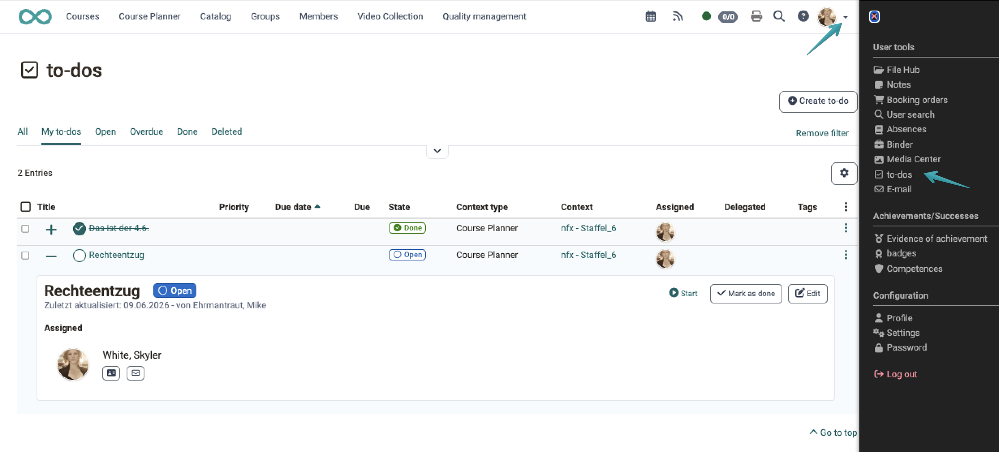

# To-dos: basics {: #to_dos_basics}

A to-do is a task with a responsible person and a date. OpenOlat provides to-dos in several modules, everywhere with the same fields and the same status model. This page describes what applies to all to-dos. How you work with them in a module is described on that module's page.

{ class="shadow lightbox" title="Personal to-do list" }

## Where are to-dos available?

Tasks are recorded where they arise. In the personal menu they come together.

| Place | What is recorded there |
|---|---|
| [Personal menu](../personal_menu/To-Dos.md) | All your to-dos from all modules in one list, plus your own to-dos without a module reference |
| [Project](../area_modules/Project_Todos.md) | Tasks within a project, linkable with files, dates and decisions |
| [Course](../learningresources/Course_todos.md) | Tasks concerning the course, created under `Course > Administration > To-dos` |
| [Course element Task](../learningresources/Course_Element_Task.md) | To-dos that the course element assigns automatically. They serve as information and cannot be edited or deleted |
| [Course Planner](../area_modules/Course_Planner_Todos.md) [:octicons-tag-16:{ title="from Release 21.0 (OO-9417)" }](https://track.frentix.com/issue/OO-9417){:target="_blank"} | Tasks on every element of a product, plus a central overview across all products |
| [Quality management](../area_modules/Quality_Management_To-dos.md) | Actions that result from a data collection |

## The fields of a to-do

All modules use the same card. Three entries exist in one module only.

| Field | Meaning | Available |
|---|---|---|
| Title | Names the task. Choose a self-explanatory title | everywhere, mandatory field |
| Assigned | The person responsible for completing the task | everywhere, mandatory field except in the Course Planner; for personal to-dos only if the administration allows assignment to other persons |
| Delegated | Execution can be delegated to other persons, also to changing persons over time. Responsibility remains with the assigned person | everywhere; for personal to-dos only if the administration allows delegation to other persons |
| Status | The processing state of the task | everywhere |
| Priority | Urgent, High, Medium or Low | everywhere |
| Start date | When the task starts. Can be used for reminders | everywhere |
| Due date | The date by which the task should be completed | everywhere |
| Expenditure of work | The estimated effort in weeks (w), days (d) and hours (h), input format `3w 1d 6h`. The value can be used for calculations | everywhere |
| Tags | Freely assignable keywords | everywhere |
| Description | Additional information about the task | everywhere |
| Context | Module and object the to-do originates from. In the list as the columns "Context type" and "Context" | everywhere |
| Links | Links the to-do with files, dates and decisions | project only |
| Metadata | Creation and all changes with person and date | project only |
| Relative dates | Start date and due date based on the implementation period instead of a fixed calendar date | [Course Planner](../area_modules/Course_Planner_Todos.md#relative_date) only |

Tags you have created once are available for selection in other to-dos as well. They are not a hierarchically structured classification like the taxonomy that OpenOlat offers elsewhere.

## Status and quick actions [:octicons-tag-16:{ title="from Release 21.0 (OO-9563)" }](https://track.frentix.com/issue/OO-9563){:target="_blank"} {: #status_quick_actions}

| Status | Meaning |
|---|---|
| Open | The task has been created but not yet started |
| In progress | Work on the task has begun |
| Done | The task is completed |
| Deleted | The to-do is removed and only visible via the "Deleted" filter |

In the list, the status appears as a coloured circle next to the title. Use the plus sign at the start of a row to expand the detail area. There you change the state without opening the dialog:

* **"Start"** sets the status to "In progress". The action only appears with the status "Open".
* **"Mark as done"** completes the task. The action appears with the statuses "Open" and "In progress".
* **"Edit"** opens the dialog with all fields.

If start date and due date are both set, the list additionally shows a progress bar.

The image at the top of the page shows the status circles and the expanded detail area with the quick actions.

## Who may edit a to-do

Editing permissions are held by the person who created the to-do, by the assigned and by the delegated person. Which roles may edit in addition is determined by the module: in the [project](../area_modules/Project_Todos.md) the project management. In the [Course Planner](../area_modules/Course_Planner_Todos.md#todo_permissions), administrators, course planners, product owners and element owners edit the to-dos; assigned and delegated persons only change the status there.

You delete to-dos where they were created. In the personal to-do list you delete your personal to-dos and the to-dos for which the module allows the assigned person to delete them.

## When OpenOlat sends e-mails about to-dos {: #notifications}

Whoever is to take on a to-do learns about it by e-mail and does not have to check the to-do list first. OpenOlat sends e-mails about to-dos in two cases:

* The e-mail "New to-do" goes to whoever is newly entered under "Assigned" or "Delegated" for a to-do. It names the title of the to-do and contains a link to it. If a person changes from "Assigned" to "Delegated" or vice versa, no e-mail is sent.
* The e-mail "To-do done" goes to the person who created the to-do and to the assigned and the delegated persons as soon as the to-do receives the status "Done". Whoever completes the to-do does not receive one. To-dos from the course element "Task" do not trigger this e-mail.

In the Course Planner, in the project, in quality management and for personal to-dos, whoever enters themselves receives no e-mail. E-mails about to-dos only go to persons with an active account.

In the Course Planner, OpenOlat combines the assignments of one operation. If a copy with "Copy element" or the bulk action "Create to-dos" assigns several to-dos to the same person, that person receives a single e-mail "New to-dos". It states the number of to-dos and lists one line with title and link per to-do. With more than 20 to-dos it shows the first 20 and below them the line "… and N more", where N stands for the number of remaining to-dos. If a person receives only one to-do from the operation, the e-mail "New to-do" is sent. OpenOlat sends the e-mails only once the operation is completed. [:octicons-tag-16:{ title="from Release 21.1 (OO-9731)" }](https://track.frentix.com/issue/OO-9731){:target="_blank"}

There is no setting that switches off e-mails about to-dos. When copying an implementation, no e-mails are sent if you choose the option "To-dos only" or "Don't copy" under "To-dos": [Adopt to-dos when copying](../area_modules/Course_Planner_Implementations.md#copy_todos)

[To the top of the page ^](#to_dos_basics)

---

## Further information {: #further_information}

**Mentioned on this page** 
[Personal tools: To-dos >](../personal_menu/To-Dos.md) 
[Projects: To-dos >](../area_modules/Project_Todos.md) 
[To-dos in the course >](../learningresources/Course_todos.md) 
[Course Element "Task" >](../learningresources/Course_Element_Task.md) 
[Course Planner: To-dos >](../area_modules/Course_Planner_Todos.md) 
[Quality Management: Actions (To-dos) >](../area_modules/Quality_Management_To-dos.md) 
[Course Planner: Implementations >](../area_modules/Course_Planner_Implementations.md)

**Further reading** 
[Module To-do (Admin) >](../../manual_admin/administration/Modules_ToDo.md)

[To the top of the page ^](#to_dos_basics)
