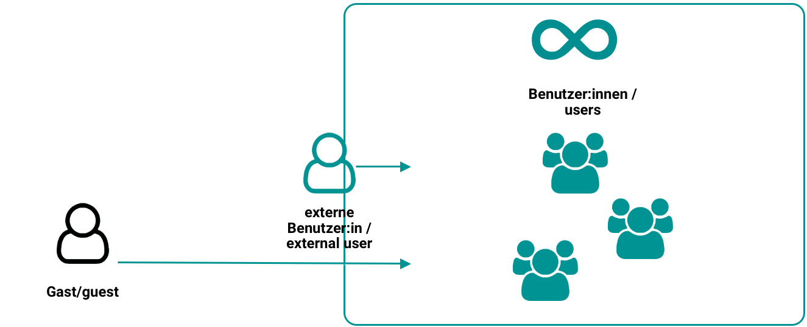

# Rollen und Rechte: Benutzertypen {: #user_types} 

## Die 3 Benutzertypen

OpenOlat arbeitet mit einem Rollen- und Rechte-Management. Auf oberster Ebene wird zwischen 3 grundsätzlichen Benutzertypen unterschieden. Dies sind:

{ class=" shadow lightbox" }

### **Registrierte Benutzer:innen** (Standard) 
Alle Benutzer:innen haben einen eindeutigen Benutzernamen, der nach der Registrierung zur Identifikation benutzt wird. Benutzer:innen können freigeschaltete Lerninhalte nutzen und sich an allen Lernaktivitäten beteiligen. Lernergebnisse (z.B. aus Tests) werden dem Benutzernamen zugeordnet. Zudem haben alle Benutzer:innen eine individuell konfigurierbare Startseite und [Speicherplatz](../personal_menu/Personal_folders.de.md) zur Verfügung. Alle registrierten Benutzer:innen hat auch die Möglichkeit eigene [Gruppen](../groups/index.de.md) zu erstellen und alle darin enthaltenen Funktionen und Tools zu nutzen. 

Bei registrierten Benutzer:innen ohne weitere Rollen und Rechte handelt es sich in der Regel um die Lernenden.

Registrierte Benutzer:innen können aber auch zusätzlich eine oder mehrere Rollen erhalten. Mit jeder dieser Rollen sind Rechte für bestimmte Aufgaben verbunden. 

### Weitere Benutzertypen

* **Externe Benutzer:innen** 
sind in OpenOlat mit ihrer E-Mail-Adresse bekannt. Es existiert jedoch kein kompletter Datensatz mit Benutzerdaten, wie bei registrierten Benutzer:innen. Externe Benutzer:innen können dem entsprechend die meisten Rollen in OpenOlat nicht übernehmen, da sie eine volle Registrierung erfordern.
Externe Benutzer:innen können bei Bedarf zu vollwertigen registrierten Benutzer:innen umgewandelt werden.

* **Anonyme Gäste** 
Gäste haben - ohne sich zu registrieren – beschränkten Zugang zu OpenOlat. Sie können für Gäste freigegebene Lerninhalte betrachten, sich jedoch nicht an allen Lernaktivitäten beteiligen. Der Link zum Gastzugang befindet sich auf der Login-Seite. Weitere Informationen zum Gast finden Sie [hier](guest_access.de.md).

!!! info "Hinweis"

    Es versteht sich, dass nahezu alle Rollen nur an registrierte Benutzer:innen vergeben werden können. Anonyme Gäste und externe Benutzer:innen (nur mit E-Mail bekannt) können keine Aufgaben (wie z.B. Betreuer:in oder Administrator:in) innerhalb OpenOlat übernehmen.

