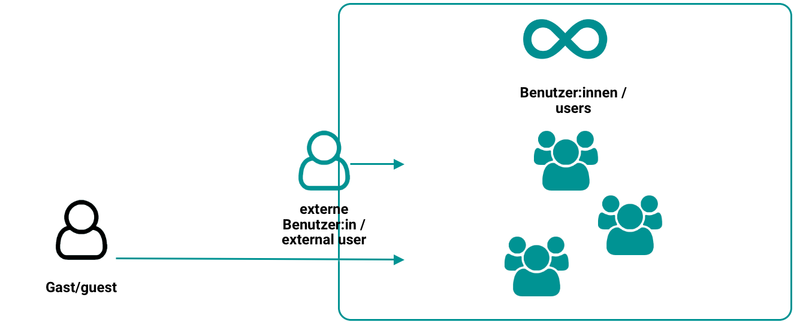

# Roles and Rights: User Types {: #user_types} 

## The 3 User Types 

OpenOlat works with a roles and rights management system. At the top level, a distinction is made between 3 basic user types. These are:

{ class="shadow lightbox" }

### Registered Users (Standard) {: #registered_users} 

All users have a unique username that is used for identification after registration. Users can access enabled learning content and participate in all learning activities. Learning results (e.g. from tests) are assigned to the username. In addition, all users have an individually configurable home page and [storage space](../personal_menu/File_Hub.md#quota) available. All registered users also have the option to create their own [groups](../groups/index.md) and use all the functions and tools they contain.

Registered users without additional roles and rights are generally the learners.

Registered users can also be assigned one or more additional roles. Each of these roles comes with rights for specific tasks. 

[To the top of the page ^](#user_types)

---

### External Users [:octicons-tag-16:{ title="from Release 19.1.11 (OO-8636)" }](https://track.frentix.com/issue/OO-8636) {: #external_users}

External users are known in OpenOlat by their email address. However, no complete data record with user data exists, as is the case with registered users. External users therefore cannot take on most roles in OpenOlat, since these require full registration.
External users can be converted into full registered users if required.

The account of an external user is automatically set to inactive after the period expires (default: 180 days). A new invitation reactivates the account and sets a new expiration date.

[To the top of the page ^](#user_types)

---

### Anonymous Guests {: #guests} 

Guests have limited access to OpenOlat without registering. They can view learning content released for guests, but cannot participate in all learning activities. The link to guest access is on the login page. More information about the guest can be found [here](guest_access.md).

[To the top of the page ^](#user_types)

---

## Comparison {: #comparison} 

| Feature | Guest | External user | Registered user |
|---|---|---|---|
| Account required | no | temporary (via invitation link) | yes |
| Identification | anonymous | email address known | Data per profile (with various mandatory fields) |
| Time limit | no (access possible while course is open) | Default: max. 180 days | unlimited or time-limited (with account expiration date)|
| in conventional courses | yes | yes | yes |
| in learning path courses | yes | yes | yes |
| Activation by administrator required | yes | yes | no |
| specific offers | yes, offer "Guest access"  | no | no (standard) |
| Bulk invitation| no  | yes (email list) | yes |
| Authentication | no | yes, by validated email address | yes, various methods |
| Management of learners | not possible, as user is unknown | user management, members management | user management, members management |
| Management of learning data | not possible, as user is unknown | yes | yes |
| Group membership | not possible, as user is unknown | yes (possibly restricted by administrator in general) | yes |

!!! info "Note"

    It goes without saying that almost all roles can only be assigned to registered users. Anonymous guests and external users (known only by email address) cannot take on tasks (such as coach or administrator) within OpenOlat.

[To the top of the page ^](#user_types)

---

## Further information {: #further_information}

[Personal tools: File Hub >](../personal_menu/File_Hub.md) 
[Groups >](../groups/index.md) 
[Roles and Rights: Guest access >](guest_access.md) 
[Members management >](../learningresources/Members_management.md) 
[Anonymous guests and external users >](../../manual_admin/administration/Guest_and_invitation.md)

[To the top of the page ^](#user_types)

