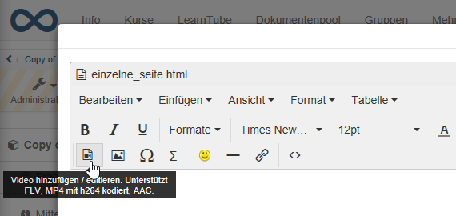
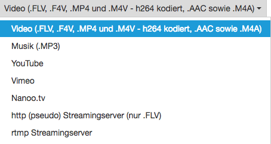
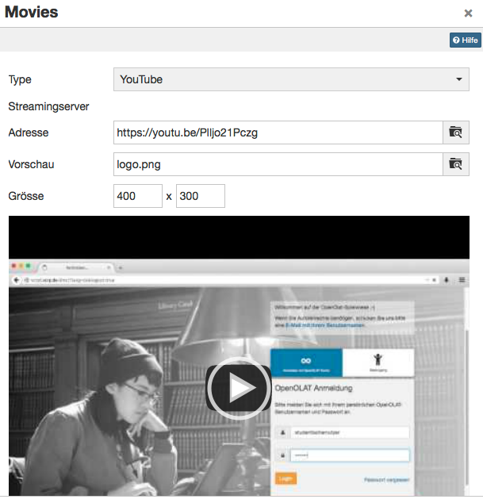
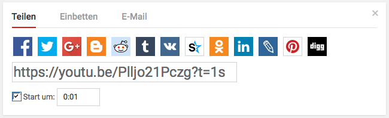
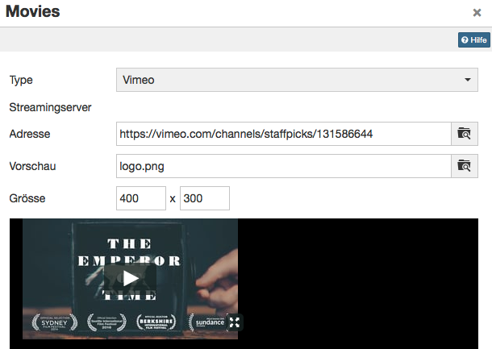
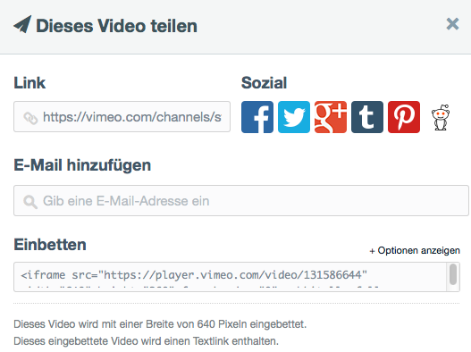
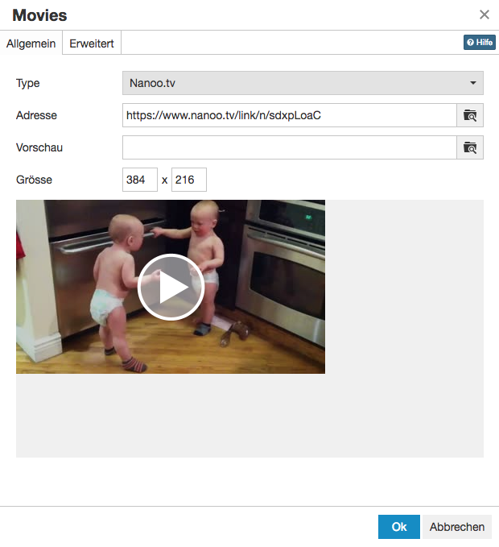

# Videos in course element "HTML page" {: #video_html_page}

Videos that are integrated into the course element "HTML page" are **directly integrated** videos.  (See [Video: Overview](Video.md))

These videos can be **uploaded** into the OpenOlat database or function as **links**, e.g. to YouTube videos. 
(Videos in HTML pages are therefore not video learning resources, i.e. they are without annotations, quizzes, etc.)

The directly integrated videos in the course element "HTML page" are **stored in the course storage folder**. From there, they are linked to the course element. Videos embedded in this way are only available in the respective course.

## Display of videos in an HTML page

The tool uses the **media player** integrated in OpenOlat for the display, which has several advantages.

1. The player recognizes the format itself as long as the video and audio data are encoded correctly.
2. The player recognizes whether users are accessing the video with an HTML5-capable and codec-compatible mobile browser. In this case, the films are provided with an HTML5 tag and can also be displayed on an iPad or similar without any problems.

In addition to mp4, OpenOlat also supports HTML5 videos that have been integrated into an HTML page with external tools. In this case, you as the author must ensure that different alternative video formats have been specified in the HTML tags (e.g. m4v and ogg) and that these are also stored in different resolutions in OpenOlat.

In this case, OpenOlat supports pseudo-streaming by means of progressive download or range requests.

### Released media servers [:octicons-tag-16:{ title="from Release 19.1 (OO-7955)" }](https://track.frentix.com/issue/OO-7955) {: #media_server}

Administrators define in the system administration which external video platforms OpenOlat may embed via link: `Administration > Login > Security`, tab "Media server". A video from a domain that has not been released is not played in the HTML page. Instead, the message "The media resource is from a restricted domain." is displayed. Details can be found in the administration manual under [Security](../../manual_admin/administration/Login_Security.md#tab_mediaserver).

## Add/edit video

The course element "HTML page" provides you with an HTML editor that you can also use to integrate videos into an HTML page. In the "Page content" tab, you can open the editor and access the "Add/edit video" button.

{ class="shadow lightbox" }

In the dialog, select the kind of integration under "Type". Under "Address", enter the link to the video or upload a file. Under "Size", define the width and height of the player in pixels.

!!! tip "Tip"

    You can also add a start image to your media file.
    (Upload of an image under "Preview".)

Below you will find the most important information on using the TinyMCE plugin "Add/edit video" used in HTML pages (Supports FLV, MP4 coded with h264, AAC).

### Recommended format

In practice, the **mp4** (or MPEG-4) container with the H.264 video codec for video and the **mp3** audio codec for audio has become established. Current versions of Firefox, Chrome and Safari can play such videos.

The following options are available to you:

{ class="shadow lightbox" }

| Option | Description |
|---|---|
| Video | Integration of a video with specific coding. |
| Sound | Integration of an audio file without video. |
| YouTube / Vimeo / Nanoo.tv | Integration of a YouTube, Vimeo or Nanoo.tv video. |
| http | Streaming with Flash file from a web server. |
| rtmp | Streaming with Flash file from a special streaming server. |

#### Video (.FLV, .F4V, .MP4, .M4V (h264 coded), .AAC, and .M4A)

This setting is best suited for the integration of videos on OpenOlat. The following labels are suitable as container formats, i.e. the formats that can be uploaded:

| Format container | Name of the container | Description |
|---|---|---|
| .FLV | Flash container | Flash videos with video and audio, defined by Adobe (Attention: Flash player needs to be activated) |
| .F4V | | No container, but pure video format without audio, defined by Adobe |
| .MP4 | MPEG-4 | MP4 video and audio format, defined by the MPEG group, various codecs |
| .M4V | MPEG-4 | MP4 video format with H.264 video codec and MP3 or AAC audio codec; format for iTunes |

You can either enter the link to the video directly in the address field or upload the file accordingly.

!!! tip "Tip"

    To ensure optimum compatibility, an MPEG-4 container with H.264 encoding for video and AAC or MP3 encoding for audio should be used.

    This means that .mp4 or .m4v are available as file extensions, although .m4v cannot be played by all devices.

    Flash movies are not recommended, as they cannot be played on many mobile devices such as the iPad.

#### YouTube

YouTube videos are linked directly, i.e. the selection box for uploading a file is not required here. Videos can be **directly integrated** with this configuration.

{ class="shadow lightbox" }

Use a direct link to the video as "Address", available under the link "**Share**".

{ class="shadow lightbox" }

#### Vimeo

Vimeo videos are also linked directly in OpenOlat. Enter the link of the desired video under "Address".

{ class="shadow lightbox" }

You will find a direct link to the Vimeo video under the link "**Share**".

{ class="shadow lightbox" }

#### Nanoo.tv

Videos from the platform [Nanoo.tv](https://portal.nanoo.tv/) can be linked directly. A Nanoo.tv account is required to use and view the videos.

{ class="shadow lightbox" }

The URL can be used to control, independently of the browser, whether the video starts automatically or not. To do this, the URL behind /link/ must be adapted accordingly.

* start automatically with "n": https://www.nanoo.tv/link/ **n** /sdxpLoaC
* start manually with "v": https://www.nanoo.tv/link/ **v** /sdxpLoaC

The settings in the "Advanced" tab do not work here.

#### http (pseudo) streaming server (only .FLV)

This function can be used to integrate **Flash movies** in **.flv** format. If the films are exported correctly at the point of origin, they contain an index. With the help of this table of contents, you can also quickly jump to any point within the film; the film does not have to be loaded completely first. This is not real streaming, for which a corresponding streaming software must also be installed on the server.

The address of the server must be entered in the "Streaming server" field. The address of the actual film is entered under "Address".

!!! warning "Attention"

    As the content cannot be viewed on the iPad and most other mobile devices with this variant of embedding, this procedure is **not recommended**.

#### rtmp streaming server

A Flash streaming server can be used with this function. A special protocol is used for this: RTMP - Real Time Messaging Protocol. Various products can be used as streaming servers, e.g. the Akamai network.

This protocol developed by Adobe enables the video to be transferred from the server to the Flash Player. However, this variant often causes problems with port settings and firewalls.

!!! warning "Attention"

    As the content cannot be viewed on the iPad and most other mobile devices with this variant of embedding, this procedure is **not recommended**.

    As Flash is no longer supported by most browsers, or only to a very limited extent, the use of Flash-based videos should generally be avoided.

## Further information {: #further_information}

[Video: Overview >](Video.md) 
[Security >](../../manual_admin/administration/Login_Security.md) 
[Nanoo.tv >](https://portal.nanoo.tv/)

[To the top of the page ^](#video_html_page)
