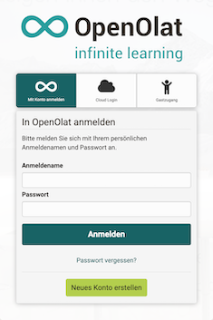
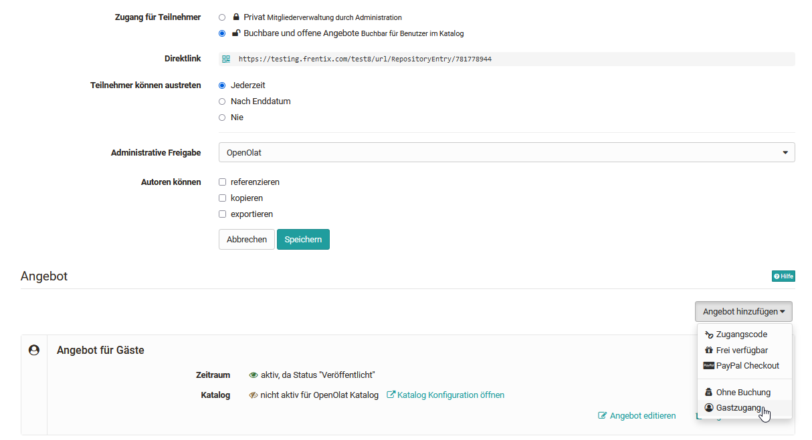
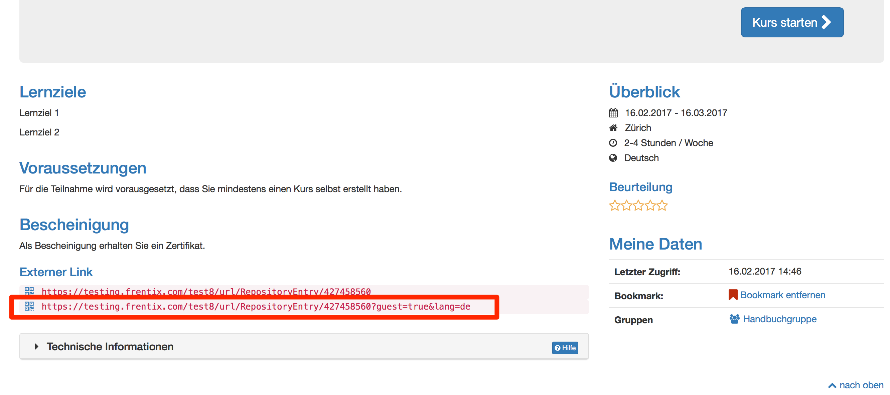

# Rollen und Rechte: Gastzugang {: #guest_access}

{ class="shadow lightbox aside-right-lg" }

Neben registrierten Benutzern können auch Personen ohne OpenOlat Account als
Gäste Zugang zum System erhalten. Gäste sind anonyme, nicht registrierte
Benutzer, welche in der [Benutzerverwaltung](../../manual_admin/usermanagement/index.de.md) nicht verwaltet werden können.  

Damit Gäste Zugang erhalten, muss der Gastlogin vom Administrator der OpenOlat Instanz aktiviert werden. Auch kann konfiguriert werden auf welche OpenOlat Bereiche Gäste Zugriff haben und auf welche nicht. Diese Basis-Einstellungen sind nur durch den Systemadministrator möglich.

Grundsätzlich können diverse Lernressourcen z.B.  Wikis, Blogs, Tests, Videos oder Glossare für Gäste freigeschaltet werden.  

## Kursbereich 

!!! warning "Hinweis"

    Der Gastzugang ist nur bei herkömmlichen Kursen, nicht bei Lernpfad Kursen
    aktivierbar.

In einem herkömmlichen Kurs kann der Kursbesitzer die Zugangskonfiguration in den
"Einstellungen"→ Tab "Freigabe" so einrichten, dass auch Gäste Zugriff auf den Kurs erhalten. Als Einstellung muss dabei die Angebotsart aktiviert und in einem zweiten Schritt der Gastzugang ausgewählt werden.

Folgende Kursbausteine kann ein Gast sehen bzw. teilweise bearbeiten:

  * Nur **lesen**: CP Lerninhalt, Blog, Wiki, Forum, Mitteilung, Kalender, Einzelseite, externe Seite, Dateidiskussion, Linkliste
  * **Forum**: Der Kursitzer kann im Kurseditor einstellen, ob auch Gäste Forenbeiträge erstellen dürfen
  * **Podcast und Video** schauen
  * **Ordner**: Dateien herunterladen
  * **SCORM**: durchführen
  * **Test**: je nach Konfiguration durchführen
  * **Selbsttest**: durchführen (auch wenn Option nicht angewählt)
  * An **BigBlueButton**, **OpenMeetings** u.ä. Meetings teilnehmen
  * **Umfragen** bearbeiten

Wenn Sie einem Gast einen direkten Zugriff zu einem Kurs geben, können Sie ihm den Externen Link zum  Kurs schicken. 

!!! tip "Tipp: Alternative zum Gastzugang"

    Möchten Sie jemanden zu einem OpenOlat Kurs einladen der noch keinen OpenOlat Account besitzt können Sie als Kursbesitzer alternativ auch die Option "Externe Mitglieder einladen" in der Mitgliederverwaltung nutzen. Die eingeladene Person erhält dann einen Registrierungslink und einen eingeschränkten Zugriff auf OpenOlat, hat allerdings mehr Möglichkeiten als ein Gast. 

!!! info "Info"
    
    OpenOlat Administratoren finden auf den Seiten "[Gast und Einladung](../../manual_admin/administration/Guest_and_invitation.de.md)" sowie unter "[Customizing](../../manual_admin/administration/Customizing.de.md)" weitere Informationen zur Konfiguration von OpenOlat für Gäste. 
    

[Zum Seitenanfang ^](#guest_access)