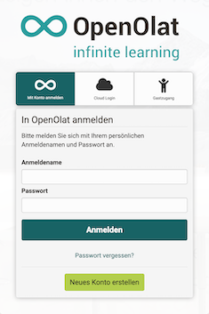
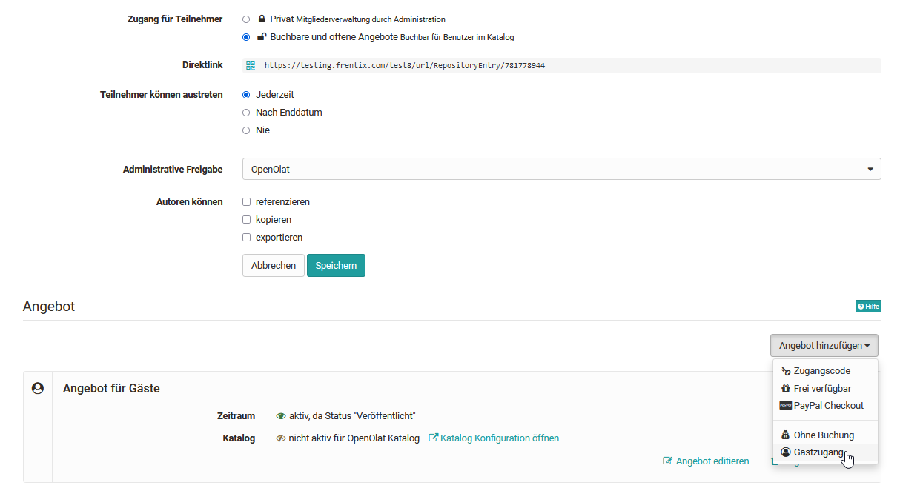
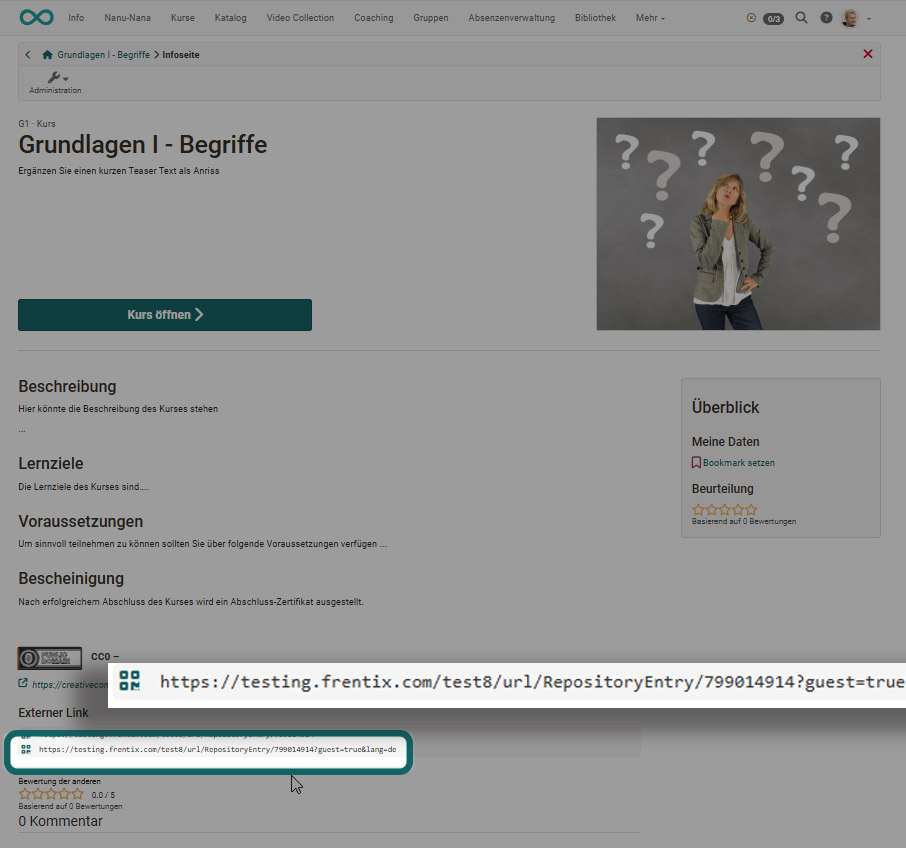

# Rollen und Rechte: Gastzugang {: #guest_access}

{ class="shadow lightbox aside-right-lg" }

Neben registrierten Benutzer:innen können auch Personen ohne OpenOlat-Konto als Gäste Zugang zum System erhalten. Gäste sind anonyme, nicht registrierte Benutzer:innen, die in der [Benutzerverwaltung](../../manual_admin/usermanagement/index.de.md) nicht verwaltet werden können.

Damit Gäste Zugang erhalten, muss der Gastlogin von den Systemadministrator:innen der OpenOlat-Instanz aktiviert werden. Auch kann konfiguriert werden, auf welche OpenOlat-Bereiche Gäste Zugriff haben und auf welche nicht. Diese Basis-Einstellungen sind nur durch die Systemadministrator:innen möglich.

Grundsätzlich können diverse Lernressourcen, z.B. Wikis, Blogs, Tests, Videos oder Glossare, für Gäste freigeschaltet werden.

## Kursbereich {: #course_level}

!!! info "Wichtig"

    Der Gastzugang ist nur bei herkömmlichen Kursen, nicht bei Lernpfadkursen aktivierbar.

In einem herkömmlichen Kurs können Kursbesitzer:innen die Zugangskonfiguration so einrichten, dass auch Gäste Zugriff auf den Kurs erhalten: `Kurs > Administration > Einstellungen > Freigabe`. Setzen Sie dort "Zugang für Teilnehmer:innen" auf "Buchbare und offene Angebote". Fügen Sie anschliessend im Abschnitt "Angebot" über "Angebot hinzufügen" ein Angebot der Art "Gastzugang" hinzu.

{ class="shadow lightbox" }

Folgende Kursbausteine kann ein Gast sehen bzw. teilweise bearbeiten:

  * Nur **lesen**: CP-Lerninhalt, Blog, Wiki, Forum, Mitteilungen, Kalender, Einzelseite, Externe Seite, Dateidiskussion, Linkliste
  * **Forum**: Kursbesitzer:innen können im Kurseditor mit der Option "Gästen das Erstellen von Beiträgen gestatten" einstellen, ob auch Gäste Forenbeiträge erstellen dürfen
  * **Podcast und Video** schauen
  * **Ordner**: Dateien herunterladen
  * **SCORM**: durchführen
  * **Test**: je nach Konfiguration durchführen
  * **Selbsttest**: durchführen
  * An **BigBlueButton**, **OpenMeetings** u.ä. Meetings teilnehmen
  * **Umfragen** bearbeiten

Wenn Sie einem Gast direkten Zugriff auf einen Kurs geben möchten, schicken Sie ihm den externen Link zum Kurs.

{ class="shadow lightbox" }

!!! tip "Tipp: Alternative zum Gastzugang"

    Möchten Sie jemanden zu einem OpenOlat-Kurs einladen, der noch kein OpenOlat-Konto besitzt, können Sie als Kursbesitzer:in alternativ auch die Option "Externe Mitglieder einladen" in der [Mitgliederverwaltung](../learningresources/Members_management.de.md) nutzen. Die eingeladene Person erhält dann einen Registrierungslink und einen eingeschränkten Zugriff auf OpenOlat, hat allerdings mehr Möglichkeiten als ein Gast.

!!! note "Hinweis"

    OpenOlat-Administrator:innen finden auf den Seiten "[Anonyme Gäste und externe Benutzer:innen](../../manual_admin/administration/Guest_and_invitation.de.md)" sowie unter "[Customizing](../../manual_admin/administration/Customizing.de.md)" weitere Informationen zur Konfiguration von OpenOlat für Gäste.

## Weiterführende Informationen {: #further_information}

**Auf dieser Seite erwähnt** 
[Benutzerverwaltung >](../../manual_admin/usermanagement/index.de.md) 
[Mitgliederverwaltung >](../learningresources/Members_management.de.md) 
[Anonyme Gäste und externe Benutzer:innen >](../../manual_admin/administration/Guest_and_invitation.de.md) 
[Customizing: Übersicht >](../../manual_admin/administration/Customizing.de.md)

**Weiterführend** 
[Zugangskonfiguration / Freigabe >](../learningresources/Access_configuration.de.md) 
[Angebotsarten >](../learningresources/Offer_Types.de.md) 
[Rollen und Rechte: Benutzertypen >](User_Types.de.md) 
[Login-Seite >](../login_registration/Login_Page.de.md)

[Zum Seitenanfang ^](#guest_access)
