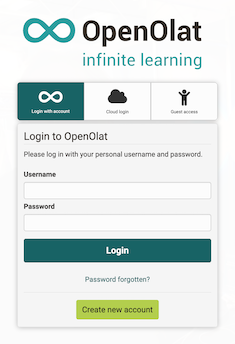
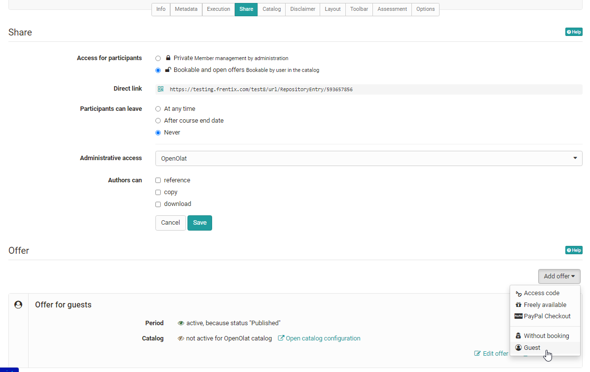

# Roles and Rights: Guest access {: #guest_access}

{ class="shadow lightbox aside-right-lg" }

Beside OpenOlat users a guest access can be enabled. Guests are anonymous, not
registered users, which cannot be managed in the [user management](../../manual_admin/usermanagement/index.md).

In order to grant guests access the guest login has to be activated by the administrator of the OpenOlat instance. It is also possible to configure which OpenOlat areas guests have access to and which not. These basic settings can only be made by the system administrator.

Generally, various learning resources, e.g. wikis, blogs, tests, videos or glossaries can be unlocked for guests.  

## Course level

!!! warning "Attention"

    Guest access can only be activated for conventional courses, not for learning path courses.

In a course, the course owner can set up the access configuration in the
"Settings"→ "Access" tab so that guests can also access the course. The offer style must be activated as a setting and guest access must be selected in a second step.

The following course elements can be seen by guests:

  * Read **only**: CP learning content, blog, wiki, forum, notifications, calendar, single page, external page, file dialog, link list
  * **Forum**: In the course editor it can be defined by the course owner, if guests should be allowed to create forum entries
  * Watch **podcast and video**
  * **Participant folder**: same as normal user
  * **SCORM**: do
  * **Test**: do it depending on configuration
  * **Self test**: do (even if option is not selected)
  * Participate in **BigBlueButton**, **OpenMeetings** and similar meetings
  * Edit **Surveys**

If you want to give a guest a direct access to a course, you can send him/her the external link for the course. 

!!! tip "Tip: Alternative to guests"

    If you want to invite someone to an OpenOlat course who does not yet have an OpenOlat account, you can alternatively use the option "Invite external members" in the member administration. The invited person will then receive a registration link and limited access to OpenOlat, but has more possibilities than a guest. 
  
!!! info "Info"  

    Administrative settings are made by OpenOlat administrators in the section
    Login → ["Guest and Invitation"](../../manual_admin/administration/Guest_and_invitation.md) and under ["Customizing"](../../manual_admin/administration/Customizing.md) → "Sites".

[To the top of the page ^](#guest_access)