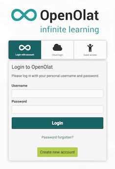
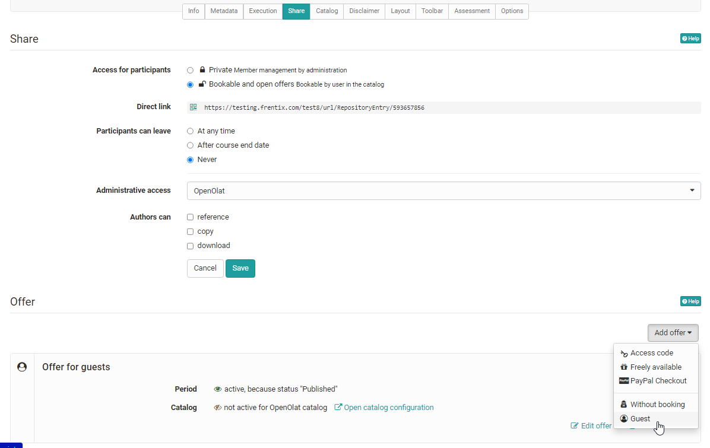

# Roles and Rights: Guest access {: #guest_access}

{ class="shadow lightbox aside-right-lg" }

Besides registered users, people without an OpenOlat account can also access the system as guests. Guests are anonymous, unregistered users who cannot be managed in the [user management](../../manual_admin/usermanagement/index.md).

For guests to gain access, the system administrators of the OpenOlat instance must activate the guest login. It is also possible to configure which OpenOlat areas guests can access and which not. Only the system administrators can make these basic settings.

Generally, various learning resources, e.g. wikis, blogs, tests, videos or glossaries, can be released for guests.

## Course level {: #course_level}

!!! info "Important"

    Guest access can only be activated for conventional courses, not for learning path courses.

In a conventional course, course owners can set up the access configuration so that guests can also access the course: `Course > Administration > Settings > Share`. Set "Access for participants" to "Bookable and open offers". Then add an offer of the type "Guest" in the "Offer" section via "Add offer".

{ class="shadow lightbox" }

Guests can see or partially edit the following course elements:

  * **Read** only: CP learning content, blog, wiki, forum, notifications, calendar, single page, external page, file dialog, link list
  * **Forum**: In the course editor, course owners can use the option "Allow guests to post" to define whether guests may also create forum posts
  * Watch **podcast and video**
  * **Folder**: download files
  * **SCORM**: run
  * **Test**: run depending on configuration
  * **Self-test**: run
  * Participate in **BigBlueButton**, **OpenMeetings** and similar meetings
  * Edit **surveys**

If you want to give a guest direct access to a course, send them the external link to the course.

{ class="shadow lightbox" }

!!! tip "Tip: Alternative to guest access"

    If you want to invite someone to an OpenOlat course who does not yet have an OpenOlat account, as a course owner you can alternatively use the option "Invite external members" in the [members management](../learningresources/Members_management.md). The invited person then receives a registration link and limited access to OpenOlat, but has more possibilities than a guest.

!!! note "Note"

    OpenOlat administrators find further information on configuring OpenOlat for guests on the pages "[Anonymous guests and external users](../../manual_admin/administration/Guest_and_invitation.md)" and "[Customizing](../../manual_admin/administration/Customizing.md)".

## Further information {: #further_information}

**Mentioned on this page** 
[User management >](../../manual_admin/usermanagement/index.md) 
[Members management >](../learningresources/Members_management.md) 
[Anonymous guests and external users >](../../manual_admin/administration/Guest_and_invitation.md) 
[Customizing >](../../manual_admin/administration/Customizing.md)

**Further reading** 
[Access configuration >](../learningresources/Access_configuration.md) 
[Offer types >](../learningresources/Offer_Types.md) 
[Roles and Rights: User Types >](User_Types.md) 
[Login Page >](../login_registration/Login_Page.md)

[To the top of the page ^](#guest_access)
