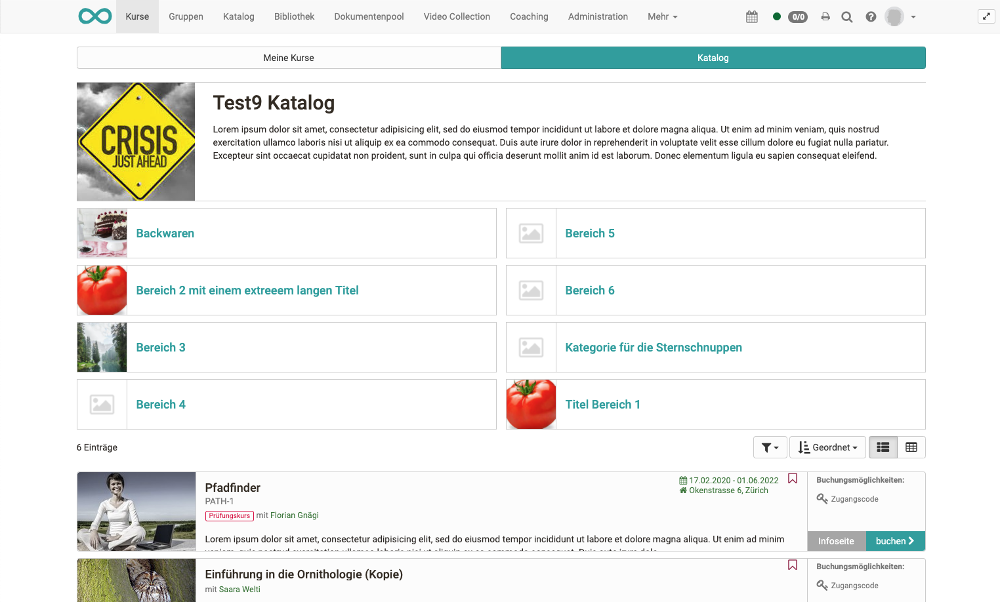

# Kurse finden

Der Menüpunkt „Kurse“ bietet Ihnen den Zugang zu den für Sie zugänglichen
Kursen und eventuell weiteren Lernressourcen. Klicken Sie in der
Hauptnavigation oben auf den Punkt „Kurse“.

## Meine Kurse

Unter "Meine Kurse" können Sie sich alle Kurse und Lernressourcen anzeigen
lassen (Aktuelle Kurse), nur die Kurse anzeigen lassen, die Sie selbst als
Favorit gekennzeichnet haben (Favoriten), Kurse die schon beendet sind
(Beendet) oder Sie nutzen die Suche um einen Kurs bzw. eine Lernressource
basierend auf einem Stichwort zu finden.

Ihre Kurse können Sie auch anhand verschiedener Kriterien filtern, darunter
nach Aktualität, Mitgliedsstatus und nach Bewertungsstatus. Klicken Sie dafür
auf den kleinen Pfeil und weitere Filteroptionen erscheinen.
[Hier](../personal/Working_with_tables.de.md) erfahren Sie mehr darüber wie Sie Ihre
Ansicht optimal filtern können.

### Suchen

Über die Suche sind alle Lernressourcen auffindbar, auf die Sie Zugriff haben.
Geben Sie ein Stichwort oder den Kurstitel ein und lassen Sie sich die
passenden Kurse oder Lernressourcen anzeigen. Klappen Sie die Filteroption auf
um die Suche anhand der Filter weiter einzugrenzen. Sie können die
Filtereinstellung auch speichern.

Wenn Sie mal einen Kurs nicht finden, achten Sie darauf eventuell noch ein
nicht gewünschter Filter aktiviert ist z.B. nur Kurse gefunden, die Sie noch
nicht bestanden haben. Entfernen Sie in diesem Fall den entsprechenden Filter.

Markieren Sie den Kurs als Favorit, wenn Sie ihn gefunden haben. Klicken Sie
dazu die weisse Flagge an, die sich dann rot färbt. Beim nächsten Login finden
Sie den Kurs dann direkt in Ihren Favoriten.

## Katalog

Der OpenOlat Katalog ähnelt einem Vorlesungsverzeichnis in Papierform. Der
Aufbau des Katalogs kann vom OpenOlat Administrator bzw. von einem
Katalogverwalter eingerichtet werden, so dass die Autoren Kurse und andere
Lernressourcen sinnvoll in den Katalog einsortieren können. Die Reihenfolge
der Katalogeinträge kann vom Administrator bzw. Katalogverwalter definiert
werden.

Für OpenOlat Benutzer bietet sich der Katalog für die Suche nach bestimmten
Kursen und Lernressourcen an.

Verwenden Sie die Suchmaske, wenn Sie den gewünschten Kurs im Katalog nicht
finden. Möglicherweise hat der Besitzer den Kurs noch nicht in den Katalog
eingetragen.

In den Katalog können nur Kurse und Lernressourcen vom Lehrenden eingetragen
werden, die auch für die Lerner frei geschaltet sind. Die Sichtbarkeit im
Katalog ist abhängig vom Publikationsstatus und den Freigabeeinstellungen der
Lernressource:

Benutzerrolle| Freigabeeinstellung| Publikationsstatus  
---|---|---  
Besitzer der Lernressource| Privat, Buchbar, Offen| immer sichtbar  
Betreuer der Lernressource| Privat, Buchbar, Offen|  "Freigabe Betreuer",
"Veröffentlicht" oder "Beendet"  
Teilnehmer der Lernressource| Privat, Buchbar, Offen| "Veröffentlicht" oder
"Beendet"  
Alle OpenOlat Benutzer| Buchbar, Offen| "Veröffentlicht" oder "Beendet"  
Gäste| Offen & Gastzugang aktiviert| "Veröffentlicht" oder "Beendet"  
  
Verfügt ein User auch über Kurse, die einem [Curriculum
](../curriculum/Curriculum_Management.de.md)zugeordnet sind, erscheint im Menü "Kurse" auch
der Bereich "Lehrgänge".
