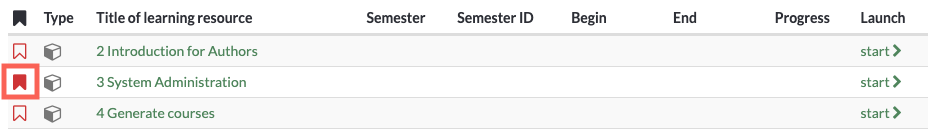

# Finding courses

The "Courses" menu item gives you access to the courses and possibly other
learning resources available to you. Click on the "Courses" menu item in the
main navigation at the top.

## My courses

Under "My Courses", you can view all courses and learning resources (Current
Courses), view only the courses you've marked as favorites (Favorites), view
courses that have already finished (Finished), or use the search to find a
course or learning resource based on a keyword.

You can also filter your courses based on various criteria, including the
timeline, membership status, and results. To do so, click the small arrow and
more filter options will appear. Learn more about how to best filter your
tables [here](../personal/Working_with_tables.md).

## Search

Use the search function to find all the learning resources you have access to.
Enter a keyword or the course title and have the matching courses or learning
resources displayed. Unfold the filter option to further narrow the search
based on the filters. You can also save the filter setting.

If you do not find a course, make sure that you have not activated a filter
that you do not want, e.g. only courses that you have not yet passed are
found. In this case, remove the corresponding filter.

Mark the course as a favorite when you have found it. To do this, click on the
white flag, which will then turn red. The next time you log in, you will find
the course directly in your favorites.

## Catalog

The OpenOlat catalog is similar to a paper version of the course catalog. The
structure of the catalog can be set up by the OpenOlat administrator or by a
catalog administrator, so that authors can sort courses and other learning
resources into the catalog in a meaningful way. The order of catalog entries
can be defined by the administrator or catalog administrator.

OpenOlat users can use the catalog to search for specific courses and learning
resources.

Use the search mask in case you should not find the appropriate course in the
catalog. It may be that the course author has not yet listed that course in
the OpenOlat catalog.

Use the search mask if you cannot find the desired course in the catalog. The
owner may not have entered the course in the catalog yet.

Only courses and learning resources that are also activated for learners can
be entered in the catalogue.

The visibility in the catalog depends on the publication status and access
settings of the learning resource:

User's role

|

Access settings

|

Publication status  
  
---|---|---  
Owner of learning resource| Private, Bookable, Open| Always visible  
Coach of learning resource| Private, Bookable, Open|  "Access for coach",
"Published" oder "Finished"  
Participant of learning resource| Private, Bookable, Open| "Published" or
"Finished"  
All OpenOlat users| Bookable, Open| "Published" or "Finished"  
Guests| Open & Access without login enabled| "Published" or "Finished"  
  
If a user also has courses assigned to a curriculum, the
„[Curricula](../curriculum/Curriculum_Management.md)" section will also appear in the
"Courses" menu.

  

  

