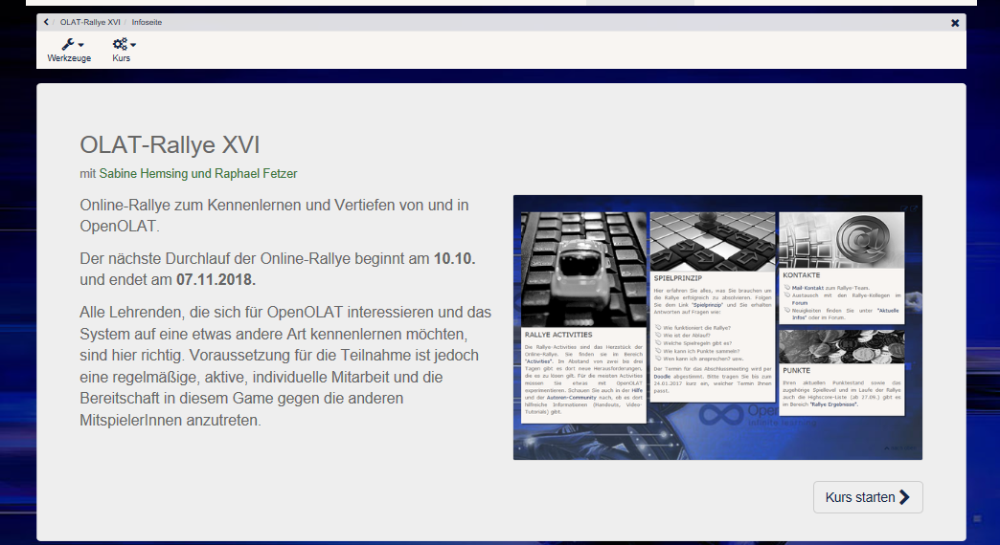
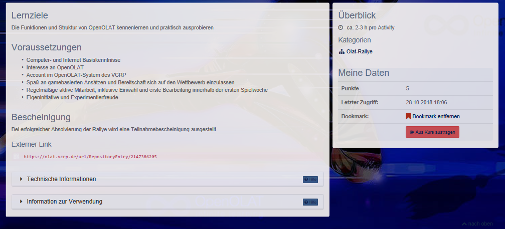
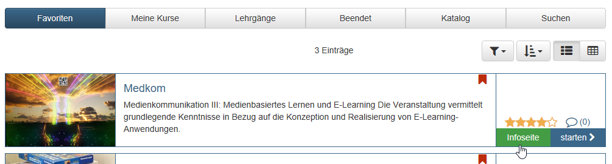
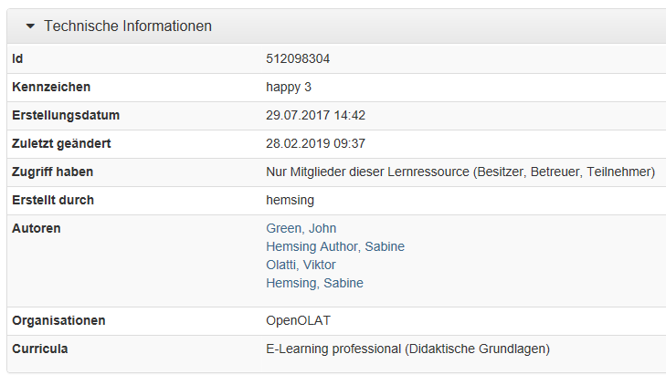
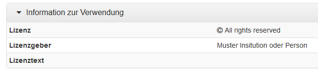
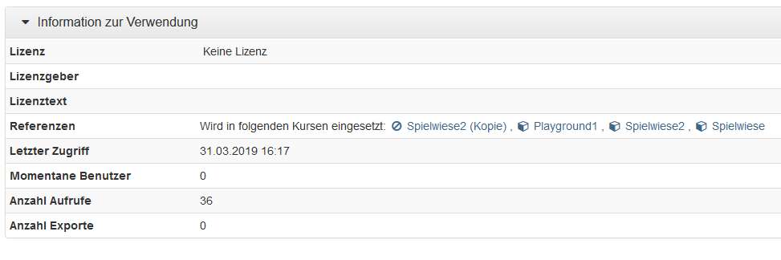
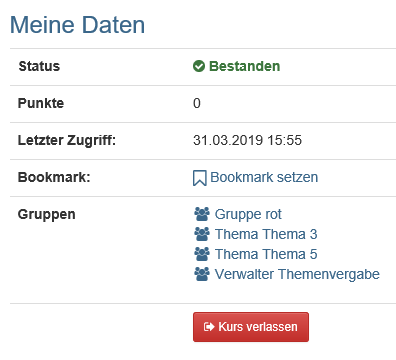
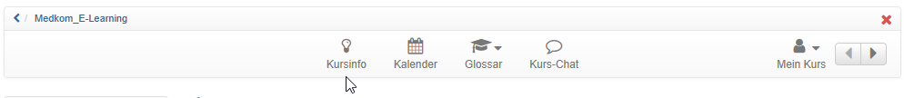

# Infoseite

Jeder Kurs und jede OpenOlat Lernressource verfügt über eine Infoseite. Bei
Kursen wird diese Seite als „Kursinfo“ bezeichnet. Die hier eingestellten
Informationen sind bereits sichtbar bevor ein Kurs bzw. Lernressource
überhaupt vom Lerner gebucht oder betreten wird.  

Lehrende können auf diese Weise der Zielgruppe schon im Vorfeld zentrale
Informationen zur Verfügung stellen. Hierzu zählen z.B.

  * Namen der beteiligten Lehrenden
  * Beschreibung der Veranstaltung
  * Sprache
  * Durchführungszeitraum
  * Zeitaufwand, Lernziele, Voraussetzungen, Bescheinigung
  * Lizenzart der Lernressource

Viele Lehrende ergänzen ein Bild oder Video zur Veranstaltung. Dieses Bild
sowie ein erster Teil der Beschreibung erscheinen dann auch in der Übersicht
unter „Meine Kurse“ bzw. „Favoriten“ sofern nicht die Tabellenansicht gewählt
wurde.

Die Infoseite enthält auch einen Link um den Kurs zu starten bzw. zu buchen.
OpenOlat generiert automatisch weitere Informationen die für die Nutzer
wichtig sind. Hierzu zählen:

  * Der externe Link zum Kurs bzw. zur Lernressource für den direkten Zugang
  * Technische Infos mit der Kurs ID, Datum der letzten Änderung u.ä. Die ID ist die automatisch generierte Identifikationsnummern der Lernressource. Mit dieser ID können Sie die Lernressource über die Suchmaske suchen.
  * Infos zur Verwendung mit Lizenzangaben zur Lernressource bzw. zum Kurs
  * Meine Daten mit dem aktuellen Status, dem letzten Zugriff usw.

Ferner besteht die Möglichkeit den Kurs bzw. die Lernressource mit Sternen zu
bewerten (sofern vom OLAT Admin aktiviert).

### Technische Informationen

Die Infos zu den Zugriffsberechtigungen, dem Ersteller und den aktuellen
Autoren sind nur für die OLAT Besitzer sichtbar.

### Informationen zur Verwendung

Beispiel für eine User Ansicht

Beispiel für eine Besitzer Ansicht

 **Lizenzinformationen:** Anzeige der zur Lernressource zugeordneten Lizenz
sowie - falls angegeben - Lizenzgeber und -text.

 **Referenzen:** Hier sehen Sie, welche Kurse diese Lernressource verwenden.
Solange die Lernressource in einem Kurs verwendet wird, kann sie nicht
gelöscht werden.

Der **letzte Zugriff** gibt an, wann die Lernressource das letzte Mal
gestartet wurde.

 **Momentane Benutzer:** Gibt an, wie viele Benutzer diese Lernressource
zurzeit in OpenOlat gestartet haben.

 **Anzahl Aufrufe:** Zählt automatisch, wie viel Male die Lernressource
insgesamt gestartet wurde. Wenn die Lernressource nicht in OpenOlat gestartet
werden kann, erscheint der Eintrag _Ausführung nicht unterstützt_.

 **Anzahl Exporte:** Zählt automatisch, wie viel Male die Lernressource
insgesamt heruntergeladen wurde.

### Meine Daten

Unter „Meine Daten“ finden Sie ihre benutzerspezifischen Informationen zum
Kurs, darunter den „Bestanden“-Status, wann Sie zum letzten Mal auf den Kurs
zugegriffen haben, und mit welchen Gruppen Sie im Kurs eingetragen sind. Hier
können Sie auch einen Bookmark auf den Kurs/die Lernressource setzen. Falls
der Besitzer des Kurses das Verlassen des Kurses gestattet, können Sie dies
hier ebenfalls tun.

## Wie findet man die Infoseite?

Zur Infoseite einer Lernressource gelangen Sie, wenn Sie im Bereich „Kurse“
oder „Katalog“ in der Liste auf den Link „Infoseite“ klicken oder wenn Sie im
Kursbetrieb in der Kurstoolbar das Icon  wählen.

Wenn Ihre gewählte Veranstaltung kaum Informationen umfasst, dann liegt es
daran, dass Ihr Lehrender diese Seite (noch) nicht weiter eingerichtet hat.

  

  

  

