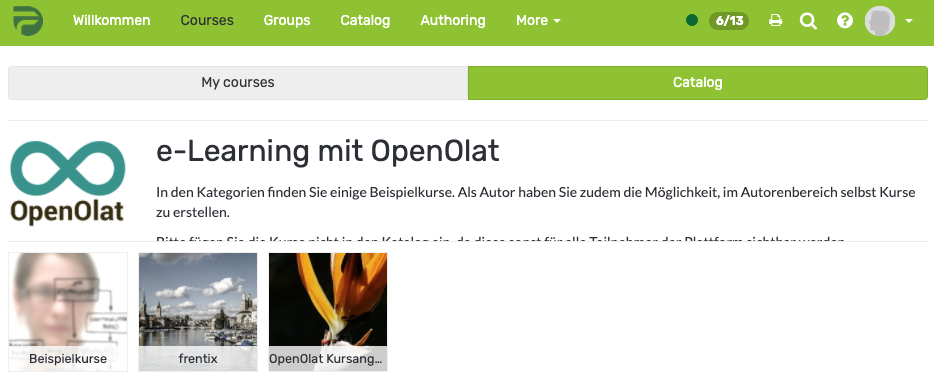

# Catalog 1.0

The Catalog 1.0 can be set up by an administrator or catalog administrator, so that authors can sort courses and other learning
resources into the catalog in a meaningful way. The order of catalog entries
can be defined by the administrator or catalog administrator.

OpenOlat users can use the catalog to search for specific courses and learning
resources.
Use the search mask in case you should not find the appropriate course in the
catalog. It may be that the course author has not yet listed that course in
the OpenOlat catalog.

Use the search mask if you cannot find the desired course in the catalog. The
owner may not have entered the course in the catalog yet.

Only courses and learning resources that are also activated for learners can
be entered in the catalogue.

The visibility in the catalog depends on the publication status and access
settings of the learning resource:

User's role | Access settings|Publication status
---|---|---  
Owner of learning resource| Private, Bookable, Open| Always visible  
Coach of learning resource| Private, Bookable, Open|  "Access for coach",
"Published" oder "Finished"  
Participant of learning resource| Private, Bookable, Open| "Published" or
"Finished"  
All OpenOlat users| Bookable, Open| "Published" or "Finished"  
Guests| Open & Access without login enabled| "Published" or "Finished"  
