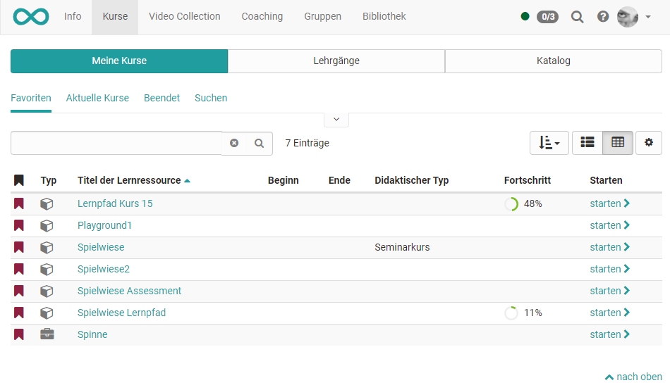

# Kurse und Katalog

Dreh- und Angelpunkt in OpenOlat sind die Kurse sowie weitere Lernressourcen,
also Lerninhalte und Lernaktivitäten aller Art. Dieses Kapitel erläutert die
Kurssuche und -buchung für OpenOlat-Benutzer ohne Autorenrechte.

Unter „[Kurse finden](Finding_courses.de.md)“ werden Funktionen und Ansichten für
reguläre OpenOlat-Benutzer erläutert und aufgezeigt, wie man Kurse suchen
kann. Auch findet sich eine Übersicht, was der Katalog ist und wie er im
Kursalltag helfen kann.

sites/manual_user/docs/catalog/index.de.md §Info_page.de.md§ 481
Unter "[Infoseite](Info_page.de.md)" wird die Infoseite, die detaillierte
Informationen über den Kurs bereitstellt, vorgestellt. Auch ist hier
ersichtlich welche Aktionen OpenOlat Benutzern zur Verfügung stehen.

