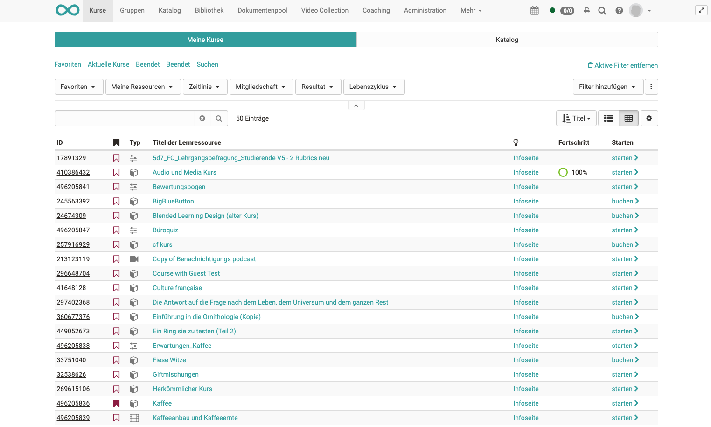

# Kurse und Katalog

Dreh- und Angelpunkt in OpenOlat sind die Kurse sowie weitere Lernressourcen,
also Lerninhalte und Lernaktivitäten aller Art. Dieses Kapitel erläutert die
Kurssuche und -buchung für OpenOlat-Benutzer ohne Autorenrechte.

## Kurse finden

[Link zur Seite](Finding_courses.de.md)

:octicons-device-camera-video-24: **Video-Einführung**: [Wo finde ich meine Kurse?](<https://www.youtube.com/embed/2sN32vLD9UY>){:target="_blank”}

Vorgestellt werden Funktionen und Ansichten für
reguläre OpenOlat-Benutzer und aufgezeigt, wie man Kurse suchen
kann. Auch findet sich eine Übersicht, was der Katalog ist und wie er im
Kursalltag helfen kann.

## Infoseite

[Link zur Seite](Info_page.de.md)

Es wird die Infoseite, die detaillierte
Informationen über den Kurs bereitstellt, vorgestellt. Auch ist hier
ersichtlich welche Aktionen OpenOlat Benutzern zur Verfügung stehen.
