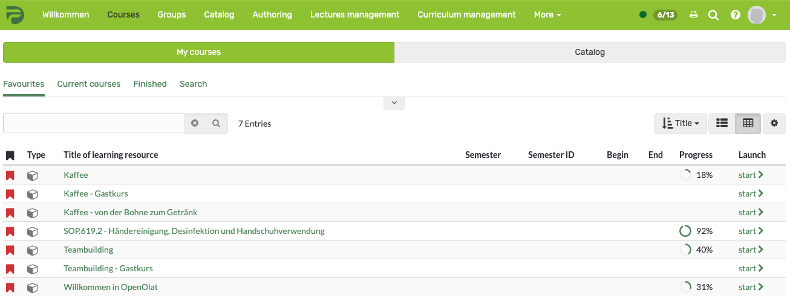

# Courses and Catalog

Courses and other learning resources, i.e. learning content and learning
activities of all kinds, are the linchpin of OpenOlat. This chapter explains
how to search for such resources and book them as OpenOlat user without author
rights.

"[Finding courses](Finding+courses.html)" explains tools and views for
ordinary OpenOlat users and how to search for courses. There are also
information about the catalog and how to use it.

"[Info page](Info+page.html)" introduces the courses' Info page, where
detailed information on the course is provided. Actions available to users
without authors rights will be explained here.

