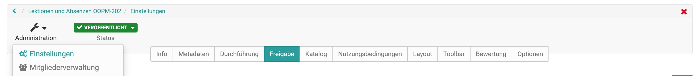

# Zugangskonfiguration {: #access-configuration}

Damit ein Kurs für die Lernenden sichtbar wird, muss er zunächst
veröffentlicht werden. Wird der Kurs für alle Benutzer freigegeben, kann der
Zugang zusätzlich mit einer Buchungsmethode, z.B. einem Passwort versehen
werden.

Generell werden folgende Varianten der Publikation unterschieden, die unter
"Status" in der Toolleiste eines Kurses sichtbar sind:

Veröffentlichung (Publikationsstatus)

Eine neu erstellte Lernressource ist standardmässig nur für die jeweiligen
Besitzer zugänglich und hat den Publikationsstatus "Vorbereitung". Unter
"Status" kann der Zustand verändert und die Lernressource für weitere
Mitglieder zugänglich gemacht werden:

Publikationsstatus| Zugriff|
---|---|  
Vorbereitung | Nur Besitzer dieser Lernressource haben Zugriff.|
 Review | Nur Besitzer dieser Lernressource haben Zugriff. Alle Vorbereitungen zu dieser Lernressource sind abgeschlossen und die Inhalte sind zur weiteren Überprüfung freigegeben.  
Freigabe Betreuer | Besitzer und Betreuer dieser Lernressource haben Zugriff.  
Veröffentlicht | Der Kurs ist nun auch im Bereich "Kurse" auffindbar. Alle Mitglieder der Lernressource haben Zugriff.  
Beendet | Alle Mitglieder haben weiter Zugriff auf den Kurs, können aber nur noch lesen.  
  
Die konkrete Variante des Kurszugangs (bzw. generell des Zugangs zu einer
Lernressource)  wird im Menü "Freigabe" der Kurs "Administration"
eingerichtet. Im Folgenden erfahren Sie welche Optionen Ihnen zur Verfügung
stehen.  

## Zugang für Teilnehmer organisieren

Der Zugang zu einem Kurs wird in der "Administration" → "Einstellungen" im Tab
"Freigabe" konfiguriert.

Zwei grundsätzliche Varianten stehen zur Verfügung:

Bei der  wahl **"Privat"** werden die Teilnehmer durch den Besitzer bzw. Personen, die über das Recht der Mitgliederverwaltung verfügen,eingetragen.

Bei der Wahl der Option **"Buchbare und offene Angebote"** können die Lernenden einen Kurs/Lernessource
selbst buchen, müssen aber eventuell (je nach Einstellung) ein Passwort
eingeben.

## Freigabe für andere Autoren

Des weiteren kann im Tab "Freigabe" festgelegt werden, welche zusätzlichen
Rechte andere OpenOlat Autoren an der Lernressource bzw. dem Kurs haben. Dabei
gelten die Rechte generell für alle OLAT Autoren der Instanz.

Autoren können | Erklärung  
:-----|:------------------
referenzieren | Lernressourcen wie zum Beispiel Glossar, Formular oder Test können in Kursen anderer Autoren eingebunden werden kann.  
kopieren | Die Lernressource kann von allen anderen Autoren kopiert werden.  
exportieren | Die Lernressource ist für alle andere Autoren zum Download freigegeben.  
  
Die Optionen "referenzieren" und "kopieren " machen z.B. Sinn, wenn Sie eine
Vorlage oder gutes Beispiel für andere OpenOlat Autoren nutzbar machen
möchten.

## Angebote erstellen

Haben Sie zuvor die Option "Buchbare und offene Angebote"
gewählt können Sie anschließend Angebote erstellen.

Sie können definieren wann und unter welchen Voraussetzungen die Benutzer des
Systems eine Lernressource buchen können. Buchen kann dabei als Synonym für
belegen, einschreiben, einkaufen verstanden werden.

Wählen Sie die Schaltfläche "Angebot erstellen", um Angebote hinzuzufügen.

{ class="size24" }  **Zugangscode**

Wählen Sie die Buchungsmethode Zugangscode um die Buchung auf einen bestimmten Personenkreis einzuschränken. Nur Personen die über diesen Zugangscode verfügen können die Ressource buchen. Vor dem ersten Öffnen des Kurses muss dieser Code, der beispielsweise im Vorfeld per Mail verschickt oder bei Blended-Learning Veranstaltungen an die Tafel geschrieben wurde, vom Benutzer eingegeben werden. Der Code braucht nur einmal eingetragen zu werden.

{ class="size24" } **Frei verfügbar**

Wählen Sie diese Option, wenn keine weiteren Einschränkungen gelten. Alle OLAT Benutzer können die Lernressource öffnen und benutzen. Ein Benutzer wird dadurch als Teilnehmer hinzugefügt. Wird die Funktion  _"Automatisches Buchen"_  eingeschaltet, werden Benutzer automatisch auf die Kursansicht geleitet, ohne die Lernressource mit Hilfe des Buchungsdialogs noch ausdrücklich buchen zu müssen. Der Vorteil gegenüber der Option "offen ohne Buchung" ist, dass der Besitzer sieht, wer seinen Kurs gebucht hat.

{ class="size24" }   **PayPal und Kreditkarte**
  
Ist nur verfügbar wenn vom [Administrator freigeschaltet](../../manual_admin/administration/PayPal_Configuration.de.md): Wählen Sie die PayPal/Kreditkarten Buchungsmethode um eine Buchung gegen eine finanzielle Vergütung zu ermöglichen. Bei dieser Buchungsmethode können Sie einen Betrag definieren, der mit einem PayPal Konto oder mit einer Kreditkarte (Visa/Mastercard) bezahlt werden muss. (Diese Funktion steht nur Benutzern mit Autorenrechten zur Verfügung)

Optional kann einer Buchungskonfiguration ein Start- und Enddatum beigefügt werden. Diese Konfiguration ist dann nur zwischen dem konfigurierten Datum
gültig. Sie können auch nur ein Start- oder nur ein Enddatum angeben. Möchten
sie keine zeitliche Einschränkung vorgeben so lassen Sie dieses Feld leer.
Buchungsmethoden können nachträglich angepasst werden.

Sie können auch mehrere Buchungsmethoden konfigurieren. Diese gelten als
verschiedene Optionen, aus denen der Benutzer wählen kann, achten Sie in
diesem Fall auf sinnvolle Beschreibungen. So können z.B. Kurscodes für
Personen aus unterschiedlichen Kontexten kombiniert oder ein Kurs bis zu einem
bestimmten Termin frei und danach nur noch mit Passwort zugänglich
eingerichtet werden.

Achtung: Ein angegebenes Start- oder Enddatum bezieht sich ausschliesslich auf
den _Buchungsprozess_ nicht auf den Durchführungszeitraum der Lernressource.
Hat ein Benutzer eine Ressource gebucht, so wird die Person in der
Teilnehmerliste dieser Ressource eingetragen. Von dem Zeitpunkt an entscheidet
das System einzig über die Teilnehmerliste ob eine Person Zugang zu einer
Ressource hat. Abgelaufene Buchungskonfigurationen haben daher keinen Einfluss
auf eine Teilnehmerschaft. Als Besitzer der Ressource können Sie auch
jederzeit eine Person zu der Teilnehmerliste hinzufügen bzw. austragen. In dem
zweiten Fall kann der Benutzer durch erneutes Buchen sich wieder in die
Ressource als Teilnehmer eintragen.

Sie können die konfigurierten Buchungsmethoden jederzeit problemlos löschen.
Die bereits getätigten Buchungen bleiben bestehen und sind davon nicht weiter
tangiert.

## Lernressource verlassen

Im Tab "Freigabe" kann auch definiert werden (sofern vom Administrator
erlaubt), ob bzw. wann die Benutzer einen Kurs bzw. eine Lernressource
verlassen können. Folgende Optionen stehen zur Wahl:

* Jederzeit (Standard): Benutzer können beliebig aus dem Kurs austreten
* Nach Enddatum: Wurde ein Durchführungszeitraum festgelegt, ist es Teilnehmern nach Ablauf dieses Zeitraums gestattet den Kurs zu verlassen. Wurde diese Option gewählt ohne zuvor in der Beschreibung einen Durchführungszeitraum zu wählen, wird es den Teilnehmern zu keinem Zeitpunkt gestattet sein den Kurs zu verlassen.
* Nie: Teilnehmer dürfen den Kurs zu keinem Zeitpunkt verlassen

Wenn Teilnehmer den Kurs verlassen dürfen, können sie dazu im Menü "Mein Kurs"
den Eintrag "Kurs verlassen" wählen.

Standardmässig können Benutzer einen Kurs bzw. eine Lernressource zu jeder
Zeit verlassen.

## Kurszyklus: Beenden und löschen

Wurde ein Kurs durchgeführt und ist abgelaufen kann er beendet und/oder
gelöscht werden.

Wenn ein Kurs **beendet** wird, befindet er sich anschliessend im Lesemodus.
Alle Benutzerdaten bleiben bestehen und alle Kursmitglieder haben nach wie vor
Zugriff auf den Kurs. Der Kurs befindet sich jedoch nicht mehr im Tab „Meine
Kurse“, sondern im Tab „Beendet“ gleich nebenan.

  
Im Autorenbereich wird der beendete Kurs mit einem neuen Symbol und
durchgestrichen angezeigt.

Falls der Kurs wieder geöffnet werden soll, rufen Sie erneut den Lebenszyklus
des Kurses auf und klicken Sie auf "Erneut öffnen".

### Kurs löschen

Im Menü "Administration" → "Löschen" bzw. über das 3-Punkte
Menüim
Autorenbereich kann eine Lernressource gelöscht werden. In diesem Fall wird
die Lernressource in den Tab "Gelöscht" verschoben und liegt sozusagen im
Papierkorb.
