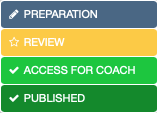
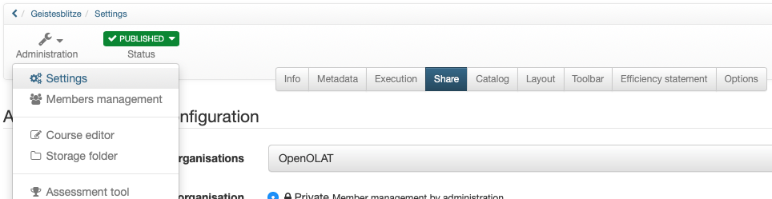
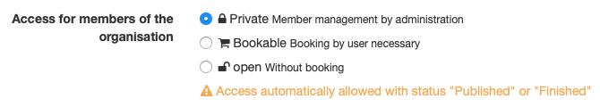
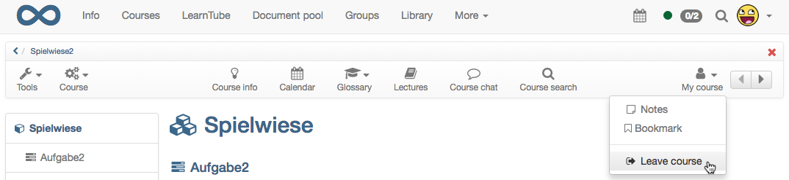
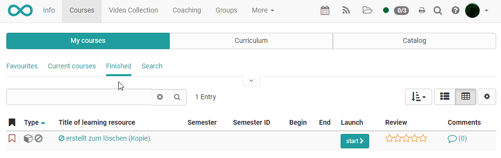

# Access configuration

In order for a course to be visible to learners, it must first be published.
If the course is released for all users, the access can additionally be
provided with a booking method, e.g. a password.

In general, a distinction is made between the following publication variants,
which are visible under "Status" in the toolbar of a course:

## Publication

A newly created learning resource is by default only accessible to its owners
and has the publication status "Preparation". Under "Status" the status can be
changed and the learning resource can be made accessible to other members:

Publication status| Access| Display  
---|---|---  
  
  * Preparation

| Only owners of this learning resource have access.|

  

  

  
  
  * Review

| Only owners of this learning resource have access. All preparations for this
learning resource have been completed and the contents have been released for
further review.  
  
  * Access For Coach

| Owners and coaches of this learning resource have access.  
  
  * Published

| All members of the learning resource have access.  
  
  * Finished

| All members still have access to the course, but can only read.  
  
The concrete variant of course access (or access to a learning resource in
general) is set up in the "Share" menu of the "Administration" course. In the
following, you will learn which options are available to you.

## Organize access for members

The access to a course is configured in the "Administration" → "Settings" in
the tab "Share".

Three basic variants are available:

With the private member administration the participants are registered by the
owner and/or persons, who have the right of the member administration.

If the "Bookable" option is selected, learners can book a course/learning
resource themselves, but may have to enter a password (depending on the
setting).

If the setting "open without booking" is selected, everyone can attend the
course and it is not visible to the owners who has dialed into the course. If
required, guests without OpenOlat identification can also be granted access to
the learning resource via this option.

## Configure booking methods

If you have previously selected the option "Bookable - Booking by user
necessary", you can then continue to set up the booking method and also check
whether the users should receive a confirmation e-mail.

You can define when and under which conditions the users of the system can
book a learning resource. Booking can be understood as a synonym for
occupying, enrolling, shopping.

Select the button "Add booking method" to add one of the following booking
methods:

  *  **  Freely available**: Select the free booking method if no other restrictions shall apply. All users can book the resource. Using this booking method adds users as participants to the resource, but will not add them to a group, thus working like the enrolment course element. Once the feature " _Freely available"_  is activated, users will automatically be directed to the course view, without the need to confirm the booking through the booking dialog.
  *  **  Access code**: Select the access code booking method if booking shall be restricted to people in possession of a specific access code. The access code must be provided to participants, e.g. by email. The participants must enter the access code before they can open a corresponding course. This is the method of choice when providing payable courses, or courses with otherwise limited access, respectively.
  *  **  PayPal and credit card** (only available if unlocked by an administrator): Select the PayPal/Credit card payment method require a financial payment to access a resource. When using this booking method you can define an amount of money required to be payed in the currency defined in the system configuration. This amount can then be payed by either a PayPal account or by using a credit card (Visa/Mastercard). (This feature is only available for users with author rights)

Optionally, you can add a validity period to each booking method in order to
control resource access in addition to the use of visibility and access rules.
In that case the booking method is only available during this period. It is
also possible to specify just a start or just an end time. If you don't want
to restrict the booking method to a specified period, just leave the fields
empty. You can edit booking methods at any time after the initial setup.

You may also configure more than just one booking method. The user will then
have several booking options to choose from. As an example, you can combine
course codes for users form different contexts, or set the time point for a
course such that it is first freely accessible and only later requires a
password to log in, respectively. In addition, it can be defined if self-
registered users will get a confirmation email.

Attention: the start and end date is only valid for the  _booking process_.
Once a resource has been booked by a user he will be added to the resource
members list. From that moment the members list grants access to the user.
When a booking method is no longer valid or has been deleted users on the
members list will still have access to the resource. As an owner of the
resource you can add or remove users to/from the resource members list at any
time.

You can delete configured booking methods at any time. The already booked
orders will not be affected by this.

Since OpenOlat version 13, the publication status is separated from the
booking method. This allows you to configure the booking method before the
actual publication and to activate it by changing the publication status.

## Leaving a learning resource

The system administrator determines in the administration tab whether course
participants are per default allowed to leave the course at any time, never,
or after the course end date. You can override the default setting anytime.
The following options are available:

  * At any time (Default): Participants may leave the course at any given time.
  * After course end date: If an [execution period](https://confluence.openolat.org/display/OO130EN/Access+configuration#Accessconfiguration-d14e1774) has been configured for the course, this options allows participants to leave the course at the end of this time period. If this option was selected without a configured execution period, participants are not allowed to leave the course at any time.
  * Never: Participants may never leave the course.

If members are allowed to leave the course, they can do so by selecting "Leave
course" in the "My course" menu.

By default, users can leave a course or learning resource at any time.

## Release for other authors

Furthermore, the tab "Share" can be used to define which additional rights
other authors have to the learning resource.

Authors can

|

Description  
  
---|---  
  
  * reference

|

This option is not relevant for courses.

For other learning resources (e.g. a glossary or test) it is then possible for
other course authors to include them in their courses.  
  
  * copy

| The learning resource can be copied by other authors.  
  
  * download

| The learning resource is available for download by other authors.  
  
The options "reference" and "copy" make sense if you want to use a template or
a good example for other OpenOlat authors.

## Lifecycle: Finish/Delete

If a course has been completed and has expired, it can be finished and/or
deleted.

If a course is  **completed** , it is then in read mode. All user data is
retained and all course members still have access to the course. The course is
no longer in the tab "My Courses", but in the tab "Finished" next to it.

  

Im Autorenbereich wird der beendete Kurs mit einem neuen Symbol und
durchgestrichen angezeigt.

Falls der Kurs wieder geöffnet werden soll, rufen Sie erneut den Lebenszyklus
des Kurses auf und klicken Sie auf "Erneut öffnen".

### Delete course

A learning resource can be deleted in the menu "Administration" → "Delete" or
via the action
menuin
the author area. In this case, the learning resource is moved to the "Deleted"
tab and is in the trash, so to speak.

  

