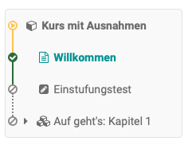

# Kurseinstellungen

Das Menü "Einstellungen" der "Administration" bietet weitere zentrale
Konfigurationen für Ihren OpenOlat Kurs.

Jede [Lernressource](../authoring/Various_Types_of_Learning_Resources.de.md), nicht nur
Kurse, verfügen über ein Menü "Einstellungen". Ferner variieren die
Einstellungen von herkömmlichen und Lernpfad Kursen leicht.

  

**Kurseinstellungen**

  * 1Tab Info
  * 2Tab Metadaten
  * 3Tab Durchführung
  * 4Tab Freigabe
  * 5Tab Katalog
  * 6 Tab Nutzungsbedingungen
  * 7 Tab Layout
  * 8Tab Toolbar 
  * 9 Tab Bewertung
  * 10 Optionen

Über die Tabs "Info", "Metadaten", "Durchführung" und "Freigabe" können Sie
Informationen die in der Kursinfo sichtbar werden einrichten.

## Tab Info

Hier definieren Sie weitere Informationen zum Kurs bzw. Lernressource. Hierzu
zählen beispielsweise: Titel, Beschreibung, Lernziele, Voraussetzungen,
Anforderungen an die Bescheinigung, Titelbild und Teaser-Film. Diese Infos
sind für Interessierte auch ohne Kurszugang unter (Kurs)info sichtbar. Unter
dem hier definierten Titel erscheint die Lernressource in der alphabetischen
Kursliste und ist für Anfragen über die Suchmaske relevant. Weitere Infos
finden Sie [hier](../authoring/Set_up_info_page.de.md).

## Tab Metadaten

Hier können Sie weitere Dinge, die unter „Infos“ erscheinen, z.B. die Namen
der Lehrenden des Kurses, eintragen. Auch kann der Kurs einem vorgegebenen
didaktischen Typ wie Selbstlernkurs oder Prüfungskurs zugeordnet werden.
Besonders relevant ist auch der Eintrag der Lizenz des Kurses.

## Tab Durchführung

Hier können Sie den Durchführungszeitraum des Kurses definieren, das
„[Lektionen- und Absenzmanagement](../course_operation/Lectures_and_absences.de.md)“ einschalten
und weiter konfigurieren (sofern vom Administrator aktiviert), existierende
herkömmliche Kurse in Lernpfad Kurse konvertieren bzw. bei [Lernpfad
Kursen](Learning_path_course.de.md) definieren,
wie der Lernfortschritt berechnet wird, anhand der Anzahl der Kursbausteine
oder anhand der Bearbeitungsdauer der Kursbausteine.

## Tab Freigabe

Im Tab "Freigabe" definieren Sie wie und für wen ein Kurs oder eine
Lernressource freigegeben wird. Weitere Informationen zur Einrichtung der
passenden Zugangskonfiguration finden Sie [hier](Access_configuration.de.md).

## Tab Katalog

Über den Button "In Katalog einfügen" kann die Lernressource in den Katalog
eingetragen und einer oder mehreren vordefinierten Kategorie zugeordnet
werden. Um den Kurs oder die Lernressource in mehrere Katalogbereiche
einzutragen muss der Schritt wiederholt werden. Anschließend erscheinen alle
Katalogeinträge hier im Tab "Katalog" und können hier auch wieder entfernt
werden.

Der gesamte OpenOlat [Katalog ](../catalog/Finding_courses.de.md)ist für alle User im Menü
"Kurse" einsehbar.

Tragen Sie Ihre Kurse erst in den Katalog ein, wenn diese fertiggestellt sind
und für die Benutzer sichtbar sein sollen.

  

##  Tab Nutzungsbedingungen  {: #disclaimer}

Hier können frei definierbare kursbezogene Nutzungsbedingungen und eine
kursbezogene Datenschutzerklärung aktiviert und hinterlegt werden. Startet
eine Person den Kurs, muss sie zunächst die Bedingungen akzeptieren, ansonsten
ist ein Kurszugang nicht möglich. In der [Mitgliederverwaltung
](../course_operation/Members_management.de.md)sehen Sie im Bereich "Einwilligungen" welche
Personen die Bedingungen bereits akzeptiert haben.

##  Tab Layout

Unter Layout kann eine Layoutvorlage für einen Kurs ausgewählt, die linke
Kursnavigation und auch die Krümelnavigation für Teilnehmende ausgeblendet
werden. Je nach Einstellungen durch den Kursadministrator stehen Ihnen
bestimmte Layoutvorlagen, mindestens aber eine Standard Vorlage zur Verfügung.
Darüber hinaus können Sie im [Ablageordner
](../course_operation/Using_Course_Tools.de.md#EinsatzderKurswerkzeuge-_ablageordner)des
Kurses eigene CSS Kursvorlagen hinterlegen und im Menü Layout verknüpfen. So
lassen sich z.B. Schriften und Farben für Texte, Überschriften, Links, das
Menü und die Toolbox individuell gestalten und mit einem passenden Logo
versehen.

Im Bereich "Standard Stil Kursbausteine" können Sie die Basisdarstellung der
Kursbausteine definieren und z.B. ein Hintergrundbild hochladen und den Stil
des Bildes definieren sowie eine Farbkategorie zuordnen. In der Vorschau sehen
Sie die Auswirkungen.

## Tab Toolbar

Hier schalten Sie die Toolbar sowie die konkreten einzelnen Werkzeuge der
Toolbar ein oder aus. Auf diesem Weg können Tools, die kontinuierlich zur
Verfügung stehen sollen, an einer zentralen Stelle aufgerufen werden. Zu den
[Tools ](../course_operation/Using_Additional_Course_Features.de.md)zählen neben der
Kurssuche, dem Glossar und dem Kurs-Chat diverse Werkzeuge, die auch als
Kursbausteine aufrufbar sind, z.B. Kalender, Teilnehmerliste, E-Mail, Blog,
Wiki, Forum und Dokumenten Ordner. Bei [Wiki ](Wiki+erstellen.html)und [Blog
](Blog+erstellen.html)kann auch auf bereits erstellte Lernressourcen
zurückgegriffen werden. Die anderen Tools ähneln zwar den entsprechenden
Kursbausteinen, bieten aber nicht die weiteren Konfigurationsmöglichkeiten wie
sie in den Kursbausteinen im Kurseditor zur Verfügung stehen.

Die Nutzung der Tools der Toolbar ist besonders für linear gestaltete
[Lernpfad Kurse](Learning_path_course.de.md)
wichtig, um unabhängig von einer sequenziellen Abfolge der Lernschritt,
wichtige Tools kontinuierlich und zentral zur Verfügung zu stellen.

  

### Konfiguration der Anzeige des Navigationsmenüs bei Lernpfadkursen

Unter Kurseinstellungen > Layout > Navigation kann die Anzeige diese flexibel
für unterschiedliche Bedürfnisse eingestellt werden.

In Lernpfadkursen wird der Lernpfad auch im Navigationsmenü visualisiert. Dies
ist für strengere Lernpfadszenarios mit überwiegend obligatorischen
Kursbausteinen sinnvoll. Bei offeneren Kursen ohne vorgegebene
Bearbeitungsreihenfolge braucht es diese Visualisierung nicht, die typischen
Kursbaustein-Icons eignen sich dafür besser.

Unter Kurseinstellungen > Layout > Navigation kann die Anzeige flexibel für
unterschiedliche Bedürfnisse eingestellt werden.

  

##  Tab Bewertung {: #assessment}

In diesem Tab können Sie die Verwendung von **Leistungsnachweisen** aktivieren
und ein **Zertifikat** automatisiert erzeugen lassen. Wenn Sie die Option
"Leistungsnachweise verwenden" aktivieren, erscheint im Kurs im Toolbar Menü
"[Mein Kurs](../learning_activities/Additional_Course_Features.de.md)" die
Option "Leistungsnachweis" und die Kursteilnehmer sehen einen Überblick über
die bewertbaren Kursbausteine mit ihrem jeweiligen aktuellen Bewertungsstatus.
Wurde auch die Option "PDF Zertifikat erzeugen" aktiviert, erscheint hier auch
das erhaltene Zertifikat, sobald alle Bedingungen für einen bestandenen Kurs
erfüllt sind.

Sie können die Zertifikaterstellung auch im
"[Bewertungswerkzeug](../course_operation/Assessment_tool_-_overview.de.md)"
aktivieren.

Der Link zum Leistungsnachweis erscheint im Kurs erst dann, wenn im Kurs
mindestens einen bewertbaren Kursbaustein existiert, und der Kursteilnehmer
bereits mindestens eine manuelle oder automatische Bewertung erhalten hat.
Dies kann z.B. der Lösungsversuch eines Tests sein oder die Bewertung einer
Aufgabe.

Wenn Sie die Funktion ausschalten, sehen Ihre Kursteilnehmenden keine
Leistungsnachweise mehr. Die Leistungsnachweise gehen nicht verloren, sondern
werden lediglich nicht mehr angezeigt.

Wenn Sie den Leistungsnachweis wieder einschalten, stehen alle aktuellen Daten
wieder zur Verfügung. Wenn Sie hingegen einen Kurs mit bestehenden
Leistungsnachweisen löschen, können die Benutzer nach wie vor ihre
Leistungsnachweise einsehen.

### PDF Zertifikat erzeugen

Ein PDF Zertifikat kann als Bestätigung für den Besuch eines Kurses bzw. der
Erreichung von kursbezogenen Aktivitäten verwendet werden. Ein Zertifikat kann
auch ausgestellt werden ohne die Verwendung eines Leistungsnachweises. Sie
wählen aus, ob das Zertifikat **manuell** vom Betreuer ausgestellt wird, oder
**automatisch** nach Bestehen des Kurses. Die Auswahl "manuell" gestattet
Ihnen die Verwendung von Zertifikaten in Kursen ohne bewertbare Kurselemente.
Wenn das Zertifikat manuell ausgestellt werden soll, kann der Betreuer dies im
Bewertungswerkzeug in der Leistungsübersicht der einzelnen Benutzer vornehmen.
Bei automatischer Ausstellung erhält der Benutzer eine E-Mail-Benachrichtigung
sobald die Erstellung eines Zertifikates ausgelöst wurde.

Standardmässig wird für einen Kurs einmalig ein Zertifikat ausgestellt. Falls
ein Zertifikat jedoch regelmässig erneuert werden muss, z.B. bei Sprachkursen,
kann eine Rezertifizierung zugelassen werden. Sie legen die Zeitspanne in
Tagen, Wochen, Monaten oder Jahren fest. Um die Gültigkeit des Zertifikats zu
überprüfen, muss der Vorlage das Attribut certificateVerificationUrl
hinzugefügt werden. Dieses erlaubt es, mittels QR-Code das Zertifikat zu einem
späteren Zeitpunkt nochmals zu generieren und mit der vorliegenden Version zu
vergleichen. Sofern beide Versionen übereinstimmen, kann das Zertifikat als
gültig erklärt werden. Der QR-Code zur Validierung ist allerdings nur bei
Verwendung eines HTML-Formulars möglich.

Als Vorlage für das Zertifikat dient in der Regel eine systemweite, vom
Administrator festgelegte PDF-Vorlage. Wenn Sie eine eigene Vorlage verwenden
möchten, können Sie diese unter  **Zertifikatvorlage**  hochladen.

Eine PDF-Vorlage ist keine gewöhnliche PDF-Datei, sondern muss mit HTML
erzeugt werden, um Layout und Variablen zu gewährleisten.

Mit diesem [Zertifikatsbot](https://tools.vcrp.de/zertifikatsbot/) können
einfach und schnell Zertifikatsvorlagen im HTML-Format erstellt werden. Wer
den Bot an seine Bedürfnisse anpassen möchte, dem steht das
[Repository](https://gitlab.vcrp.de/openolat/zertifikatsbot) mit dem
öffentlich geschalteten Code (MIT Lizenz) zur Verfügung.

Die Formularfelder müssen bestimmte Variablen enthalten, die vom System später
durch die spezifischen Daten ersetzt werden. Es können alle Attribute als
Variablen verwendet werden. Bei PDF-Vorlagen werden die Variablennamen ohne
$-Präfix, bei HTML-Formularen mit $-Präfix verwendet.

Zum Formatieren von Datumsformaten steht das "dateFormatter"-Objekt zur
Verfügung. Damit lassen sich die "*Raw" formate mittels "formatDate()"
formatieren oder mit formatDateRelative(Date baseLineDate, days, months,
years) eine angegebene Periode addieren.

  

  

 Hier eine Übersicht über die wichtigsten Variablen:

_Benutzer:_

  * $fullName
  * $firstName
  * $lastName
  * $birthDay
  * $institutionalName
  * $orgUnit
  * $studySubject

 _Kurs:_

  * $title
  * $externalReference
  * $authors
  * $from (date)
  * $fromLong (date)
  * $location
  * $to (date)
  * $toLong (date)
  * $expenditureOfWork
  * $mainLanguage

 _Daten zur Leistung (alle Kurstypen):_

  * $score
  * $status

 _Daten zur Leistung (nur Lernpfadkurs):_

  * $maxScore
  * $progress

 _Daten zum Zertifikat:_

  * $dateFirstCertification
  * $dateFirstCertificationLong
  * $dateFirstCertificationRaw
  * $dateCertification
  * $dateCertificationLong
  * $dateCertificationRaw
  * $dateNextRecertification
  * $dateNextRecertificationLong
  * $dateNextRecertificationRaw  

  * $certificateVerificationUrl

 _ Relatives Datum:_

Auf dem Zertifikat können Daten angegeben werden, die relativ zu einem Raw-
Datum berechnet werden:

Methode und Parameter| Beispiel: $dateNextRecertificationRaw = 15.11.2021  
---|---  
  
Relatives Datum kurz:

$formatter.formatDateRelative(Originaldatum, "Sprachcode", +/- Tage, +/-
Monate, +/- Jahre)

|

$formatter.formatDateRelative($dateNextRecertificationRaw, "de", 7, -2, 10)

==> Relatives Datum = 22.09.2031  
  
Relatives Datum lang:

$formatter.formatDateLongRelative(Originaldatum, "Sprachcode", +/- Tage, +/-
Monate, +/- Jahre)

|

$formatter.formatDateRelative($dateNextRecertificationRaw, "de", 7, -2, 10)

==> Relatives Datum = 22. November 2031  
  
  

 _Daten aus der Kursbeschreibung:_

  * $!description  

  * $!objectives  

  * $!requirements  

  * $!credits

 _Optionale Variablen:_

  * $custom1
  * $custom2
  * $custom3

  

Sollten Sie eine Zertifikatvorlage wünschen, kontaktieren Sie uns unter
[support@frentix.com](mailto:support@frentix.com) für einen Kostenvoranschlag
für eine Vorlage gemäss Ihren individuellen Wünschen.

  

Die Option **Rezertifizierung erlauben** bewirkt die Erstellung eines neuen
Zertifikats nach einer vorgegebenen Zeitperiode.

  

### Upload externer Zertifikate

Nutzer können auch externen Zertifikate in OpenOlat hochladen, um ihr Profil
zu vervollständigen. Im persönlichen Menü unter dem Tab "Leistungsnachweise"
befindet sich die Schaltfläche "Zertifikat hochladen".

Der Upload externer Zertifikate kann nun für die Benutzer im persönlichen
Bereich "Leistungsnachweise" freigeschaltet werden (Administration >
eAssessment > Zertifikate). Zusätzlich ist diese Funktion auch für
Benutzerverwalter, Linienvorgesetzte derselben Organisation oder für
verantwortliche Personen, die über eine Benutzer-zu-Benutzer-Beziehungen
verbunden sind, verfügbar und kann jeweils separat konfiguriert werden.

  

### Tab Bewertung für Lernpfad Kurse

Bei [Lernpfad
Kursen](Learning_path_course.de.md) werden in
dem Tab Bewertung zusätzlich auch die Kriterien für das **Bestehen** des
gesamten Kurses eingestellt. Ein Bestehen kann z.B. erfolgen, wenn ein Lerner
100% beim Lernfortschritt erreicht hat, alle oder eine bestimmte Anzahl von
Kursbausteinen bestanden hat oder eine bestimmte Mindestpunktzahl erreicht
hat. Dabei ist es ausreichend eins der markierten Kriterien zu erfüllen (Oder-
Optionen).

Im Einzelnen stehen folgende Konfigurationsmöglichkeiten zur Verfügung:

  * Punkte: Hier kann definiert werden ob bzw. welche Art von Punkten (Gesamtpunkte oder Durchschnitt) noch ergänzend zu der Prozentanzeige im Kurs angezeigt wird. 
  * Betreuer kann Bewertung freigeben: Hier kann eingestellt werden, ob der Betreuer die Möglichkeit haben soll, die Bewertung für die Teilnehmer freizugeben.
  * Manuelles bestanden definieren: Dieses Feld ist nur verfügbar, wenn das Feld "Betreuer kann Bewertung freigeben" aktiviert ist. In diesem Fall kann der Kurs Betreuer bzw. Besitzer im Bewertungswerkzeug manuell einstellen, ob ein Kursteilnehmer den Kurs bestanden hat oder nicht.
  * Lernfortschritt 100 %: Wenn alle obligatorischen Kursbausteine abgeschlossen wurden und 100 % angezeigt wird, gilt der Kurs automatisch als bestanden.
  * Alle Kursbausteine bestanden: Der Kurs gilt als bestanden, wenn alle bewertbaren Kursbausteine, die mit einem "bestanden/nicht bestanden" versehen sind, bestanden wurden, egal ob sich um obligatorische oder freiwillige Kursbausteine handelt. Um einzelne Kursbausteine auszunehmen, muss im Tab "Bewertung" des Kursbausteins im Kurseditor "Bei Kurs-Bewertung ausschliessen" angehakt sein.
  * Anzahl Kursbausteine bestanden: Hier können Sie definieren, wie viele Kursbausteine bestanden sein müssen, damit der gesamte Kurs als bestanden gilt.
  * Punktschwelle erreicht: Hier können Sie definieren, wie viele Punkte Lernende erreichen müssen, damit der gesamte Kurs als bestanden gilt.

Nur wenn unter "Punkte" Summe oder Durchschnitt gewählt wurde, kann im
Kurseditor auch der Reiter "Highscore" konfiguriert werden.

Bei herkömmlichen Kursen werden die Kriterien für das Bestehen eines Kurses im
Kurseditor auf dem obersten Kursbaustein eingestellt und das Ergebnis auf der
Kursstartseite angezeigt.

##  Optionen {: #options}

Hier können Sie ein kurspezifisches [Glossar
](../course_operation/Using_Additional_Course_Features.de.md)und einen [Ressourcenordner
](../authoring/Various_Types_of_Learning_Resources.de.md)aktivieren, konfigurieren und so
mit Ihrem Kurs verbinden sowie einen speziellen Ordner für Betreuer erstellen.

### Glossar einbinden

Sie können hier entweder eine Verbindung zu ihren bereits erstellten Glossar
herstellen oder im erscheinenden Menü ein neues Glossar erstellen.  Sobald ein
Glossar gewählt wurde, kann es auch im Tab "Toolbar" aktiviert werden.

### Ressourcenordner einbinden

Sie können hier entweder eine Verbindung zu ihren bereits erstellten
Ressourcenordnern herstellen oder im erscheinenden Menü einen neuen
Ressourcenordner erstellen. Die Dateien des Ressourcenordners erscheinen
anschließend im Ablageordner des Kurses im automatisch erstellten Unterordner
„_sharedfolder“.

Standardmäßig sind die Dateien des Ressourcenordners im Kurs schreibgeschützt
und eine Bearbeitung nur direkt in der Lernressource, nicht aber im
Ablageordner des Kurses noch bei der Einbindung über Einzelseiten im
Kurseditor möglich. Soll eine Bearbeitung aber auch im Kurs möglich sein, muss
in den Optionen der Kurseinstellungen der Haken bei „Schreibgeschützt“
entfernt werden.

Weitere Informationen und eine Schritt-für-Schritt-Anleitung zur Einbindung
eines Ressourcenorders finden Sie
[hier](../how-to/use_the_same_files_in_several_courses.de.md).

Beachten Sie: Sie können lediglich _einen_ Ressourcenordner pro Kurs
einbinden. Überlegen Sie deshalb im Vorfeld genau, welche Dateien Sie über
einen kursübergreifenden Ressourcenordner statt des kursbezogenen
Ablageordners organisieren möchten.

### Betreuer Ordner aktivieren

Ferner kann im Menü "Optionen" ein kursweiter Ordner für die Betreuer des
Kurses aktiviert werden. In diesem Ordner können dann alle Kursbetreuer
Dokumente ablegen, anschauen, bearbeiten oder löschen. Auch die Erstellung von
Unterordnern ist im eingerichteten Bereich möglich.

Als Ort für den Ordner kann entweder ein bereits existierender Ordner aus dem
Ablageordner des Kurses gewählt oder ein neuer Ordner speziell für die
Betreuer generiert werden. Wird "Automatisch generierter Ordner" gewählt,
haben die Betreuer keinen Zugriff auf weitere Dateien, die sich im
Ablageordner des Kurses befinden, während Kursersteller bzw. Personen mit
Zugriff auf den Kurseditor die Dateien der Betreuer im automatisch generierten
Ordner "_coachdocuments" im Ablageordner sehen können. Das bedeutet
Kursbesitzer haben immer auch Zugriff auf die Dateien des Betreuer Ordners und
können sie auch für die Verknüpfung mit bestimmten Kursbausteinen z.B. einer
Einzelseite nutzen. Umgekehrt erhalten Betreuer aber auch mit dem neuen Ordner
_keine_ Möglichkeit Dateien in die Kursstruktur zu integrieren.

Im Menü Administration erscheint sowohl für Betreuer als auch für Besitzer des
Kurses das neue Untermenü "Unterlagen Betreuer".

  

  

