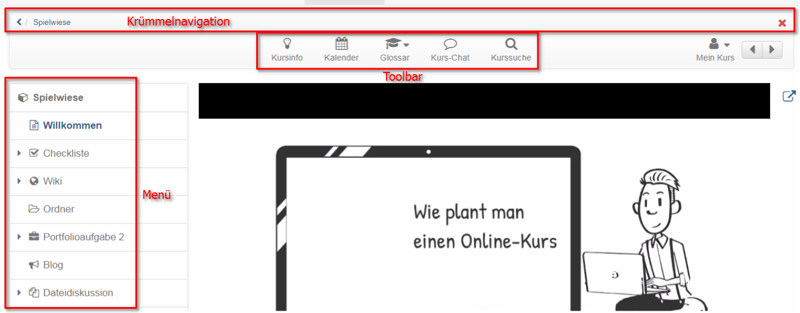

# Course Settings

The menu "Settings" of the "Administration" offers further central
configurations for your OpenOlat course.

Each [learning resource](../authoring/Various_Types_of_Learning_Resources.md), not just courses, have a menu "Settings". Furthermore, the settings of conventional and
learning path courses vary slightly.

**Course settings**

Via the tabs "Info", "Metadata", "Execution" and "Share" you can set up
information that is visible in the course info.

## Tab Info

Here you define further information on the course or learning resource. This
information is also visible to interested parties without course access under
(Course)info. This includes, for example: Title, relevant description,
certificate, cover image and teaser movie. The learning resource appears under
the title in the alphabetical course list and for queries via the search mask.
Further information can be found [here](../authoring/Set_up_info_page.md).

## Tab Metadata

Here you can enter other things that appear under "Info" e.g. the names of the
teachers of the course. Also, the course can be assigned to a given didactic
type such as self-study course or examination course. Especially relevant is
the entry of the license of the course.

## Tab Execution {: #Execution}

Here you can activate the "[Lecture and Absence
Management](../course_operation/Lectures_and_absences.md)" if activated by the administrator,
convert existing conventional courses into learning path courses or, in case
of [learning path courses](Learning_path_course.md), define how the learning
progress is calculated on the basis of the number of course elements or on the
basis of the learning time of the course elements.  

## Tab Share

In this tab you define how and for whom a course or a learning resource is
released. Further information on setting up the appropriate access
configuration can be found [here](Access_configuration.md).

## Tab Catalog  

As soon as a learning resource has been activated it can be inserted in the
catalog with the help of the info page. Just select "Course" --> "Catalogue
entries". Afterward you choose the category to which your learning resource
should be related to by using "Add to catalog". Learning resources can be
inserted more than once at different spots in your catalog, just repeat the
before mentioned step. All selected categories will be displayed under
"Catalogue entries", where you can delete them as well.

The entire OpenOlat catalogue can be viewed by all users in the "Courses"
menu.

Only enter your courses in the catalog when they are finished and should be
visible to the users.

##  Tab Disclaimer {: #disclaimer}

Here you can activate and set course-related terms of use or a course-related
privacy policy. If a person starts the course, he/she must first accept the
conditions, otherwise access to the course is not possible. In the [member
administration](../course_operation/Members_management.md) you can see in the area "Consents"
which persons have already accepted the conditions.

##  Tab Layout

Under "Layout" you can select a layout template for a course, hide the left
course navigation and also the bread-crumb navigation for participants.
Depending on the settings by the course administrator, certain layout
templates are available, but at least one default template. In addition, you
can store your own CSS course templates in the course [storage
folder](../course_operation/Storage_folder.md) and link them in the Layout menu. For example,
fonts and colors for texts, headlines, links, the menu and the toolbox can be
individually designed and provided with a suitable logo.

In the section "Course element default style" you can define the default
presentation of the course elements and, for example, upload a background
image and define the style of the image as well as assign a color category. In
the preview you can see the effects

## Tab Toolbar

Here you switch the toolbar and certain tools of the toolbar on or off. In
this way, certain tools that are to be available continuously can be called up
at a central location. In addition to course search, glossary and course chat
these tools include various tools that can also be called up as course
element, e.g. calendar, list of participants, e-mail, blog, wiki, forum, and
documents folder. In the case of
[Wiki](https://confluence.openolat.org/display/OO151EN/Creating+Wikis) and
[Blog](https://confluence.openolat.org/display/OO151EN/Creating+Blogs), it is
also possible to fall back on learning resources that have already been
created. The other tools are similar to the corresponding course elements, but
do not offer the further configuration options as they are available in the
course elements in the course editor.

The use of the tools in the toolbar is particularly important for linear
[learning path courses](Learning_path_course.md) in order to make important
tools available continuously and centrally, regardless of the sequential order
of the learning steps.

  

## Tab Assessment {: #assessment}

In this tab you can activate performance records and have a certificate
generated automatically. If you activate the option "Use certificates of
achievement", the option "Certificate of achievement" appears in the toolbar
menu "My course" and the course participants see an overview of the assessable
course elements with their current assessment status. If the option "Generate
PDF certificate" was also activated, the received certificate will also appear
here as soon as all conditions for a passed course have been fulfilled.  You
can also activate certificate creation in the "Assessment tool".

The according link will only appear in your course if there is also an
assessable course element, and the course participant has received at least
one automatic or manual assessment. This could be, e.g., a test attempt or the
assessment of a task.

If you deactivate this feature your participants will no longer see their
evidences of achievement. However, they are not lost; those evidences will
only no longer be on display.

Evidences already existing will then no longer be visible. As soon as you
offer this option anew your participants can dispose of their evidences along
with new data. If you choose to delete a course that contains evidences of
achievement your users will still be able to see their own evidences.

### Generate PDF certificate

A PDF certificate can be used to confirm attendance of a course or achievement
of course-related activities. A certificate can also be issued without the use
of the evidence of achievement. You can choose whether the certificate is
issued manually by the coach or automatically after passing the course. The
selection "manual" allows you to use certificates in courses without
assessable course elements. Whether and when a course participant has passed
the course depends on the conditions specified in the course node in the tab
"Score". If the certificate is to be issued manually, the coach can do this in
the assessment tool in the performance overview of the individual users.

Users automatically receive an email notification as soon as a certificate has
been automatically issued.

By default, certificates for a course are issued once only. If for any reason
a certificate needs to be re-issued on a regular basis, e.g. for language
certification, re-certification can be allowed. Select a given number of days,
weeks, months or years for the period of time required before a new
certificate can be issued.

To control the validity of a certificate the attribute
certificateVerificationUrl needs to be added to the template. It allows to
generate the certificate again later on, thanks to a QR code. It can then be
compared with the already available version. If both versions are consistent,
the certificate can be validated. However, the QR code for validation is only
possible if you use an HTML form.

Usually, a systemwide PDF template, specified beforehand by an administrator,
should be available. If however, you wish to utilize your own individual
template, you can upload one in the  **Certificate template**  section. A PDF
template though is no ordinary PDF file, but has to be either a PDF form
created with e.g. Acrobat Pro or LibreOffice, or a HTML form.

 A brief instruction on how to create a PDF form with LibreOffice:

  * Select the toolbars **Form Design** and **Controls** in the View toolbar
  * In the Form Design toolbar, enable _Design mode_ in order to insert text boxes and label fields 
  * After double clicking a text box, enter in the "Name" field the required variable name from OpenOlat (see below), such as fullName, and format the box. The vertical alignment might need some patience, though
  * Select File  → Export as PDF, deselect PDF/A-1a and check the _Create PDF Form_ instead, with the FDF format

You can download an example template in [.odt file
format](https://en.wikipedia.org/w/index.php?title=OpenDocument&oldid=698642005)
[here](assets/example_certificate.odt).

With this [certificate bot](https://tools.vcrp.de/zertifikatsbot/) you can
easily and quickly create certificate templates in HTML format. If you want to
adapt the bot to your needs, you can use the
[repository](https://gitlab.vcrp.de/openolat/zertifikatsbot) with the public
code (MIT license).

The form fields then must contain specific variables, which will be replaced
by the system upon certificate creation with the respective values. All
attributes can be used as variables. PDF templates use variable names without
a $ prefix, HTML forms use a $ prefix.

In order to be able to format date-values there is the"dateFormatter"-object.
It offers methods to format the "*Raw" formats. To just format a raw format
there is the "formatDate()" function. To add a given period of time there is
the formatDateRelative(Date baseLineDate, days, months, years) which adds the
period given in days/months/years to the baseLineDate.

???+ note "Here a list of the most important variables:"

    _User:_

      * $fullName
      * $firstName
      * $lastName
      * $birthDay
      * $institutionalName
      * $orgUnit
      * $studySubject

    _Course:_

      * $title
      * $externalReference
      * $authors
      * $from (date)
      * $fromLong (date)
      * $to (date)
      * $toLong (date)
      * $location
      * $expenditureOfWork
      * $mainLanguage

    _Performance data (all types of courses):_

      * $score
      * $status

    _ _Performance data_  (Learning path course only):_

      * $maxScore
      * $progress

    _Certificate data:_

      * $dateFirstCertification
      * $dateFirstCertificationLong
      * $dateFirstCertificationRaw
      * $dateCertification
      * $dateCertificationLong
      * $dateCertificationRaw
      * $dateNextRecertification
      * $dateNextRecertificationLong
      * $dateNextRecertificationRaw
      * $certificateVerificationUrl

    _Relative date:_

    Dates can be specified on the certificate that are calculated relative to a
    "raw" date:

    Method and parameters
   

    Example: $dateNextRecertificationRaw = 11/15/2021  
        
    Relative date short style:

    $formatter.formatDateRelative(original date, "language code", +/- days, +/-
    months, +/- years)

    $formatter.formatDateRelative($dateNextRecertificationRaw, "en", 7, -2, 10)

    ==> Relative date = 09/22/2031  
      
    Relative date long style:

    $formatter.formatDateLongRelative(original date, "language code", +/- days,
    +/- months, +/- years)
 
    $formatter.formatDateRelative($dateNextRecertificationRaw, "en", 7, -2, 10)

    ==> Relative date = November 22, 2031  
            

    _Fields from the course info:_

      * $!description
      * $!objectives
      * $!requirements
      * $!credits  

    _Optionale Variablen:_

      * $custom1
      * $custom2
      * $custom3

If you would like to have such a certificate template, feel free to contact us
via [support@frentix.com](mailto:support@frentix.com) in order to receive a
cost estimate for a template according to your requirements.

 **Allow re-certification:**  This enables the issuing of a new certificate
after a specified period.

  

### Tab Assessment for Learning Path Courses

For learning path Courses there are further configuration options in the tab
Assessment. Here you define when a course is considered passed and whether or
what kind of points are displayed.

  * Score: Here you can define whether or which type of points (total points or average) are displayed in addition to the percentage display in the course.
  * Define passed manually: In this case the course coach or owner can manually define in the assessment tool whether a course participant has passed or failed the course.

  * Learning progress 100 %: When all mandatory course elements have been completed and 100 % is displayed the course is automatically considered passed.

  * All course elements passed: A course is regarded as passed if all assessable course elements marked with "passed/not passed" have been passed, no matter whether the course modules are mandatory or optional. In order to exclude individual course elements you have to tick off "Ignore in course assessment" in the tab "Assessment" of the course element in the course editor.

  * Number of course elements passed: Here you can define how many course elements have to be passed in order to consider the entire course as passed.

  * Score reached: Here you can define how many points learners have to achieve in order to consider the entire course as passed.

The individual criteria are an "or-link". It is therefore sufficient if one of
the criteria mentioned applies.

Only if sum or average has been selected under "Score," the tab "High Score"
can be configured in the course editor.

!!! hint
	For conventional courses, the criteria for passing a course are set in the
	course editor on the top course element and the result is displayed on the
	course start page.

## Tab Options {: #options}

Here you can activate and configure a course-specific
[glossary](../course_operation/Using_Additional_Course_Features.md) and a resource folder. And
so connect with your course as well as create a special folder for Coaches.

### Include glossary

You can either connect to your already created glossary here or create a new
glossary in the menu that appears.  Once a glossary has been selected, it can
also be activated in the "Toolbar" tab.

### Including Resource Folder

Here you can connect a resource folder (learning resource) to a course and
thus access the files stored in the resource folder. Here you can either
connect to your already created resource folders or create a new resource
folder in the appearing menu. The files of the resource folder then appear in
the storage folder of the course in the automatically created subfolder
"_sharedfolder".

By default in the course all files of the resource folder are read only and
the edit of the files is neither in the storage folder nor in the course
editor when embedding into a single page possible. If edit should be possible
in the course, this option need to be deselected in the course settings at
"Read only".

For more information or the step-by-step instructions on integrating a
resource folder, click [here](../how-to/use_the_same_files_in_several_courses.md).  

You can only add _one_ resource folder to a course. We strongly recommend to
first define a general strategy: Which files should be stored in an overall
resource folder, and which files are preferably stored in a storage folder
within a course, respectively.

### Enable Coach Folder

Furthermore, a course-wide folder for the Coaches of the course can be
activated in the "Options" menu. All course coaches can then store, view, edit
or delete documents in this folder. It is also possible to create subfolders
in the configured area.

As location for the folder, either an already existing folder from the storage
folder of the course can be selected or a new folder can be generated
especially for the Coaches. If "Automatically generated folder" is selected,
the coaches will not have access to any other files located in the storage
folder of the course, while course creators or persons with access to the
course editor will be able to see the coaches' files in the automatically
generated folder "_coachdocuments" in the storage folder. This means that
course owners always have access to the files of the Coach folder and can also
use them for linking to certain course elements, e.g. a single page. On the
other hand, Coaches will not be able to integrate files into the course
structure even with the new folder.

In the Administration menu, the new submenu "Coach documents" appears for
Coaches as well as for course owners.

  

