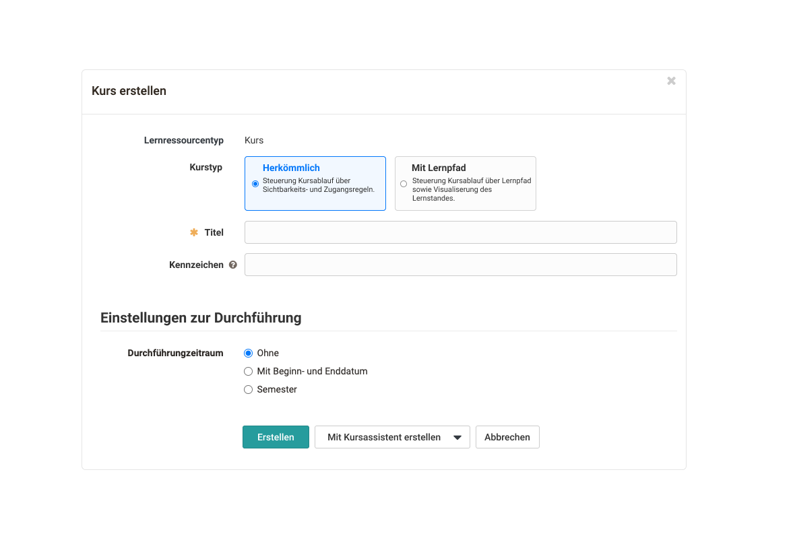
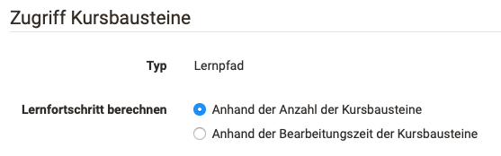
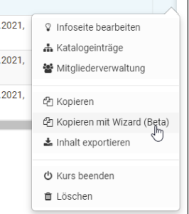

# Lernpfad Kurse erstellen

Die Erstellung sowohl von herkömmlichen als auch von Lernpfad Kursen erfolgt
im Autorenbereich unter „Meine Einträge“ oder „Favoriten“ -> Erstellen ->
Kurs. Anschließend kann der gewünschte Kurstyp gewählt werden.

Bereits existierende, herkömmliche Kurse können in Lernpfad Kurse umgewandelt
werden. Einen entsprechenden Link findet man in der Kurs Administration und
auch im Bereich "Einstellungen" im Tab "Durchführung".

Bei der Umwandlung wird eine Kopie des Kurses angelegt. Kurse die eine
Portfolioaufgabe oder einen alten Fragebogen enthalten, können allerdings
nicht umgewandelt werden. Hier müssen zunächst die entsprechenden
Kursbausteine entfernt werden und dann die Umwandlung noch einmal gestartet
werden.

Eine Umwandlung eines Lernpfad Kurses in einen herkömmlichen Kurs ist nicht
möglich.

## Konfiguration zur Berechnung des Lernfortschritts

Gehen Sie in die Kursadministration und wählen Sie die "Einstellungen". Im Tab
"Durchführung" kann definiert werden wie der Lernfortschritt des Kurses
berechnet wird. Der Kursfortschritt kann basierend auf der Anzahl der
erfolgreich bearbeiteten obligatorischen Kursbausteine definiert werden.
Alternativ kann jeder obligatorische Kursbaustein mit einer zu erwartenden
Bearbeitungszeit versehen werden und der Fortschritt sich auf die bereits
absolvierten Zeiteinheiten beziehen.

  

Die Berechnungsgrundlage beeinflusst dann den für die Lernenden angezeigten
Fortschritt, der in der Grafik rechts oben und im Bereich "Lernpfad" angezeigt
wird.

Darüber hinaus kann in den "Einstellungen" im Tab "Bewertung" noch definiert
werden, ob auch die Gesamtpunkte des Kurses in der Fortschrittsgrafikanzeige
erscheinen werden sollen (Summe oder Durchschnitt) und ob und wie ein Bestehen
des Kurses berechnet wird.

  

## Lernpfad Kurse kopieren

Wie alle Lernressourcen können auch Lernpfad Kurse kopiert werden. Neu ist
jedoch seit OpenOlat 16 die Möglichkeit einen Lernpfad mit Hilfe eines Wizards
zu kopieren (Beta). Auf diesem Weg können weitere Detaileinstellungen vor dem
Kopiervorgang vorgenommen werden, so dass eine spätere Überarbeitung entfällt.
Folgende Dinge können eingestellt werden:

  * ob bei Änderung des Durchführungszeitraums alle Datumseinstellungen automatisch angepasst werden
  * ob alle bisherigen Besitzer und Betreuer mitkopiert werden
  * ob Gruppen mitkopiert werden
  * ob Aufgabenstellungen und Musterlösungen kopiert werden
  * ob Nutzungsbedingungen übernommen werden
  * ob einzelne Kursbausteine obligatorisch oder freiwillig sind
  * sowie weitere Datumsangaben zu den einzelnen Kursbausteinen

