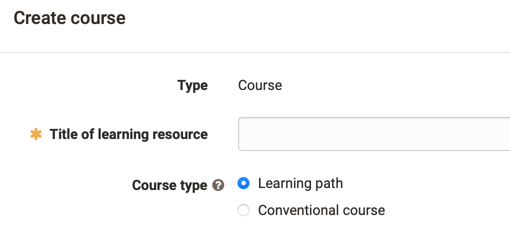
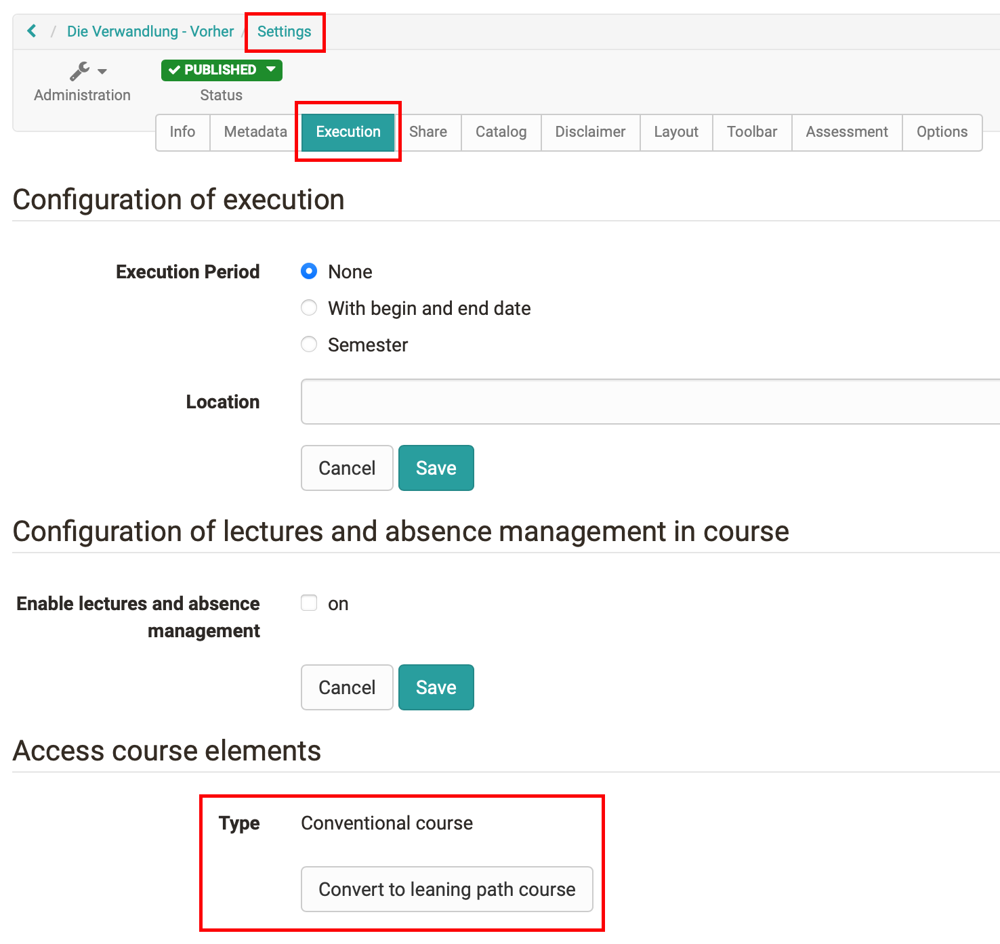
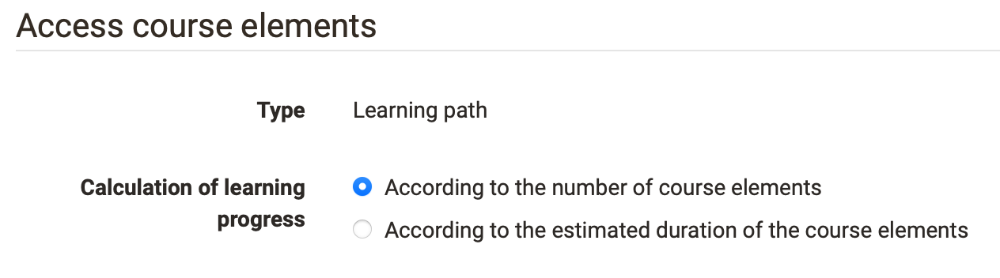
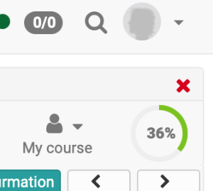

# Creating learning path courses

The creation of both conventional and learning path courses takes place in the
author area under "My entries" or "Favorites" -> Create -> Course. The desired
course type can then be selected.

Existing conventional courses can be converted into learning path courses. A
corresponding link can be found in the course administration and also in the
"Settings" area in the "Execution" tab.

  

During the conversion a copy of the course is created. However, courses that
contain a portfolio task or an old questionnaire cannot be converted at the
moment. In this case, these course elements must first be removed and then the
conversion must be started again.

!!! warning "Warning"

    It is not possible to convert a learning path course into a conventional
    course.

## Configuration for calculating the learning progress

Go to the course administration and select the "Settings". In the tab
"Execution" you can define how the learning progress of the course is
calculated. The course progress can be defined based on the number of
successfully completed mandatory course elements. Alternatively, each
mandatory course element can be given an expected completion time and the
progress can be based on the time units already completed.

  

The calculation basis then influences the progress displayed for learners in
the graphic at the top right and in the "Learning path" area.

In addition, it is possible to define in the "Settings" in the tab
"Assessment" whether the total points of the course should also appear in the
progress graphic display (sum or average) and whether and how a pass of the
course is calculated.

 

  

