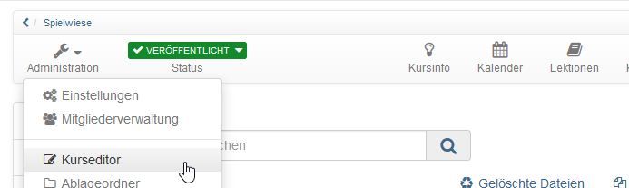
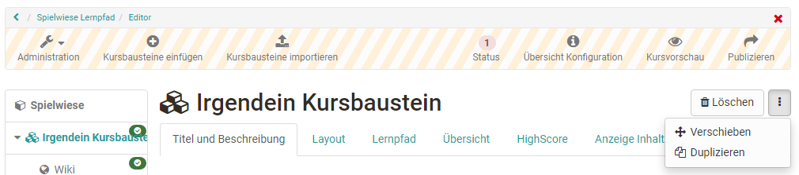

# Löschen, Verschieben und Kopieren von Kursbausteinen

Änderungen an Ihrem Kurs nehmen Sie im Kurseditor vor. Sie gelangen in den Kurseditor indem Sie den Kurs starten und im Menü unter "Administration" die Option "Kurseditor" auswählen. 

Um einen Kursbaustein zu löschen zu duplizieren oder zu verschieben müssen Sie den gewünschten Kursbaustein zunächst auswählen. Anschliessend erscheint rechts oben das entsprechende Menü.

Die jeweilige Aktion bezieht sich dabei auf den aktuell markierten und alle ihm untergeordneten Kursbausteine. Wählen Sie im Verschieben- bzw. Duplizieren-Fenster die Position unter die Sie das Kurselement einsetzen wollen, und wählen den entsprechenden Pfeil: Nach oben um das neue Element oberhalb einzusetzen, nach unten um das Element unterhalb einzusetzen, und den gebogenen Pfeil um das Element untergeordnet einzusetzen. 
Ebenso ist es möglich, Kursbausteine einfach mittels „Drag&Drop“ in der Kursstruktur links zu verschieben.

Die Änderungen zum Löschen, Verschieben und Kopieren von Kursbausteinen müssen publiziert werden, um sie für die Kursteilnehmer wirksam werden zu lassen. Solange Sie diese nicht publiziert haben, können gelöschte Kursbausteine wiederhergestellt werden.

Das Duplizieren von Kursbausteinen empfiehlt sich, wenn Sie beispielsweise Gruppenarbeiten anbieten und dieselbe Struktur mehrmals verwenden möchten.

## Kursbausteine importieren

Haben Sie in einem anderen Kurs bereits eine umfangreiche Kursstruktur angelegt die Sie weiterverwenden wollen, bietet es sich an, diese Kursbausteine über "Kursbausteine importieren" in den gewünschten Kurs zu kopieren.

## Der Weg:

a) Wählen Sie den gewünschten Kurs in dem sich der oder die zu kopierenden Kursbausteine befinden.

b) Markieren Sie den oder die Kursbausteine, die Sie übertragen wollen. Untergeordnete Kursbausteine werden automatisch mitausgewählt, können aber bei Bedarf durch Entfernung des Hakens wieder abgewählt werden.

c) Es werden alle gewählten Kursbausteine noch einmal angezeigt. Bei einigen Kursbausteinen wie Podcast, Blog, Wiki, Aufgabe, Gruppenaufgabe oder Ordner können noch weitere Einstellungen für den Kopiervorgang vorgenommen werden. Zum Beispiel können die Dateien des Kursbausteins Ordner mitkopiert werden. Ein Blog, Wiki oder Podcast kann entweder wiederverwendet, neu erstellt oder für den Moment erst mal nicht weiter konfiguriert werden. Bei Aufgaben und Gruppenaufgaben kann die hinterlegte Aufgabenstellung und die Musterlösung mitkopiert werden oder nicht.

d) Im nächsten Schritt erscheinen die Dateien, die sich im Ablageordner des zu kopierenden Kurses befinden und können bei Bedarf ausgewählt werden. Dabei sind die Dateien, die mit den ausgewählten Kursbausteinen verbunden sind bereits vorausgewählt. Eine Änderung der Einstellung ist aber an dieser Stelle möglich.

**Bitte beachten:**

* Beim Kopieren der Kursbausteine werden keine Gruppen mitkopiert. Für Gruppenaufgaben, Einschreibungen müssen also entweder neue Gruppen erstellt oder später vorhandene Gruppen verknüpft werden.

* Beim Kopieren von Foren werden die Forenbeiträge nicht mitkopiert. 

* Bei der Kopie von BigBlueButton werden keine Räume und Termine mitkopiert.

## Änderungen am laufenden Kurs

Sie entscheiden über den Zeitpunkt, an dem die Änderungen im laufenden Kurs erscheinen. Alle Benutzer, die zum Zeitpunkt des Publizierens den Kurs bearbeiten, müssen den Kurs neu starten. Nicht gespeicherte Forumsbeiträge oder Testresultate gehen dabei verloren! Wenn Benutzer im Kurs sind und Sie das Publizieren auf einen späteren Zeitpunkt verschieben können, empfehlen wir, den Publiziervorgang abzubrechen und später zu wiederholen.