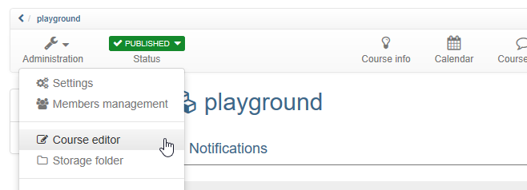
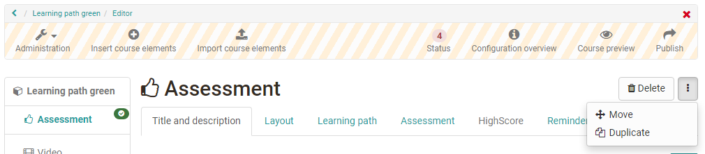
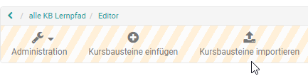
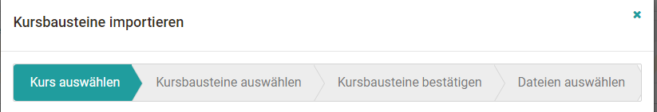

# Deleting, Moving and Copying Course Elements

You can make changes to your course in the course editor. You can access the
course editor by starting the course and selecting the option "Course editor"
in the menu under "Administration".

Um einen Kursbaustein zu löschen zu duplizieren oder zu verschieben müssen Sie
den gewünschten Kursbaustein zunächst auswählen. Anschließend erscheint rechts
oben das entsprechende Menü.

 ~~The drop down menu "Modify course elements" helps you to delete, move or
copy course elements. Your action will affect the currently marked course
elements as well as all subordinated ones. In the Move / Copy overlay select
the position you wish to insert the new element into, and choose the
corresponding icon: the upward arrow to insert the new element above, the
downward arrow to insert below, and the bent arrow to insert as child
element.~~

 ~~It is possible as well to move course elements using „Drag &Drop“ in the
course structure to the left.~~

 ~~Modifications such as deleting, moving, copying course elements have to be
published later on in order to be effective. If you have not published a
deleted course element it can still be recovered.~~

 ~~Copying course elements is advisable if you plan to offer team work in
groups and want to reuse the same structure.~~

Die jeweilige Aktion bezieht sich dabei auf den aktuell markierten und alle
ihm untergeordneten Kursbausteine. Wählen Sie im Verschieben- bzw.
Duplizieren-Fenster die Position unter die Sie das Kurselement einsetzen
wollen, und wählen den entsprechenden Pfeil: Nach oben um das neue Element
oberhalb einzusetzen, nach unten um das Element unterhalb einzusetzen, und den
gebogenen Pfeil um das Element untergeordnet einzusetzen.

Ebenso ist es möglich, Kursbausteine einfach mittels „Drag&Drop“ in der
Kursstruktur links zu verschieben.

Die Änderungen zum Löschen, Verschieben und Kopieren von Kursbausteinen müssen
publiziert werden, um sie für die Kursteilnehmer wirksam werden zu lassen.
Solange Sie diese nicht publiziert haben, können gelöschte Kursbausteine
wiederhergestellt werden.

Das Duplizieren von Kursbausteinen empfiehlt sich, wenn Sie beispielsweise
Gruppenarbeiten anbieten und dieselbe Struktur mehrmals verwenden möchten.

## Kursbausteine importieren

Haben Sie in einem anderen Kurs bereits eine umfangreiche Kursstruktur
angelegt die Sie weiterverwenden wollen, bietet es sich an, diese
Kursbausteine über "Kursbausteine importieren" in den gewünschten Kurs zu
kopieren.

### Der Weg:

a) Wählen Sie den gewünschten Kurs in dem sich der oder die zu kopierenden
Kursbausteine befinden.

b) Markieren Sie den oder die Kursbausteine, die Sie übertragen wollen.
Untergeordnete Kursbausteine werden automatisch mitausgewählt, können aber bei
Bedarf wieder durch Entfernung des Hakens wieder abgewählt werden.

c) Ihnen werden alle gewählten Kursbausteine noch einmal angezeigt. Bei
einigen Kursbausteinen wie Podcast, Blog, Wiki, Aufgabe, Gruppenaufgabe oder
Ordner können noch weitere Einstellungen für den Kopiervorgang vorgenommen
werden. Zum Beispiel können die Dateien des Kursbaustein Ordner mitgekopiert
werden. Ein Blog, Wiki oder Podcast kann entweder wiederverwendet, neu
erstellt oder für den Moment erst mal nicht weiter konfiguriert werden. Bei
Aufgaben und Gruppenaufgaben kann die hinterlegte Aufgabenstellung und die
Musterlösung mitkopiert werden oder nicht.

d) Im nächsten Schritt erscheinen die Dateien, die sich im Ablageordner des zu
kopierenden Kurses befinden und können bei Bedarf ausgewählt werden. Dabei
sind die Dateien, die mit den ausgewählten Kursbausteinen verbunden sind
bereits vorausgewählt. Eine Änderung der Einstellung ist aber an dieser Stelle
möglich.

Bitte beachten: Beim Kopieren der Kursbausteine werden keine Gruppen
mitkopiert. Für Gruppenaufgaben, Einschreibungen müssen also entweder neue
Gruppen erstellt oder später vorhandene Gruppen verknüpft werden.

  

Beim Kopieren von Foren werden die Forenbeiträge nicht mitgekopiert. Bei der
Kopie von BigBlueButton werden keine Räume und Termine mitkopiert.

  

Changes to the current course

Make changes to current courses as usual in the course editor. You can delete,
move, add and copy course elements. As long as you do not publish, the changes
have no effect on course operation. You decide when the changes appear in the
current course. When you publish a course, the system informs you how many
users are working on the course at this time.

All users who edit the course at the time of publishing must restart the
course. Unsaved forum posts or test results will be lost! If users are in the
course and you can postpone publishing to a later date, we recommend that you
cancel the publishing process and repeat it later.

  

