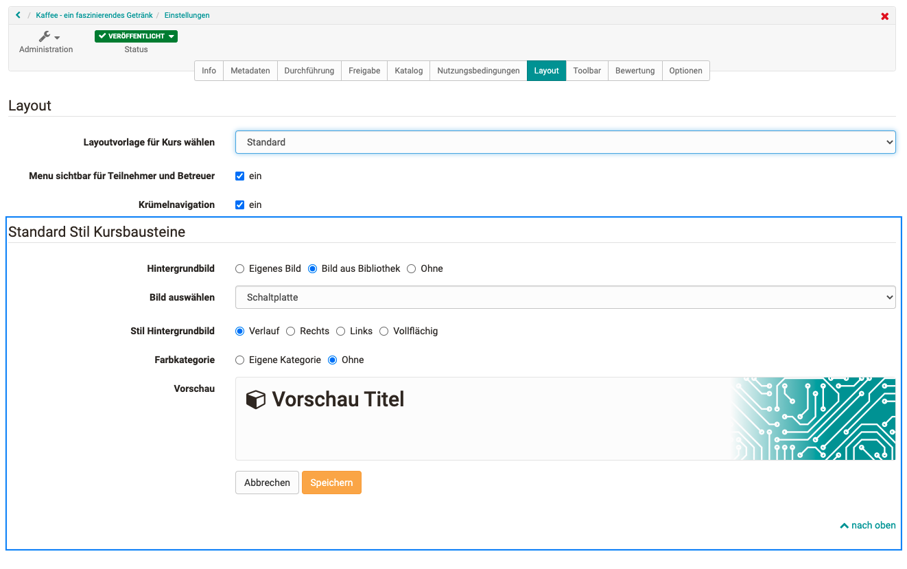
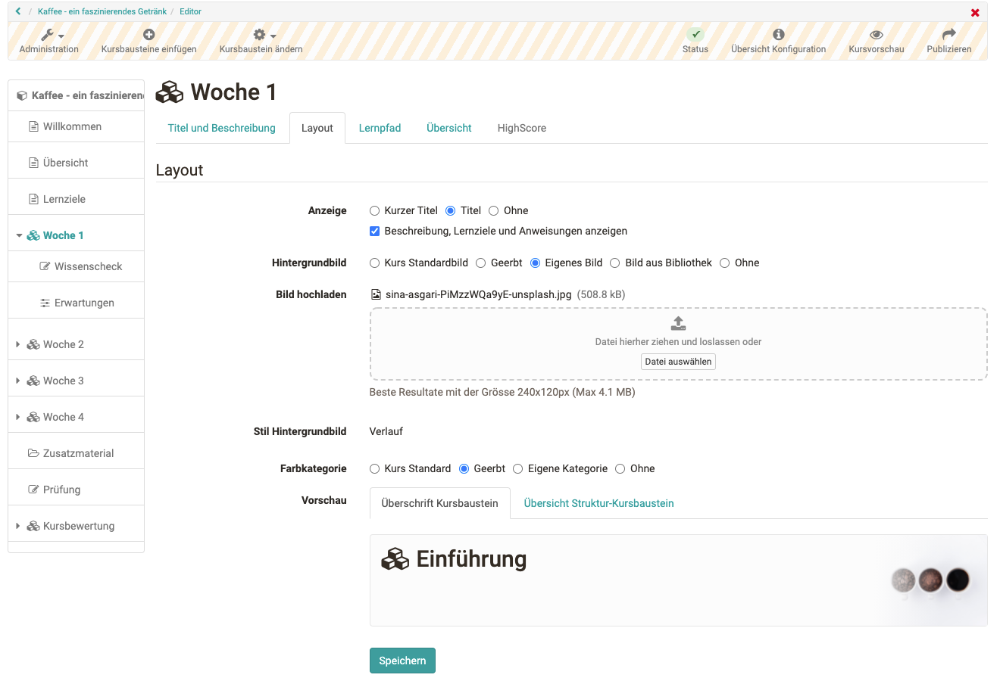
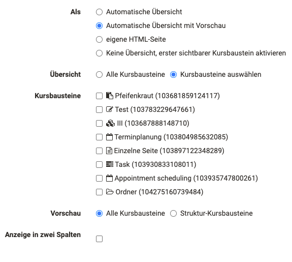
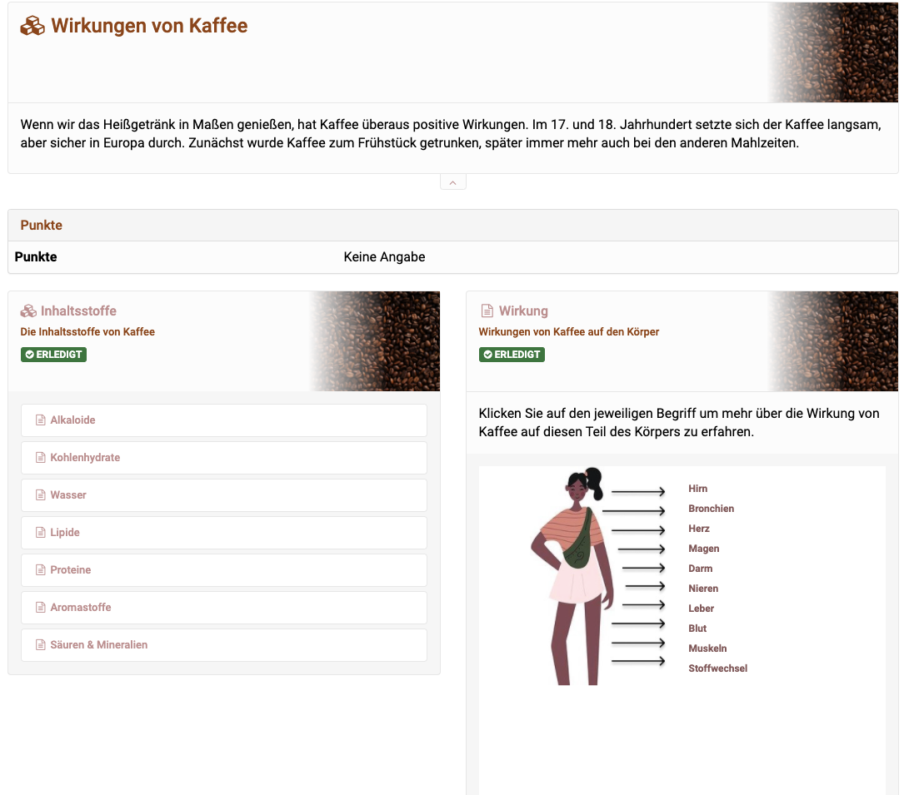

# Gestalterische Möglichkeiten von Kursen und Kursbausteinen

Die Darstellung eines Kurses und der eingebauten  Kursbausteine kann vom Kursbesitzer konfiguriert werden. Die Basis-Einstellungen hierfür werden in der Kurs Administration im Tab "Layout" definiert. Weitere Details und Anpassungen können im Kurseditor bei den jeweiligen Kursbausteinen vor allem in den Tabs "Titel und Beschreibung" sowie "Layout" vorgenommen werden. 

## Layout Einstellungen in der Kursadministration
  
### Tab "Layout" 

Im Tab Layout der Kurseinstellungen kann der Standardstil der Darstellung definiert werden. Dazu zählen: Die Auswahl eine Hintergrundbildes,  die Definition des Stils sowie die Zuordnung einer Farbkategorie.

Kursbesitzer können für die Darstellung der Kursbausteine ein eigenes Bild hochladen (maximal 4 MB), ein Bild aus der Bibliothek wählen oder auf ein Bild ganz verzichten. Das Bild kann rechts oder links positioniert, als Verlauf rechts oder vollflächig dargestellt werden. 
 
  

## Layout Einstellungen im Kurseditor

Im Kurseditor können die Tabs "Titel und Beschreibung" sowie "Layout" für die weiteren Konfiguration des Kurslayouts genutzt werden. 

### Tab "Titel und Beschreibung" 

Im Tab "Titel und Beschreibung" eines Kursbausteins können, neben dem Titel und der generellen kurzen Beschreibung des Kursbausteins, ergänzende erweiterte Informationen bereitgestellt werden, die im oberen Bereich des Kursbausteins als Information angezeigt werden. zu den erweiterten Informationen zählen: Lernziele, Anweisungen sowie spezifische Hinweise für Betreuer. 

**Lernziele:** Beschreiben Sie hier, was Sie genau mit dem Kursbaustein erreichen wollen. Beispielsweise können bei Strukturbausteinen die Lernziele für den gesamten untergeordneten Bereich erläutert werden. Generell sollten Sie prüfen, bei welchen Kursbausteinen eine Beschreibung der Lernziele relevant ist. 
  
**Anweisungen:** Instruktionen oder Lernanweisungen für die Teilnehmenden des Kurses.
Erläutern Sie hier genauer, was die Lernenden mit diesem Kursbaustein machen sollen. 
  
**Hinweise für Betreuer**
Hier können den Betreuern weitere Informationen zu diesem Kursbaustein hinterlassen werden. Diese Informationen sind nur für Betreuer und Besitzer des Kurses sichtbar.

### Tab "Layout" 

Im Tab Layout eines Kursbausteins kann man die in den "Einstellungen" der Kursadministration vorgenommenen Standardeinstellungen für jeden einzelnen Kursbaustein ändern und überschreiben.  

Für das Hintergrundbild, den Stil und die Farbkategorie kann zwischen "Kurs Standard", "Vererbt" und "Kursbaustein spezifisch" gewählt werden. Der Kurs Standard bezieht sich auf die Basis-Einstellungen der Administration. Vererbt bezieht sich auf die Einstellung des übergeordneten Kursbausteins. Und mit "Kursbaustein spezifisch" können Sie eine spezielle Konfiguration für den gewählten Kursbaustein vornehmen. 

**Anzeige**: Wählen Sie ob die im Tab "Titel und Beschreibung" definierten Infos angezeigt werden sollen oder nicht. 

  

### Automatische Übersicht 

Auf dem obersten Kursnoten und allen Struktur Kursbausteinen können im Tab "Übersicht" weitere Einstellungen zur Darstellung vorgenommen werden. Ein Vorteil ist die Verwendung der automatischen Übersicht, besonders als Orientierungshilfe für den User. Hier können nun alle oder gezielt nur bestimmt Kursbausteine für die automatische Übersicht ausgewählt werden. 

!!! Tip "Tip"

    Probieren Sie die unterschiedlichen Darstellungen aus und prüfen Sie welche Anzeige für Ihre Zwecke am besten passt. Überladen Sie die Anzeige nicht. Zu viele Texte, Bilder und Infos führen nämlich rasch zu einer unübersichtlichen Darstellung.