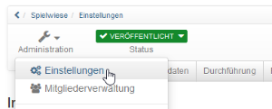

# Allgemeines

OpenOlat-Kurse ermöglichen das Abbilden von diversen Veranstaltungsformaten
z.B. Vorlesungen, Seminare, Online-Tutorien oder Gruppenpuzzle, genauso wie
die Umsetzung verschiedener Arten von Lernen, z.B. problembasiertes Lernen,
kooperatives Lernen, selbstorganisiertes Lernen usw. Durch den Einsatz

sites/manual_user/docs/course_create/General_Information.de.md §Types_of_Course_Element.de.md§ 481
beliebig vieler [Kursbausteine ](Kursbausteine.html)in frei wählbarer
Reihenfolge, gewährt Ihnen OpenOlat maximale Flexibilität bei der Umsetzung
Ihres didaktischen Konzepts.

Beantragen Sie bei Ihrer OpenOlat-Supportstelle bzw. den Administratoren Ihrer
OpenOlat Instanz, Autorenrechte und legen Sie los!

  

## Der Kurszyklus im Überblick:

  1. Kurs anlegen
  2. Kurs einrichten, gestalten
  3. Zugang einrichten
  4. Kurs Status veröffentlichen
  5. Kurs durchführen
  6. Kurs beenden
  7. Kurs löschen

  

 **Schritt**

|

 **Aktion**

|

 **Weitere Informationen**  
  
---|---|---  
  
  1. Kurs anlegen

|

Lernressource Kurs im "Autorenbereich" erstellen und den gewünschten Kurstyp
"Lernpfad" oder "herkömmlicher Kurs" wählen.

|

sites/manual_user/docs/course_create/General_Information.de.md §Creating_Courses.de.md§ 481
  * [Kurs erstellen](Kurs+erstellen.html)

sites/manual_user/docs/course_create/General_Information.de.md §In_Five_Steps_to_Your_Course_With_the_Course_Editor.de.md§ 481
  * [Mit dem Kurseditor in fünf Schritten zu Ihrem OpenOlat Kurs](In_Five_Steps_to_Your_Course_With_the_Course_Editor.de.md)

sites/manual_user/docs/course_create/General_Information.de.md §Creating_learning_path_courses.de.md§ 481
  * [Lernpfad Kurse erstellen](Creating_learning_path_courses.de.md)

  
  
2\. Kurs einrichten, gestalten, publizieren

|

Im Kurseditor setzen Sie dann Ihren Kurs um, indem Sie die für Sie passenden
Kursbausteine auswählen, eventuell Lernressourcen erstellen und alles wie
gewünscht konfigurieren.

|

sites/manual_user/docs/course_create/General_Information.de.md §Types_of_Course_Element.de.md§ 481
  * [Kursbausteine](Kursbausteine.html)

sites/manual_user/docs/course_create/General_Information.de.md §Using_additional_Course_Editor_Tools.de.md§ 481
  * [Verwendung von Kurseditorwerkzeugen](Using_additional_Course_Editor_Tools.de.md)

sites/manual_user/docs/course_create/General_Information.de.md §Learning_path_course_-_Course_editor.de.md§ 481
  * [Lernpfad Kurs - Kurseditor](Learning_path_course_-_Course_editor.de.md)

sites/manual_user/docs/course_create/General_Information.de.md §Various_Types_of_Learning_Resources.de.md§ 481
  * [Lernressourcen](../authoring/Various_Types_of_Learning_Resources.de.md)

sites/manual_user/docs/course_create/General_Information.de.md §General_Configuration_of_Course_Elements.de.md§ 481
  * [Allgemeine Konfiguration von Kursbausteinen](General_Configuration_of_Course_Elements.de.md)

sites/manual_user/docs/course_create/General_Information.de.md §Course_Settings.de.md§ 481
  * [Kurseinstellungen](Course_Settings.de.md)

  
  
  
3\. Zugang einrichten

|

Im Administrationsmenü „Einstellungen“ werden die benötigten Einstellungen für
den Zugang vorgenommen. Insbesondere der Tab "Freigabe" ist dabei wichtig.

|

sites/manual_user/docs/course_create/General_Information.de.md §Access_configuration.de.md§ 481
  * [Zugangskonfiguration](Access_configuration.de.md)

sites/manual_user/docs/course_create/General_Information.de.md §Course_Settings.de.md§ 481
  * [Kurseinstellungen](Course_Settings.de.md)

  
  
4\. Kurs Status veröffentlichen

|

In der Kurs Toolbar den Status auf „veröffentlicht“ setzen, damit der Kurs
auch für die Lernenden sichtbar wird.

|

sites/manual_user/docs/course_create/General_Information.de.md §Access_configuration.de.md§ 481
[Zugangskonfiguration](Access_configuration.de.md)  
  
5\. Kurs durchführen und Assessmentbausteine bewerten

|

Nutzen Sie das Bewertungswerkzeug für Bewertung und Feedbacks. Posten Sie im
Forum, organisieren Sie die Absenzen und nehmen Sie weitere betreuende
Handlungen vor.

|

sites/manual_user/docs/course_create/General_Information.de.md §Course_Operation.de.md§ 481
  * [Kursbetrieb](Kursbetrieb.html)

sites/manual_user/docs/course_create/General_Information.de.md §Learning_Activities_in_Courses.de.md§ 481
  * [Lernaktivitäten (Lerner Perspektive)](../../pages/viewpage.action%EF%B9%96pageId=108593198.html)

  
  
6\. Kurs beenden

|

Ist der Kurs abgelaufen sollten Sie den Status auf „beendet“ setzen.

|

sites/manual_user/docs/course_create/General_Information.de.md §Access_configuration.de.md§ 481
[Zugangskonfiguration](Access_configuration.de.md)  
  
7\. Kurs löschen

|

Das „Löschen“ des Kurses erfolgt über das passende Menü in der Kurs
Administration. Gelöschte Kurse können im Autorenbereich über die Filteroption
im Lebenszyklus ein- oder ausgeblendet oder gezielt über den Link "Gelöscht"
angezeigt werden.

|

sites/manual_user/docs/course_create/General_Information.de.md §Access_configuration.de.md§ 481
[Zugangskonfiguration](Access_configuration.de.md)  
  
Wichtig: Bevor Sie Ihren OpenOlat Kurs erstellen:

Überlegen Sie zunächst was Sie mit dem Kurs bezwecken wollen.

Wie der Aufbau Ihres Kurses aussieht ist also abhängig von Ihrem didaktischen
Konzept, den Zielen und den gesamten Rahmenbedingungen. Auf dieser Basis
können Sie entscheiden, ob ein herkömmlicher Kurs oder ein Lernpfad Kurs für
Sie die passende Wahl ist. Entscheiden Sie sich im Zweifelsfall für den
herkömmlichen Kurs, da Sie diesen jederzeit in einen Lernpfad Kurs umwandeln
können. Umgekehrt geht das nicht.

Wählen Sie nach der Grundsatzentscheidung des Kurstyps die optimalen und
effektivsten Kursbausteine aus mit denen Sie Ihr Ziel erreichen und Ihr
Kurskonzept umsetzen können. Versuchen Sie auch zusammengehörende Dinge
sinnvoll zu bündeln, um eine optimale Usability zu erreichen. Wenn der Aufbau
klar ist, bereiten Sie die Lerninhalte, weitere Dateien (HTML-Seiten, PDF-
Dateien,
[CPs](Verschiedene+Typen+von+Lernressourcen.html#VerschiedeneTypenvonLernressourcen-
lernressourcentypen_cp_lernressource), etc.). und alles, was Sie für den
Einsatz in der Lernplattform benötigen, vor.

  

  

