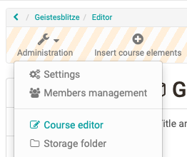
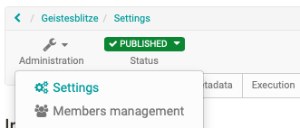
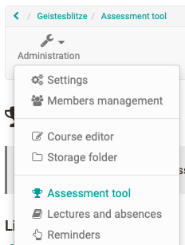

# General Information

OpenOlat courses enable the mapping of various event formats e.g. lectures, seminars, online tutorials or group puzzles, as well as the implementation of different types of learning, e.g. problem-based learning, cooperative learning, self-organized learning etc. A maximum of flexibility is guaranteed by using any number of [course elements](../course_elements/index.md) in any order of your choice; therefore it is easy to realize your didactic concept.

Apply for author rights at your OpenOlat support office and you can get started!

## The course cycle at a glance

### 1. Create course

Creating a Learning Resource Course in the Author Area and choosing the course typ "Learning path" or "Conventional course"

{ class="shadow" }  

!!! info "Further Information"
	  * [Creating Courses](index.md)
	  * [In Five Steps to Your Course With the Course Editor](In_Five_Steps_to_Your_Course_With_the_Course_Editor.md)
	  * [Creating learning path courses](Creating_learning_path_courses.md)

### 2. Set up, design course, publish

You implement your course in the course editor by selecting suitable course elements, creating learning resources if necessary, and configuring everything as desired.

{ class="shadow" }

!!! info "Further Information"
	  * [Course elements](../course_elements/index.md)
	  * [Using additional Course Editor Tools](Using_additional_Course_Editor_Tools.md)
	  * [Learning path course - Course editor](Learning_path_course_-_Course_editor.md)
	  * [Various types of learning resources](../authoring/Various_Types_of_Learning_Resources.md)
	  * [General Configuration of Course Elements](General_Configuration_of_Course_Elements.md)
	  * [Course Settings](Course_Settings.md)

### 3. Set up access

In the administration menu "Settings" the necessary settings for the access are made. The "Share" tab is particularly important here.

{ class="shadow" }

!!! info "Further Information"
	  * [Access configuration](Access_configuration.md)
	  * [Course Settings](Course_Settings.md)
  
### 4. Publish course status

In the course toolbar set the status to "published".

{ class="shadow" }

!!! info "Further Information"
	  * [Access configuration](Access_configuration.md)  
  
### 5. Execute course and evaluate assessment modules

Now especially the assessment tool is needed and further actions are carried out directly in the course, e.g. forums are supervised, absences are organised etc.

{ class="shadow" }

!!! info "Further Information"
	  * [Course Operation](../course_operation/index.md)
	  * [Learning activities in courses (learner perspective)](../learning_activities/index.md)

### 6. End course {: #end_course}

If the course has expired, the status is set to "finished".

{ class="shadow" }

!!! info "Further Information"
	  * [Access configuration](Access_configuration.md)  

### 7. Delete course

The "Delete" of the course is done via the appropriate menu in the course administration. Deleted courses can be shown or hidden in the authoring area via the filter option in the life cycle or specifically displayed in the "Deleted" tab.

{ class="shadow" }

!!! info "Further Information"
	  * [Access configuration](Access_configuration.md)  
  
## Tip

!!! hint "Before you create your OpenOlat course"

	First think about what you want to achieve with the course.
	
	What the course looks like depends on your didactic concept, the goals and the overall framework. On this basis, you can decide whether a conventional course or a learning path course is the right choice for you. If in doubt, opt for the conventional course, as you can convert it into a learning path course at any time. The other way around is not possible.
	
	Choose after the decision the optimal and most effective course elements and try to bundle things that belong together in a meaningful way to achieve optimal usability. When the structure is clear, prepare the learning content, additional files ([HTML pages, PDF files, CPs](../authoring/Various_Types_of_Learning_Resources.md), etc.) and everything you need for use in the learning platform.
