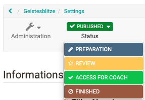

# General Information

OpenOlat courses enable the mapping of various event formats e.g. lectures,
seminars, online tutorials or group puzzles, as well as the implementation of
different types of learning, e.g. problem-based learning, cooperative
learning, self-organized learning etc. A maximum of flexibility is guaranteed
by using any number of [course elements](Types+of+Course+Element.html) in any
order of your choice; therefore it is easy to realize your didactic concept.

Apply for author rights at your OpenOlat support office and you can get
started!

## The course cycle at a glance:

  1. Create course
  2. Set up, design course
  3. Set up access
  4. Publish course status
  5. Execute course
  6. End course
  7. Delete course

  

 **Step**

|

 **Action**

|

 **Further Information**  
  
---|---|---  
  
1\. Create course

|

Creating a Learning Resource Course in the Author Area and choosing the course
typ "Learning path" or "Conventional course"

  

|

  * [Creating Courses](Creating+Courses.html)
  * [In Five Steps to Your Course With the Course Editor](https://confluence.openolat.org/display/OO101EN/In+Five+Steps+to+Your+Course+With+the+Course+Editor)
  * [Creating learning path courses](Creating+learning+path+courses.html)

  
  
2\. Set up, design course, publish

|

You implement your course in the course editor by selecting suitable course
elements, creating learning resources if necessary, and configuring everything
as desired.

|

  * [Course elements](Types+of+Course+Element.html)
  * [Using additional Course Editor Tools](Using+additional+Course+Editor+Tools.html)
  * [Learning path course - Course editor](Learning+path+course+-+Course+editor.html)
  * [Learning path course - Course editor](Learning+path+course+-+Course+editor.html)
  * [Various types of learning resources](Various+Types+of+Learning+Resources.html)
  * [General Configuration of Course Elements](General+Configuration+of+Course+Elements.html)
  * [Course Settings](Course+Settings.html)

  
  
3\. Set up access

|

In the administration menu "Settings" the necessary settings for the access
are made. The "Share" tab is particularly important here.

|

  * [Access configuration](Access+configuration.html)
  * [Course Settings](Course+Settings.html)

  
  
4\. Publish course status

|

In the course toolbar set the status to "published".

|

[Access configuration](Access+configuration.html)  
  
5. Execute course and evaluate assessment modules

|

Now especially the assessment tool is needed and further actions are carried
out directly in the course, e.g. forums are supervised, absences are organised
etc.

|

  * [Course Operation](Course+Operation.html)
  * [Learning activities in courses (learner perspective)](Learning+Activities+in+Courses.html)

  
  
6. End course

|

If the course has expired, the status is set to "finished".

|

[Access configuration](Access+configuration.html)  
  
7\. Delete course

|

The "Delete" of the course is done via the appropriate menu in the course
administration. Deleted courses can be shown or hidden in the authoring area
via the filter option in the life cycle or specifically displayed in the
"Deleted" tab.

|

[Access configuration](Access+configuration.html)  
  
Note: Before you create your OpenOlat course:

First think about what you want to achieve with the course.

What the course looks like depends on your didactic concept, the goals and the
overall framework. On this basis, you can decide whether a conventional course
or a learning path course is the right choice for you. If in doubt, opt for
the conventional course, as you can convert it into a learning path course at
any time. The other way around is not possible.

Choose after the decision the optimal and most effective course elements and
try to bundle things that belong together in a meaningful way to achieve
optimal usability. When the structure is clear, prepare the learning content,
additional files (HTML pages, PDF files,
[CPs](Various+Types+of+Learning+Resources.html#VariousTypesofLearningResources-
lernressourcentypen_cp_lernressource), etc.) and everything you need for use
in the learning platform.

  

  

