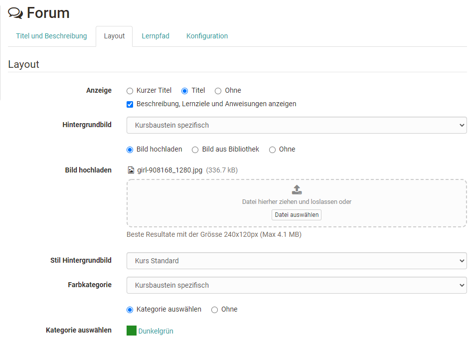
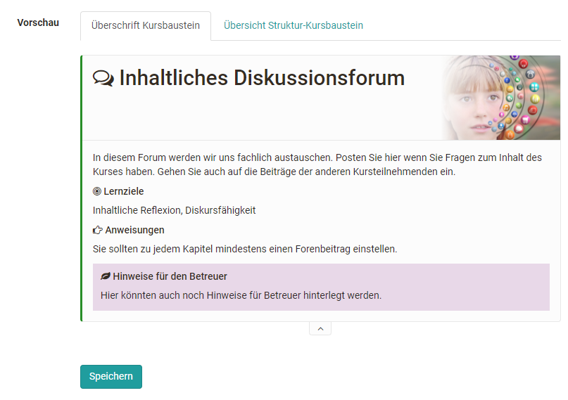

# Mit dem Kurseditor in fünf Schritten zu Ihrem OpenOlat-Kurs

Im Kurseditor können Sie dem Kurs [Kursbausteine](../course_elements/index.de.md) hinzufügen und bereits eingebaute
Kursbausteine einrichten und verändern. Im Folgenden wird die Erstellung eines
Kurses ohne die Verwendung eines Wizards beschrieben.

Im ersten Schritt erstellen Sie Ihren Kurs. In den folgenden Schritten fügen Sie die gewünschten Kursbausteine hinzu.

## Schritt 1: Kurs anlegen  
  
1. In der Hauptnavigation den ["Autorenbereich"](../authoring/index.de.md) öffnen. 
  
2. Im Autorenbereich "Erstellen“ → "Kurs“ wählen. 
    
    { class="shadow" }

3. Titel des Kurses eingeben.

4. Kurstyp (herkömmlicher Kurs oder [Lernpfad Kurs](Learning_path_course.de.md)) wählen und mit "Erstellen" bestätigen.  
    
    { class="shadow" }

5. Im erscheinenden Menü können Sie nun weitere Einstellungen vornehmen.

    Fügen Sie hier z.B. eine Beschreibung des Kurses, Lernziele oder Voraussetzungen im Tab "Info" hinzu. Nutzen Sie auch die Tabs "Metadaten" z.B. für eine Lizenzangabe und "Durchführung" für die Angabe eines Durchführungszeitraums.
    { class="shadow" }  

    Natürlich können sie auch schon jetzt die weiteren Tabs einrichten oder alle Angaben zu einem späteren Zeitpunkt ergänzen.

6. Starten Sie anschließend den "Kurseditor", den Sie im Bereich "Administration" finden.

    Über die Funktion "Kursbausteine einfügen" öffnet sich ein Auswahlfenster mit allen verfügbaren Kursbausteinen, die Sie Ihrem Kurs hinzufügen können.  
  
!!! info 
    Die genaue weitere Ausgestaltung und die Wahl der benötigten [Kursbausteine](../course_elements/index.de.mdl) sind von Ihrem didaktischen Konzept abhängig.

Im Folgenden wird _beispielhaft_ ein ähnlicher Kurs wie mit dem Kursassistenten der herkömmlichen Kurse nachgebaut.

### Im Kurseditor

Öffnen Sie den "Kurseditor", den Sie im Bereich "Administration" finden.

## Schritt 2: Willkommensseite einfügen  

1. Oben in der Kurstoolbar "Kursbausteine einfügen“ klicken. Im neu geöffneten Pop-up unter Wissensvermittlung "Einzelne Seite“ auswählen. Ein neuer Baustein wird immer unterhalb des aktuell ausgewählten Bausteins eingefügt.

    { class="shadow" }    
  
2. Im Tab „Titel und Beschreibung“ kurzen Titel des Kursbausteins eingeben und speichern.  

3. Im Tab „Seiteninhalt“ auf „Seite erstellen und im Editor öffnen“ klicken. So gelangen Sie in den OpenOlat HTML-Editor.

    { class="shadow" } 
  
4. Geben Sie hier den gewünschten Inhalt, z.B. einen Willkommenstext ein.  

5. "Speichern und schliessen“ anklicken.  
  
!!! info
    Alternativ können Sie auch eine existierende HTML- oder PDF-Seite verwenden und entsprechend hochladen oder verlinken. Wählen Sie dafür in Schritt 3 den Button "Seite auswählen". Befindet sich Ihre Datei schon im Ablageordner des Kurses wählen Sie im erscheinenden Untermenü die Option "Datei auswählen". Wollen Sie eine Datei, die sich auf Ihrem Computer befindet in den Kurs hochladen und verlinken, wählen Sie die Option "Datei hochladen".

!!! tip
    Wenn Sie keine HTMLL-Seite für die Inhalte verwenden möchten, können sie alternativ auch den Kursbaustein "Dokument" verwenden.

## Schritt 3: Ordner für Kursunterlagen einfügen und Dokumente von Ihrem Rechner hochladen  
  
1. Oben in der Kurstoolbar "Kursbausteine einfügen“ anklicken. Im neu geöffneten Pop-up Fenster unter Wissensvermittlung den Kursbaustein ["Ordner"](../course_elements/Course_Element_Folder.de.md) auswählen. Ein neuer Baustein wird immer unterhalb des aktuell ausgewählten Bausteins eingefügt.  

2. Im Tab „Titel und Beschreibung“ kurzen Titel des Kursbausteins eingeben und speichern.  

3. Im Tab "Ordnerkonfiguration“ entweder einen automatisch generierten Ordner verwenden oder den Ablageordner des Kurses wählen um den Speicherort für die Dateien des Ordners zu definieren.  

4. Anschließend können Sie über "Ordner verwalten" Ihre Dateien in den definierten Ordner hochladen.  

5. Wählen Sie den Link "Datei hochladen" und suchen Sie auf Ihrem eigenen Rechner nach der gewünschten Datei. Schließen Sie den Vorgang über den Button "Hochladen“ ab.  
  
Es gibt generell mehrere Möglichkeiten und Wege um Kursunterlagen bereitzustellen. Schauen Sie sich auch die anderen Kursbausteine aus dem Bereich Wissensvermittlung an. Darüber hinaus können Sie einen Order auch in der [Toolbar](../course_operation/Using_Additional_Course_Features.de.md) aktivieren (hier unter der Bezeichnung "Dokumente"). Auf diesem Weg steht der Ordner kontinuierlich zur Verfügung.

## Schritt 4: Diskussionsforum einfügen  

1. Oben in der Kurstoolbar „Kursbausteine einfügen“ anklicken. Im neu geöffneten Pop-up unter Kommunikation und Kollaboration „Forum“ auswählen. Ein neuer Baustein wird immer unterhalb des aktuell ausgewählten Bausteins eingefügt.  

2. Im Tab „Titel und Beschreibung“ kurzen Titel des Kursbausteins eingeben und speichern.  
  
!!! tip
    Bei Bedarf können Sie noch im Tab "Konfiguration" des Forums definieren, ob auch pseudonymisierte Forenbeiträge erlaubt sind.

!!! info
    Das Hinzufügen weiterer Kursbausteine erfolgt nach dem gleichen Prinzip.

### Einfache Gestaltungsmöglichkeit: Kursbaustein Tab Layout

Alle Kursbausteine verfügen über den Tab "Layout". Hier haben Sie weitere optische Gestaltungsmöglichkeiten für die Kursbausteine. Sie können z.B. ein Hintergrundbild hinterlegen oder einen bestimmten Darstellungsstil wählen. Auch eine farbliche Kennzeichnung ist möglich. Über die Vorschaumöglichkeit, können Sie die Auswirkungen direkt nachvollziehen. In diesem Tab bestimmen Sie auch ob der Kursbaustein mit dem hinterlegten Kurztitel dem (langen) Titel oder ohne Titel angezeigt wird. 

Hier ein Beispiel:

{ class="shadow" } 
{ class="shadow" } 

Wenn Sie die gewünschten Kursbausteine hinzugefügt haben, müssen Sie noch den Kurs publizieren.

## Schritt 5: Kurs publizieren  

1. Editor schließen, indem in der Krümelnavigation der Ursprungskurspfad gewählt wird. Alternativ kann der Kurs auch über das rechte Kreuz geschlossen werden.

    { class="shadow" }   
  
2. Im erscheinenden Pop-up "Ja automatisch" wählen.

    { class="shadow" }   
  
!!! tip
    Alternativ können Sie auch den Link "Publizieren" im Kurseditor verwenden. Hier stehen noch weitere Konfigurationsmöglichkeiten zur Verfügung.

## Schritt 6: Freigabe konfigurieren

1. Klicken Sie in der "Administration" des Kurses das Menü "Einstellungen".|

      
  
2. Wählen Sie hier den Tab "Freigabe" 

3. Konfigurieren Sie hier den Zugang für die Teilnehmer und entscheiden Sie ob die Teilnehmer den Kurs buchen können, ob Sie die Teilnehmer eintragen wollen oder ob der Zugang generell offen sein soll. Weitere Details zur Zugangskonfiguration finden Sie [hier](Access_configuration.de.md).  

4. Damit der Kurs für die Lernenden sichtbar und zugänglich wird, muss der Status von "Vorbereitung" auf "Veröffentlicht" gesetzt werden.  
  
Ihr Kurs ist nun für die OpenOlat-Benutzer sichtbar und kann besucht werden.

!!! tip "Katalog"
    Damit Ihr Kurs von den Lernenden auch optimal gefunden wird, empfehlen wir den komplett fertiggestellten Kurs auch in den [Katalog](../catalog/index.de.md) einzutragen. Diese Einstellung finden Sie im Menü "Einstellungen", im Tab "Katalog". Kursteilnehmende finden den Kurs anschließend unter "Kurse" → "Katalog" in der entsprechenden Kategorie.

!!! info "Toolbar"
    Viele der zentralen Elemente eines Kurses, die permanent verfügbar sein sollen, können auch in der [Toolbar](../course_operation/Using_Additional_Course_Features.de.md)statt in der linken Kursnavigation eingefügt werden. Dabei werden statt der Kursbausteine im Kurseditor einfach die passenden Tools in der Toolbar aktiviert. Überlegen Sie jeweils, welche Variante für Ihr Szenario passender ist.