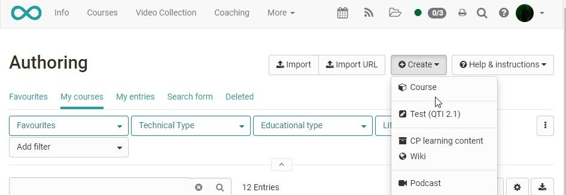

# In Five Steps to Your Course With the Course Editor

In the course editor you can add [course
elements](../learningresources/Course_Elements.md) to the course and set up and modify already installed course elements. The following describes how to create a course without using a wizard.

In the first step you create your course. In the following steps, you add the desired course elements.

## Step 1: Create course  
  
1. Click on ["Authoring"](../area_modules/Authoring.de.md) in the main navigation.
    
    { class="shadow" }

2. Click on the button "Create" and choose "Course".

3. Insert title and click "Create".
    
    { class="shadow" }

4. Select course design (conventional course, [learning path course](../learningresources/Learning_path_course.md)) or course with learning progress and confirm with "Create".  

5. You can now make further settings in the menu that appears.
    
    Add the description and further information in the tab "Info". Use the "Metadata" and "Execution" tabs for more information.

    Also use the tabs "Metadata" e.g. for a license specification and "Execution" for the specification of an execution period.

    Of course, you can also set up the other tabs now or add all information at a later time.   
  

6. Start course editor from the "administration" in the toolbar.

    The function "Insert course elements" opens a selection window with all available course elements that you can add to your course.  
  
!!! info
    The exact further design and the choice of the [course
    elements](../learningresources/Course_Elements.md) required depend on your didactic concept. The following is _an example_ of a course similar to the course wizard.

The next steps take place in the **Course Editor**. 
The following is an _example_ of how to recreate a course similar to the course wizard.

## Step 2: Insert welcome page

1. Open the "Course Editor" that can be found in the "Administration" section. Click "Insert course elements" in the course toolbar and select "Single page" in the knowledge transfer section. A new course element is always inserted right beneath the currently selected course element. 

    { class="shadow" }  
  
2. Indicate a title in the tab "Title and description" and save your settings. Possibly enter another title for the course menu if your base title is too long.  
 

3. In the tab "Page content" click on "Create page and open in editor". This is how you get to the OpenOlat HTML editor.

    { class="shadow" }  
  
4. Enter the desired content here, e.g. a welcome text. 

5. Click on "Save and close".  
  
!!! info

    Alternatively, you can use an existing HTML or PDF page and upload or link to it. To do this, select the "Select page" button in step 3. If your file is already in the course's storage folder select the option "Select file" in the submenu that will appear. If you want to upload a file on your computer and link it to your course select the option "Upload file".

!!! tip

    If you do not want to use an HTML page for the content, you can alternatively use the course element "Document".

## Step 3: Insert folder 

1. Click "Insert course elements" in the course toolbar and select ["Folder"](../learningresources/Course_Element_Folder.md) in the knowledge transfer section. A new course element is always inserted right beneath the currently selected course element.  

2. Again indicate a title in the tab "Title and description" and save your settings.  

3. In the tab "Folder Configuration" either use an automatically generated folder or select the course's storage folder to define the storage location for the folder's files.  

4. Then you can upload your files to the defined folder via "Manage folder".  

5. Select the link "Upload file" and search for the desired file on your own computer. Finish the process by clicking the "Upload" button.  
  
!!! note

    There are generally several possibilities and ways to provide course materials. Have a look at the other course elements from the knowledge transfer section. In addition, you can also activate a folder in the [toolbar](../learningresources/Using_Additional_Course_Features.md) (here under the designation "Documents"). This way the folder is continuously available.

## Step 4: Insert discussion forum

1. Click "Insert course elements" in the course toolbar and select "Forum" in the communication and collaboration section. A new course element is always inserted right beneath the currently selected course element.

2. Indicate a title in the tab "Title and description" and save your settings.  
  
!!! info
    If needed, you can define in the "Configuration" tab whether pseudonymised forum posts are also allowed.

!!! info 
    Adding further course elements follows the same principle.

### Simple design option: course element Tab Layout

All course elements have the tab "Layout". Here you have further visual design options for the course elements. For example, you can store a background image or choose a certain display style. Color coding is also possible. The preview option allows you to see the effects directly. In this tab, you also determine whether the course element is displayed with the stored short title the (long) title or without title. You can find detailed information about the possibilities
[here](../learningresources/Design_possibilities_of_courses_and_course_elements.md)

Once you have added the desired course elements, you still need to publish the course.

## Step 5: Publish and configure share

1. Close the editor by selecting the original course path in the bread crumb navigation. Alternatively, the course can be closed by clicking on the right cross. Select "Yes automatically" in the pop-up that appears. 

       
    
      
  
    !!! tip
        Alternatively, you can also use the "Publish" link in the course editor. Here you can find further configuration options.
 
    
2. Click the "Settings" menu in the "Administration" of the course.

    { class="shadow" }  

3. Select the tab "Share" here.  

4. Configure the access for the participants here and decide whether the participants can book the course, whether you want to enter the participants or whether the access should be open in general. You can find further details on access configuration [here](../learningresources/Access_configuration.md).

5. To make the course visible and accessible to learners, the status must be changed from "Preparation" to "Published".
  
Now your course is visible for OpenOlat users and can be used.

!!! tip "Tip: Catalog"
    To ensure that your course is found by the learners, we recommend that you enter the completed course in the [catalogue](../catalog/index.md). This setting can be found in the menu "Preferences," tab "Catalog". Course participants will then find your course under "Courses" → "Catalog" in the corresponding category.

!!! tip "Tip: Toolbar"
    Many of the central elements of a course that should be permanently available can also be inserted in the [toolbar](../learningresources/Using_Additional_Course_Features.md) instead of in the left course navigation. In this case, instead of the course elements in the course editor, the appropriate tools are simply activated in the toolbar. In each case, consider which variant is more suitable for your scenario.