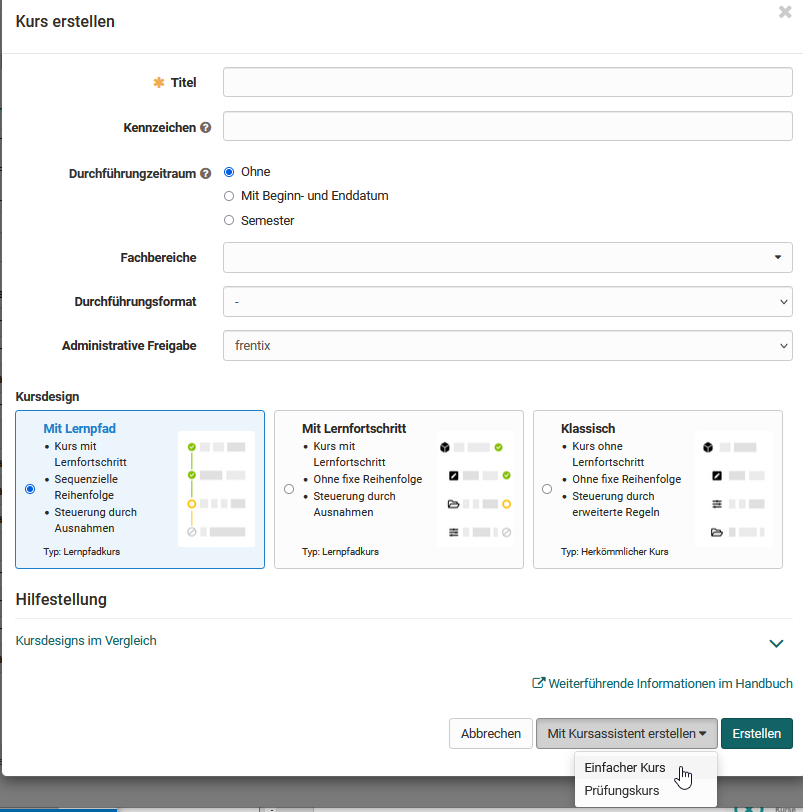
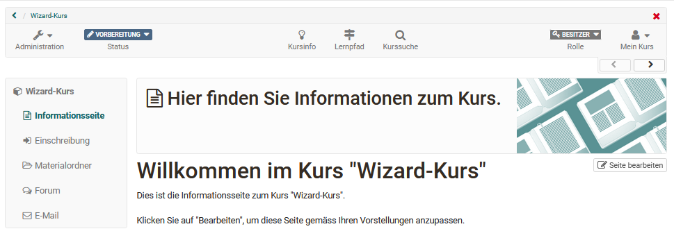

# Mit dem Kursassistenten in wenigen Mausklicks zu Ihrem OpenOlat-Kurs

Eher unerfahrene Kursautoren können Kurse auch mit Hilfe eines Wizards
erstellen. Hierbei wird eine kleine Auswahl von häufig verwendeten
Kursbausteinen verwendet. Weitere Bausteine können anschliessend noch per
Kurseditor hinzugefügt werden.

 

Wählen Sie beim Erstellen des Kurses die Option "Mit Kursassistent erstellen" -> "Einfacher Kurs". Sie können den Kursassistenten für alle drei Kursdesigns bzw. für beide Kurstypen verwenden. 

Folgen Sie dem Assistenten und lassen Sie sich Ihren Kurs einrichten. Sie können ein
paar häufig verwendete Kursbausteine auswählen, bei Bedarf einen
Einschreibebaustein für Gruppen konfigurieren, Ihren Kurs in den Katalog
eintragen und den Zugang sowie die Buchungsmethode konfigurieren.  Das
Endergebnis könnte wie folgt aussehen:

Sie finden Ihren Kurs anschließend im [„Autorenbereich“](../area_modules/Authoring.de.md) unter "Meine Kurse" sowie unter „Meine Einträge“. Wenn Sie einen OpenOlat Bookmark auf den Kurs setzen erscheint er auch unter "Favoriten". 

Im nächsten Schritt sollten Sie weitere Einstellungen im Kurs vornehmen und vor allem die Placebo-Infotexte entfernen. Gehen Sie auch durch die "Einstellungen" der Administration. 

Sie können weitere Änderungen bezüglich des Kursaufbaus in der linken Navigation jederzeit im Kurseditor durchführen. Erst wenn Sie den Kurs auf den Status "veröffentlicht" setzen, wird er für
Kursteilnehmende sichtbar.

Die Erstellung von OpenOlat-Kursen ist ziemlich einfach. Der Assistent ist in
den meisten Fällen gar nicht nötig, zumal Sie um eine spätere Überarbeitung im
[Kurseditor](../learningresources/General_Configuration_of_Course_Elements.de.md) nicht wirklich
herumkommen. Schauen Sie sich lieber den beschriebenen
[Kurszyklus](../learningresources/General_Information.de.md) an und richten Sie Ihren Kurs direkt mit dem
Kurseditor ein.
