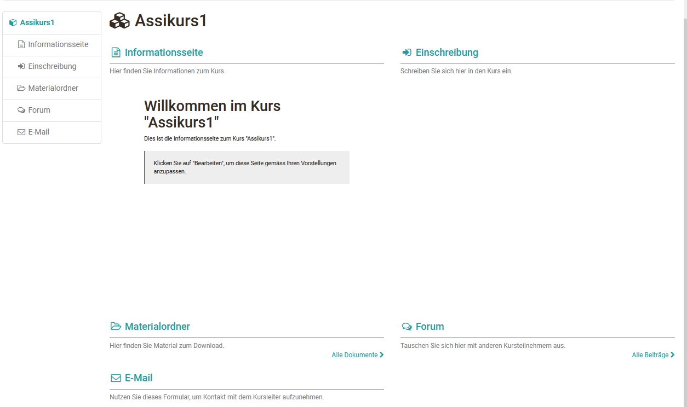

# Mit dem Kursassistenten in wenigen Mausklicks zu Ihrem OpenOlat-Kurs

Eher unerfahrene Kursautoren können Kurse auch mit Hilfe eines Wizards
erstellen. Hierbei wird eine kleine Auswahl von häufig verwendeten
Kursbausteinen verwendet. Weitere Bausteine können anschließend noch per
Kurseditor hinzugefügt werden.

Wählen Sie beim Erstellen des Kurses die Option "Einfacher Kurs". Folgen Sie
dann dem Assistenten und lassen Sie sich Ihren Kurs einrichten. Sie können ein
paar häufig verwendete Kursbausteine auswählen, bei Bedarf einen
Einschreibebaustein für Gruppen konfigurieren, Ihren Kurs in den Katalog
eintragen und den Zugang sowie die Buchungsmethode konfigurieren.  Das
Endergebnis könnte wie folgt aussehen:

Ihr Kurs befindet sich nun im [„Autorenbereich“](../authoring/index.de.md) unter „Meine Einträge“. Nun
sollten Sie weitere Einstellungen im Kurs vornehmen und vor allem die Placebo-
Infotexte entfernen. sowie die Darstellung der Startseite passend
konfigurieren, z.B. im Tab "Übersicht" des obersten Bausteins eine Anzeige
ohne Vorschau wählen.

Sie können weitere Änderungen jederzeit mit dem Kurseditor durchführen. Erst
wenn Sie den Kurs auf den Status "veröffentlicht" setzen, wird er für
Kursteilnehmende sichtbar.

Die Erstellung von OpenOlat-Kursen ist ziemlich einfach. Der Assistent ist in
den meisten Fällen gar nicht nötig, zumal Sie um eine spätere Überarbeitung im
[Kurseditor](General_Configuration_of_Course_Elements.de.md) nicht wirklich
herumkommen. Schauen Sie sich lieber den beschriebenen
[Kurszyklus](General_Information.de.md) an und richten Sie Ihren Kurs direkt mit dem
Kurseditor ein.
