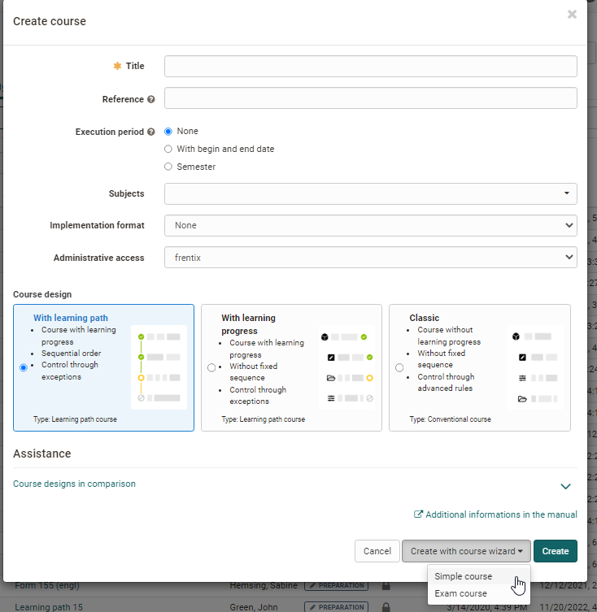
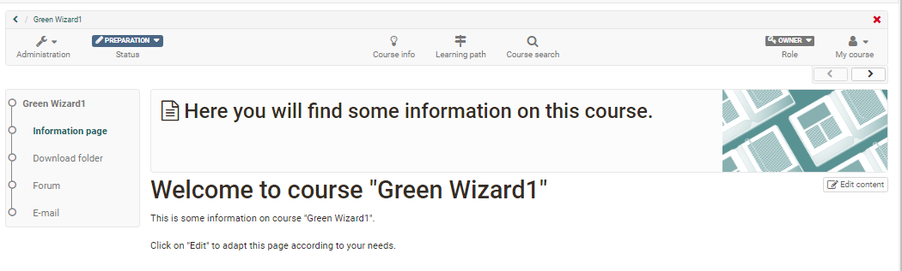

# Just a Few Clicks and the Course Wizard Will Create Your OpenOlat Course

Eher unerfahrene Kursautoren können Kurse auch mit Hilfe eines Wizards
erstellen. Hierbei wird eine kleine Auswahl von häufig verwendeten
Kursbausteinen verwendet. Weitere Bausteine können anschliessend noch per
Kurseditor hinzugefügt werden.

 

Wählen Sie beim Erstellen des Kurses die Option "Mit Kursassistent erstellen" -> "Einfacher Kurs". Sie können den Kursassistenten für alle drei Kursdesigns bzw. für beide Kurstypen verwenden. 

Follow the wizard and have your course set up. You can select a few frequently used course elements, configure a registration element for groups
if required, enter your course in the catalog and configure the access and
booking method. The end result might look like this:

Your course is now in the "Authors' Area" under "My Entries" and "My courses". Wenn Sie einen OpenOlat Bookmark auf den Kurs setzen erscheint er auch unter "Favoriten". 

You should now
make further settings in the course and, above all, remove the placebo info
texts. Gehen Sie auch durch die "Einstellungen" der Administration. 

Sie können weitere Änderungen bezüglich des Kursaufbaus in der linken Navigation jederzeit im Kurseditor durchführen. 
Only when you set the course to the status "published" will it become visible for course
participants.

Creating OpenOlat courses is pretty easy. In most cases, the wizard is not
even necessary, especially since you will not really be able to avoid a later
revision in the [course editor](General_Configuration_of_Course_Elements.md). It is better to look at the described [course cycle](General_Information.md) and set up your course directly with the [course editor](In_Five_Steps_to_Your_Course_With_the_Course_Editor.md).

The assistant only works for "conventional courses". Learning path courses
cannot be created with it.
