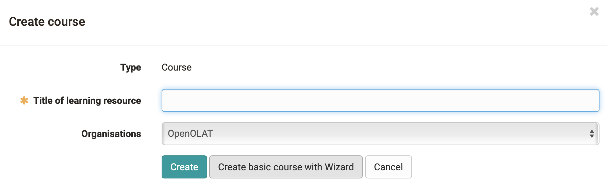
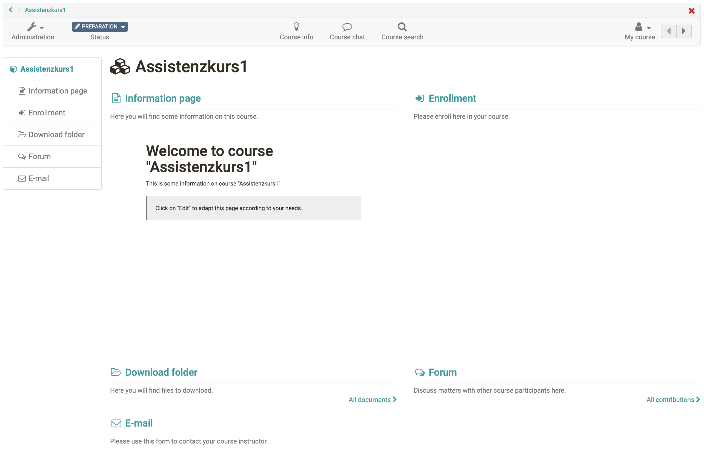

Course](Just_a_Few_Clicks_and_the_Course_Wizard_Will_Create_Your_OpenOlat_Course.md)

There is a wizard to help you create conventional courses. This Wizard is
meant for course authors who prefer to use only the most popular course
elements in OpenOlat without having to deal with the entire range of features
available in the course editor.

By selecting "Course" in the drop-down menu "Create" in the

sites/manual_user/docs/course_create/Just_a_Few_Clicks_and_the_Course_Wizard_Will_Create_Your_OpenOlat_Course.md §Authoring.md§ 481
"[Authoring](Authoring.html)" section you will get to this course wizard. Just
indicate the title and select "Create basic course with Wizard."

  

Now follow the wizard and have your course set up. You can select a few
frequently used course elements, configure a registration element for groups
if required, enter your course in the catalog and configure the access and
booking method. The end result might look like this:

Your course is now in the "Authors' Area" under "My Entries". You should now
make further settings in the course and, above all, remove the placebo info
texts and configure the display of the start page appropriately, e.g. select a
display without preview in the "Overview" tab of the top building block.

You can make further changes at any time with the course editor. Only when you
set the course to the status "published" will it become visible for course
participants.

Creating OpenOlat courses is pretty easy. In most cases, the wizard is not
even necessary, especially since you will not really be able to avoid a later
revision in the [course

sites/manual_user/docs/course_create/Just_a_Few_Clicks_and_the_Course_Wizard_Will_Create_Your_OpenOlat_Course.md §General_Configuration_of_Course_Elements.md§ 481
editor](General_Configuration_of_Course_Elements.md). It is better to look

sites/manual_user/docs/course_create/Just_a_Few_Clicks_and_the_Course_Wizard_Will_Create_Your_OpenOlat_Course.md §General_Information.md§ 481
at the described [course cycle](General_Information.md) and set up your
course directly with the [course

sites/manual_user/docs/course_create/Just_a_Few_Clicks_and_the_Course_Wizard_Will_Create_Your_OpenOlat_Course.md §In_Five_Steps_to_Your_Course_With_the_Course_Editor.md§ 481
editor](In_Five_Steps_to_Your_Course_With_the_Course_Editor.md).

The assistant only works for "conventional courses". Learning path courses
cannot be created with it.

