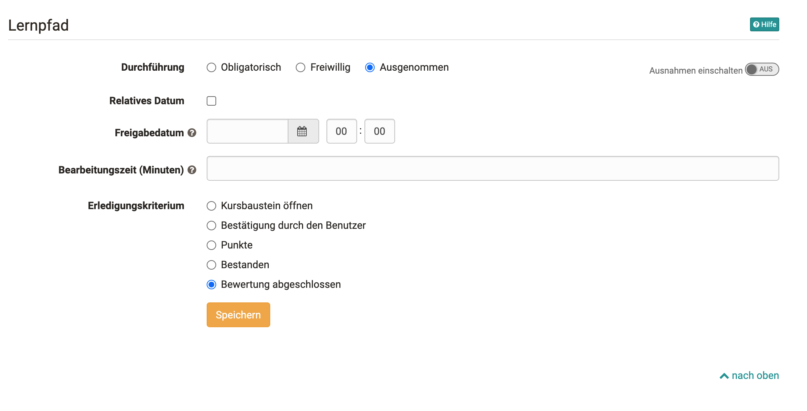

## Lernpfad Kurs - Kurseditor

## Abfolge der Lernschritte

### Sequenziell oder "ohne Reihenfolge"

Lernpfad Kurse können so konfiguriert werden, dass sie sequenziell oder in
beliebiger Reihenfolge von den Lernenden durchlaufen werden. Die
Grundeinstellung wird auf dem obersten Kursbaustein, der beim Erstellen eines
Kurses automatisch erstellt wird, eingestellt. Diese Einstellung gilt dann
zunächst für den gesamten Kurs.

Beispiele und eine weitere Einführung findet man auch in unserem [Whitepaper
für Lernpfadkurse (hier
herunterladen)](assets/Whitepaper_Lernpfadkurse_final.pdf).

Sollen bestimmte Bereiche des Kurses eine andere Einstellung erhalten, kann
dies über das Hinzufügen und Konfigurieren des Kursbausteins „Struktur“
erfolgen. Die gewählte Einstellung gilt dann für alle diesem [Kursbaustein
„Struktur](../../pages/viewpage.action%EF%B9%96pageId=108593217.html)“
untergeordneten Kursbausteine. So kann beispielsweise ein Kurs standardmäßig
als sequenziell konfiguriert sein, aber ein bestimmter Bereich im Kurs kann
permanent in beliebiger Reihenfolge aufgerufen werden.

## Der Tab Lernpfad

Lernpfad Kurse haben im Gegensatz zu herkömmlichen Kursen nicht die Tabs
„Sichtbarkeit“ und „Zugang“, sondern den Tab „Lernpfad“. Hier können folgende
Dinge konfiguriert werden:

  *  **Durchführung**
    *  **Obligatorisch** : Die Erledigung des Kursbausteins ist verbindlich und wird bei der prozentualen Auswertung des Lernfortschritts berücksichtigt.
    *  **Freiwillig** : Die Erledigung wird nicht bei der prozentualen Anzeige berücksichtigt.
    *  **Ausgenommen:  **Die Erledigung ist nicht Teil des Lernpfades und nur durch Ausnahmen steuerbar.
  *  **Freigabedatum** : Datum ab dem das Element vom User bearbeitet werden kann. Der Baustein ist dabei sichtbar aber nicht zugänglich.
  *  **Zu bearbeiten bis** : Ist ein Kursbaustein obligatorisch, kann man auch ein Datum eintragen bis zu dem die Bearbeitung erfolgt sein muss.
  *  **Bearbeitungszeit** : Hier kann eingetragen werden, wie lang der Ersteller die Bearbeitungszeit für den jeweiligen Baustein einschätzt. Er ist unabhängig davon wieviel Zeit der User wirklich für den Baustein benötigt.

Diese Einstellungen stehen für fast alle Kursbausteine zur Verfügung. Eine
Ausnahme bildet jedoch der Kursbaustein „Struktur“, der für die Bündelung von
Kursbausteinen gedacht ist.  Im Strukturbaustein kann die Abfolge der
Lernschritte die für alle untergeordneten Kurselemente gilt, mit sequenziell
oder spezifischer Reihenfolge definiert werden.

### Ausnahmen

Ausnahmen können mittels Toggle aktiviert werden und sind eine erweiterte,
feingranularere Steuerung, wer diesen Kursbaustein sehen und bearbeiten kann.  
Für jeden Kursbaustein im Lernpfad kann man gewisse Ausnahmen definieren.
Damit werden bestimmte Gruppen oder Personen vom Zugriff auf den jeweiligen
Kursbaustein ausgeschlossen. Mithilfe dieser Ausnahmen können individuelle
Lernpfade für verschiedene Lernende umgesetzt werden.

  *  **Gruppen:**  Kursbausteine sind nur für bestimmte Gruppen verfügbar 

  * **Organisationen** : Kursbausteine sind nur für bestimmte Org-Groups verfügbar 

  * **Benutzer:**  Einzelne Benutzer können für den Kursbaustein ausgeschlossen werden 

  * **Benutzer-Attribut:  **Kursbausteine sind nur für Benutzer mit bestimmten Benutzer-Attributen verfügbar 

  * **Kursbaustein bestanden** : Kursbausteine sind nur für Benutzer verfügbar, die einen bewertbaren anderen Kursbaustein bestanden haben (siehe Erledigungskriterien) (z.B. Test XY bestanden)

  

 Weitere Beispiele hier:

Ausnahmen nicht aktiviert:

  

Ausnahmen aktiviert und eine Gruppe hinzugefügt:

  

### Bearbeitungszeit

Die Bearbeitungszeit ist besonders relevant, wenn in den Kurseinstellungen für
die Durchführung der Lernfortschritt anhand der Bearbeitungszeit ermittelt
wird (siehe [Lernpfad Kurse](Creating_learning_path_courses.de.md) erstellen). In
diesem Fall werden alle Zeitangaben der einzelnen Kursbausteine summiert und
die Gesamtsumme als Basis für 100 % genommen.

Sofern eine Zeitangabe für einen Kursbaustein hinterlegt wurde, wird diese
Bearbeitungszeit auch den Teilnehmern angezeigt solange sie den Kursbaustein
noch nicht erledigt haben. Sind eine Kursbausteine mit einem Strukturbaustein
gebündelt wird den Teilnehmenden ferner aufaddiert die gesamte
Bearbeitungszeit der untergeordneten Kursbausteine angezeigt. Voraussetzung
ist, dass im Tab "Layout" des Strukturbausteins die Anzeige des Titels
aktiviert ist. Durch die Anzeige der Bearbeitungszeit haben die Lernenden
schnell einen Überblick über den Zeitaufwand eines Bereichs oder Kapitels des
Kurses.

Die Zeitanzeige ist unabhängig davon, welche Art der
Lernfortschrittsberechnung in den Kurs Einstellungen gewählt wurde. Also auch
wenn der Fortschritt basierend auf der Anzahl der Kursbausteine erfolgt, wird
die Bearbeitungszeit beim Strukturbaustein und bei den untergeordneten
Kursbausteinen angezeigt.

### Erledigungskriterien

Die meisten Kursbausteine bieten die Möglichkeit, dass der Baustein als
„erledigt“ gilt, wenn er geöffnet wird oder wenn der User explizit die
Bearbeitung bestätigt. Je nach Kursbaustein stehen aber auch noch weitere
Erledigungskriterien zur Verfügung.

 **Kursbaustein öffnen**

|

alle Kursbausteine ausser Struktur  
  
---|---  
  
 **Bestätigung** durch den Benutzer

|

alle Kursbausteine ausser Struktur  
  
 **Punkte** :  
Erledigt, wenn der User eine gewisse Mindestpunktzahl erreicht hat.

|

Aufgabe, SCORM, Bewertung, Gruppenaufgabe, Checkliste, Test, LTI,
Portfolioaufgabe  
  
 **Bestanden** :  
Erledigt, wenn die für den Kurbaustein definierten Bestehens Kriterien erfüllt
sind.

|

Aufgabe, SCORM, Bewertung, Gruppenaufgabe, Checkliste, Test, LTI,
Portfolioaufgabe  
  
 **Durchführung erledigt:**  
Komplett erledigt, wenn alle Schritte der Aufgabe durchlaufen wurden. In den
Zwischenstadien wird beim Fortschritt eine teilweise Bearbeitung prozentual
berücksichtigt.

|

Aufgabe, Gruppenaufgabe, Portfolioaufgabe  
  
Status durch **Betreuer auf "erledigt" gesetz** t:  
Erledigt wenn der Betreuer dies manuell gekennzeichnet hat.| Bewertung,
Checkliste,  
 **Test beendet**|  Test  
 **Umfrage teilgenommen:**  
Erledigt, wenn der User die Umfrage abgegeben hat.| Umfrage  
 **Einschreibung erfolgt:**  
Erledigt, wenn sich der User in mindestens eine Gruppe eingeschrieben hat.|
Einschreibung  
 **Formular ausgefüllt**|  Formular  
 **Video bis zum Ende geschaut (95%)**|  Video  
 **E-Mail versendet**|  E-Mail

