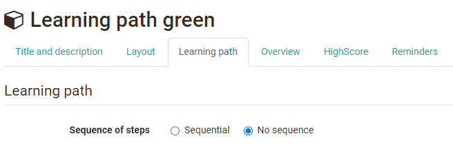
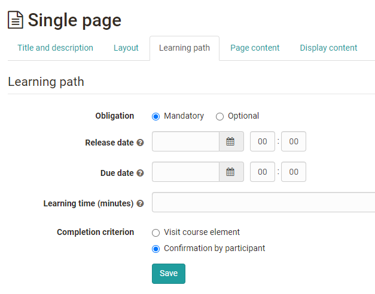

editor](Learning_path_course_-_Course_editor.md)

## Sequence of learning steps

### Sequential or " no sequence ".

Learning path courses can be configured to be followed sequentially or in any
order by learners. The basic setting is set on the top course element, which
is automatically created when a course is created. This setting then initially
applies to the entire course.

If certain areas of the course are to be given a different setting, this can
be done by adding and configuring the course element "Structure". The selected
setting will then apply to all course elements subordinate to this [course

sites/manual_user/docs/course_create/Learning_path_course_-_Course_editor.md §Course_Element_Structure.md§ 481
element "Structure"](../course_elements/Course_Element_Structure.md). For example, a
course can be configured as sequential by default, but a certain area in the
course can be permanently accessed in any order.

## Tab "Learning path"

Learning paths, unlike conventional courses, do not have the tabs "Visibility"
and "Access", but the tab "Learning path". The following things can be
configured here:

  *  **Mandatory:** The completion of the course element is binding and will be considered in the percentage evaluation.
  *  **Optional:** Completion will not be taken into account when displaying percentages.
  *  **Release date:** Date as of which the element can be edited by the user.
  *  **Due date:** If a course element is mandatory you can also enter a date by which the element must be completed.
  *  **Learning time (minutes):** Here you can enter how long the creator estimates the processing time for a given element. It does not depend on how much time the user really needs for that element. ~~This setting is particularly relevant if the progress of learning is determined by the processing time in the course settings. In this case all times are summed up and the total sum is taken as the basis for 100%.~~

These settings are available for almost all course elements. An exception is
the course element "Structure" that is meant for bundling course elements.  In
the structure element you can only define a sequence of learning steps that
applies to all subordinate course elements, either sequentially or in specific
order.

### Learning time

The learning time is particularly relevant if the learning progress is
determined on the basis of the learning time in the course settings for the
execution (see Create courses learning path). In this case, all time entries
of the individual course elements are summed up and the total sum is taken as
the basis for 100%.

If a time has been entered for a course element, this learning time will also
be displayed to the participants as long as they have not yet completed the
course element. If a course element is bundled with a structure element, the
total learning time of the subordinate course elements will be displayed to
the participants. The prerequisite is that the display of the title is
activated in the tab "Layout" of the structure element. By displaying the
learning time learners can quickly get an overview of the time spent on a
section or chapter of the course.

The time display is independent of the type of learning progress calculation
selected in the course settings. So even if progress is based on the number of
course elements, the learning time will be displayed for the structure element
and for the subordinate course elements.

### Completion criterion

Most course elements offer the possibility that the element is considered
"done" when it is opened or when the user explicitly confirms the processing.
Depending on your course element there are also other criteria for completion.

 **Visit course element**

|

all course elements except structure  
  
---|---  
  
 **Confirmation** by participant

|

all course elements except structure  
  
 **Score:**  

Done when the user has reached a certain minimum score.

|

Task, SCORM, Assessment, Grouptask, Check list, Test, LTI, portfolio task  
  
 **Passed:**

Completed when the pass criteria defined for the course component are met.

|

Task, SCORM, Assessment, Grouptask, Check list, Test, LTI, portfolio task  
  
 **Execution done:**

Completely done when all steps of the task have been completed. In the
intermediate stages, partial completion is taken into account as a percentage
of progress.

|

Task, Grouptask, portfolio task  
  
 **Coach has set status to "done":**

Erledigt wenn der Betreuer dies manuell gekennzeichnet hat.

| Assessment, Check list  
 **Test finished**|  Test  
  
 **Survey finished:**

Done when the user has submitted the survey.

| Survey  
  
 **Enrollment done:**

Done if the user has enrolled in one or more group(s).

| Enrollment  
  
 **Form filled in**

  

|  Form  
 **Video watched to the end (95%)**|  Video  
 **E-Mail sent**|  E-Mail

