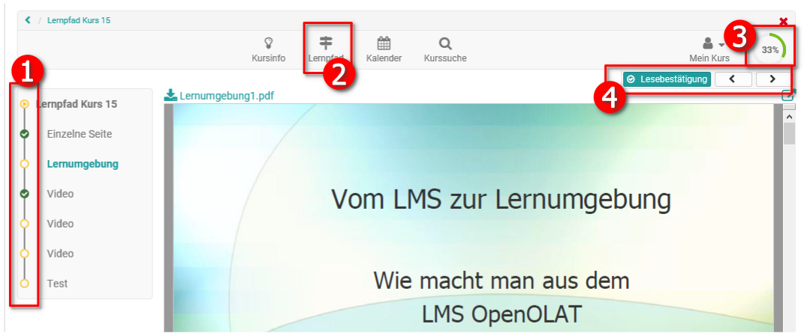
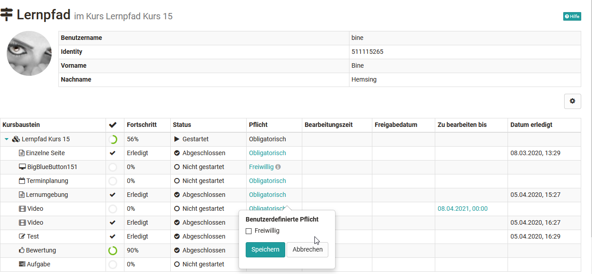
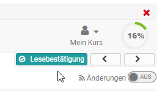

Teilnehmeransicht](Learning_path_course_-_Participant_view.de.md)

Ein Lernpfad Kurs unterscheidet sich auch für die Lernenden von einem
herkömmlichen Kurs. Die größten Unterschiede liegen in der Fortschrittsanzeige
und dem Bereich Lernpfad. Auch werden bei Lernpfad Kursen den Studierenden
keine Tool-Icons zur Orientierung angezeigt. Im Folgenden werden die zentralen
Bereiche kurz hervorgehoben.

## Typische Elemente eines Lernpfad Kurses aus Sicht der Lernenden:

  1.  **Fortschrittsleiste** im Kurs:   
Hier sehen die Lernenden welche Elemente sie schon aufgerufen bzw. erledigt
haben und auch welche Kursbereiche noch nicht zugänglich sind.

  2. Link "Lernpfad" in der Toolbar:   
Hier gelangen die Lernenden zum **Gesamtüberblick** über ihren
Bearbeitungsstand aller Kursbausteine mit weiteren Feedback Informationen wie
Fortschritt, Status, Verbindlichkeit, angesetzte Bearbeitungszeit sowie
eventuelle Datumsangaben. Kursbesitzer oder Betreuer sehen hier den
Bearbeitungsstand aller Kursteilnehmenden.  

  3. Visualisierte Anzeige des **prozentualen Fortschritts.** Wurden alle definierten Kursbaustein entsprechend der Konfiguration bearbeitet bzw. angeklickt, wird 100 % angezeigt. Sofern aktiviert werden hier auch die Gesamtpunkte des Users angezeigt.

sites/manual_user/docs/course_create/Learning_path_course_-_Participant_view.de.md §Learning_path_course_-_Course_editor.de.md§ 481
  4. Pfeilbuttons für die Navigation durch den gesamten Kurs.  Mit den Pfeilen kann der User zum nächsten Kursbaustein navigieren. Müssen bestimmte Anforderungen für den folgenden Baustein erfüllt sein, die noch nicht erfüllt wurden, z.B. fehlt eine Bestätigung durch den User oder ein Test wurde noch nicht absolviert, erscheint die Meldung „Dieses Kurselement ist nicht zugänglich.“.  Ferner erscheint beispielsweise " **Lesebestätigung** ", wenn der User bestätigen muss, dass er den entsprechenden Baustein bearbeitet hat. Einen Überblick über mögliche Bestätigungskriterien findet man [hier](Learning_path_course_-_Course_editor.de.md).

Über die visualisierte Anzeige (3) und den Bereich Lernpfad (2) erhalten die
Lernenden rasch und kontinuierlich einen Überblick über ihren Kursfortschritt
und den aktuellen Bearbeitungsstand.

Der prozentuale Bearbeitungsstand (3) kann sich an der Anzahl der bearbeiteten
Kursbausteine oder an dem mit den einzelnen Kursbausteinen verbundenen
Zeiteinheiten orientieren. Dem User wird prozentual angezeigt, wieweit er den
Kurs bereits bearbeitet hat. Sollen bei der gesamten Kursbewertung auch Punkte
angezeigt werden (siehe Konfiguration im Menü "Einstellungen" → Tab
"Bewertung"), erscheint unter der Prozentanzeige auch noch der entsprechende
bereits erreichte Punktwert.

Hat der User alle vom Lehrenden definierten Kursbausteine absolviert wird ihm
100 % angezeigt. Werden im laufenden Kurs neue Bausteine hinzugefügt oder
gelöscht, wird dies bei der Gesamtsumme berücksichtigt und der bisherige
Prozentwert der Lernenden wird entsprechend angepasst.

sites/manual_user/docs/course_create/Learning_path_course_-_Participant_view.de.md §Course_Reminders.de.md§ 481
Der Lehrende kann auch [Erinnerungsmails ](../course_operation/Course_Reminders.de.md)so konfigurieren,
dass sie bei einem bestimmten prozentualen Bearbeitungswert verschickt werden,
z.B. wer weniger als 60 % bearbeitet hat wird noch einmal motiviert die
restlichen Bearbeitungen im Kurs vorzunehmen.

