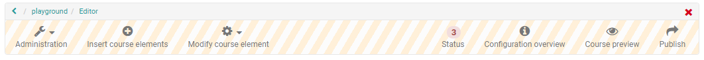
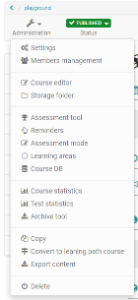
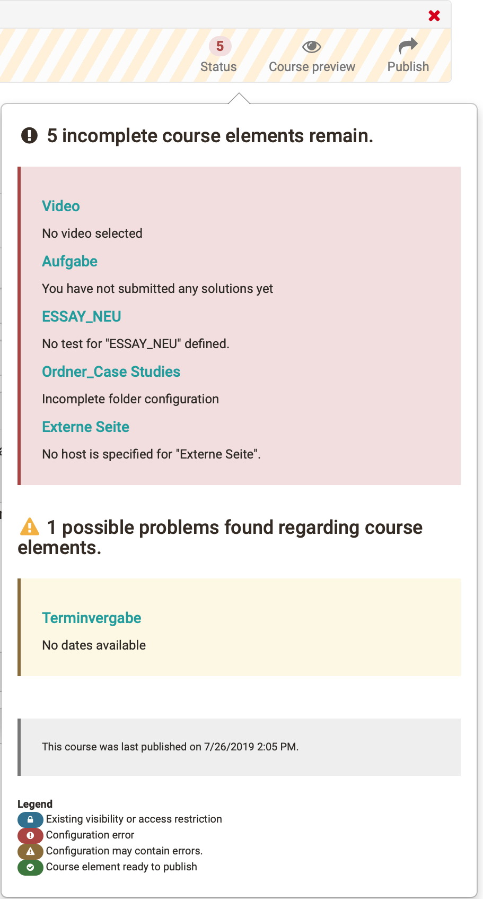
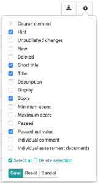
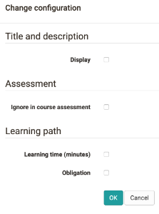
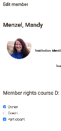
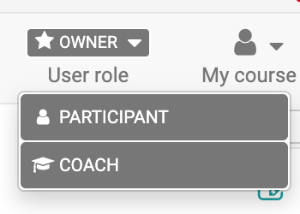

Tools](Using_additional_Course_Editor_Tools.md)

In the course editor menu you have access to the administration area with
various other configuration tools. Here you can insert and modify course
elements, view their current status and configuration as well as a course
preview and finally publish your course.

## Administration

Here you have access to various other course tools. You will find information
on the separate pages of the tools.

## Insert course elements

Here you have access to all [course elements](Types+of+Course+Element.html)
that you can integrate into a course.

## Modify course element

Added course elements can be deleted, moved and copied. Furthermore, moving
the course elements is also possible by drag & drop.

## Status

Here you can see if there are problems when configuring course elements. Click
on the number indicated and the corresponding problems will be displayed and
can be solved. The legend also indicates what kind of problem it is.

Possible configuration problems will additionally be displayed in the course
navigation.

  

## Configuration overview

Here you will get an overview of the configuration of all course elements
added to your course according to the course structure in the left navigation.

  

Select the columns you want to obtain overview information on.

The column "Score" is only relevant for assessment elements. Here it will be
indicated whether or not points have been assigned for course elements.

Select only those columns that you really need. This way the display remains
clear. Especially the column "Description" should only be displayed if there
are no long texts in course elements.

The columns do not show the ratings for individual persons, but only give an
overview of the configuration of the course elements. If points are to be
awarded or a pass/fail is to be given, this will be done in the course's
"[Assessment tool](../course_operation/Assessment_tool_-_overview.md)".

The "Change configuration" button at the end of the list allows further
detailed settings to be made. In conventional courses you can change the
display of selected course elements at once and thus e.g. standardize it. In
case of learning path courses further settings regarding assessment
configuration and learning path are possible.

  

Course preview

The editor tool "Course preview" enables you to see course settings and
content from the course participant's point of view. By clicking on "Course
preview" you will first get to the configuration menu to simulate your course
at a certain point in time, as member of a distinct group, or with other
attributes used in your course.

In contrast to the view of the course content you will see all modifications
or course elements not yet published in the course preview. Features depending
on an interaction between participant and system will not be available in the
course preview, e.g. enrolling in groups, starting a test, self-test or
questionnaire, and performing tasks in the course element "Task."

 More information on configuring the course preview:

By means of this form you can define the conditions of the course's preview.  
  
**Date:** This field is mandatory. Please enter date or time you want the
course preview to be displayed. The current date and time is pre-set.  
  
**Group:** Please enter the name of the group in order to make this course
available for relevant group members.  
  
**Learning area:** Please enter the name of a learning area in order to make
this course available for members of this learning area.  
  
**Role:** Please select to whom this preview should be accessible.

  *  _«Registered OLAT users»_ : This is how the course is presented to a regular OLAT user (e.g. student).
  *  _«Guests»_ : This is how the course is presented to a guest user (who log in without an OpenOlat account), if this course is available for guests at all.
  *  _«Tutors»_ : This is how the course is presented to a tutor of any learning group during this course.
  *  _«Course owners»_ : This is how the course is presented to course owners (course administrators).
  *  _«OLAT authors»_ : This is how the course is presented to users with OLAT author rights.

 **Attributes:** By means of these fields you can enter up to 5 AAI attribute
names with their relevant values. By means of this preview this course is
presented in the way a user with these AAI attributes would see it.  
  
**Example:**  
Attribute name: swissEduPersonStudyBranch3  
Attribute value: 4600  
This is how the course is presented to Chemistry students.  
  
For more information:  
[AAI attributes ](Access_Restrictions_in_the_Expert_Mode.md)  
[__ General information on AAI](http://www.switch.ch/aai/)

The course preview is useful, for example, to view a course from the
participant's perspective before it starts or to check certain visibility
rules.

If course owners only want to view the course presentation from the learner's
perspective, they can simply register as participants in the member
administration. This way you can switch between the desired course roles and
views while the course editor is closed.

Publishing

All settings and modifications made in the course editor will be released by
means of "Publish". This way you can prepare, set up and design your course in
the course editor at your leisure.

Your course can either be published by clicking on that link in your toolbar
or directly when closing your course editor. Only once you have published your
course it will become visible in the course run with closed editor. This does
not mean that learners will already see your course. In order to be able to do
that you have to publish your course and configure your access (see chapter
"[Access configuration](Access_configuration.md)").

If you want to make more differentiated settings when publishing, select the
"Publish" button in the toolbar of the course editor.

 Button "Publish": Configuration steps

Step 1: First you have to select all those course elements you have modified
and want to publish. Your choice will be reduced to course elements that are
available for publishing.

Step 2: Then you determine who should have access to your OpenOlat course. See
section ["Course Settings](Course_Settings.md)" to learn more about those
four options at your disposal. Now you can complete your publishing process.
Just click on "Finish."

Step 3: You can create a catalog entry for the course. Tip: Enter only
complete and functional courses in the catalogue, no test or play courses.

Step 4: At this stage you will be informed on course elements that may not
have been configured correctly and could cause problems when starting your
course.

Step 5: Any background updates of course elements are displayed here.

Step 6: At last you will get a summary of your published modifications as well
as a message containing the number of course participants working on your
course at that very moment.Complete the steps with "Finish". You can also
shorten the process by skipping individual steps and clicking on "Finish"
immediately after step 2.

In most cases it is sufficient to publish the course simply by closing the
course editor.

As long as you have not published your course elements and set the course to
"Published", course participants will not find it either via the search mask
or in the list of courses.

In case you publish a course while others are working on it all non-saved data
(such as entries in forums or Wikis) will be lost.

