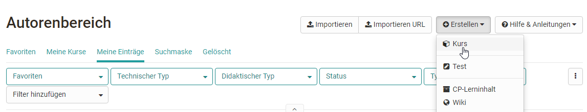
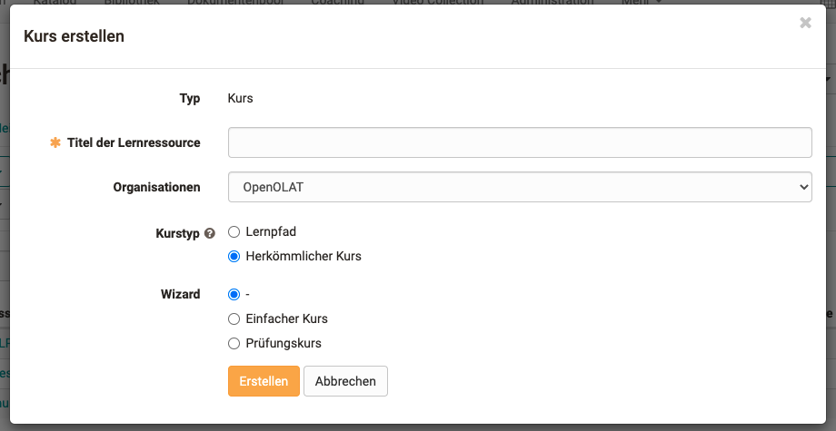

# Kurs erstellen

  

Dieses Kapitel ist für Kursautoren geschrieben und zeigt Ihnen wie man einen
Kurs erstellt, einrichtet und konfiguriert.

Es gibt zwei Varianten von OpenOlat Kursen: Herkömmliche Kurse und [Lernpfad
Kurse,](Learning_path_course.de.md) die sich
teilweise in den Konfigurationsmöglichkeiten unterscheiden. Lernpfad Kurse
verfügen u.a. über eine
[Fortschrittsanzeige](Learning_path_course_-_Participant_view.de.md). Im
Autorenbereich können sich Kursbesitzer durch einblenden der Spalte
"Technischer Typ" direkt anzeigen lassen, ob es sich bei einem Kurs um einen
Lernpfad Kurs oder einen herkömmlichen Kurs handelt.

  

  

### Wie können Sie starten?

Verschaffen Sie sich am besten zunächst einen Überblick über den gesamten

sites/manual_user/docs/course_create/index.de.md §General_Information.de.md§ 481
[Kurszyklus ](General_Information.de.md)und gehen schauen Sie sich dann die einzelnen

sites/manual_user/docs/course_create/index.de.md §Types_of_Course_Element.de.md§ 481
Bereiche an.  Die konkreten [Kursbausteine](Kursbausteine.html), die Sie für
den Aufbau von Kursen verwenden können, werden in einem separaten Kapitel
ausführlich erläutert. Die Erstellung der Kursstruktur erfolgt sowohl bei
Lernpfad Kursen als auch bei herkömmlichen Kursen im Kurseditor.

Zusätzlich kann beim anlegen eines Kurses auch ein Wizard für Einsteiger oder
auch ein spezieller Prüfungskurs angelegt werden. Für die meisten
Lehrszenarien ist allerdings die Standardeinstellung ohne Wizard die passende
Wahl.

  

  

