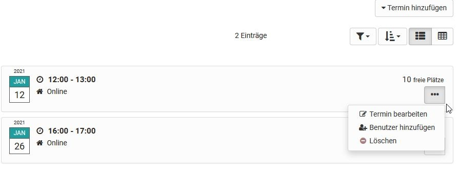

# Verwaltung und Organisation

  * 1 Verwaltung und Organisation 
    * 1.1Kursbaustein „Einschreibung“
    * 1.2Kursbaustein „Mitteilungen“
    * 1.3Kursbaustein „E-Mail“
    * 1.4 Kursbaustein „Kalender“
    * 1.5 Kursbaustein "Terminplanung"

## Kursbaustein „Einschreibung“

Der Kursbaustein „Einschreibung“ wird verwendet, damit sich Kursteilnehmer in
eine oder mehrere OpenOlat Gruppen eintragen können. Definieren Sie dazu im
Tab „Konfiguration“, in welche und wie viele **Gruppen** sich Kursteilnehmende
einschreiben können. Sie können auch die Reihenfolge der Gruppen in der
Auswahlliste definieren. Sollten Sie noch keine Gruppen erstellt haben oder
weitere benötigen, so können Sie dies mit einem Klick auf „Auswählen“ und
„Erstellen“ direkt im Tab „Konfiguration“ tun. Bestehende und neu erstellte
Gruppen können in der [Mitgliederverwaltung
](../course_operation/Members_management.de.md)bearbeitet werden.

Mittels " **Mehrere Eintragungen erlauben** " legen Sie optional fest, ob
Kursteilnehmer sich in mehrere Gruppen eintragen dürfen, und falls ja, in wie
viele.

Im Feld „ **Austragen erlaubt** “ bestimmen Sie optional, ob ein einmal
eingeschriebener Kursteilnehmer die Möglichkeit hat, sich wieder aus einer
Gruppe auszutragen. In der Gruppenverwaltung können Sie beim Editieren der
Gruppe festlegen, ob es eine Warteliste und ob es ein automatisches Nachrücken
geben soll.

Sofern Sie zuvor einen oder mehrere Lernbereiche in der Administration
angelegt und hier Gruppen zugeordnet haben, können Sie auf diese Lernbereiche
auch im Tab "Konfiguration" des Einschreibebausteins zugreifen.

## Kursbaustein „Mitteilungen“

Der Kursbaustein bietet die Möglichkeit, Mitteilungen in der Kursstruktur
einzubetten. Diese Mitteilungen sind sowohl im Kurs als auch bei den
Benachrichtigungen der einzelnen Benutzer sichtbar. Bei der Mitteilung kann es
sich sowohl um einen kurzen Infotext handeln, als auch um umfangreiche Infos,
die per Datei-Anhang (max. 5 MB) beigefügt werden. Während der Erstellung
einer Mitteilung kann definiert werden, ob die Mitteilung zusätzlich per Mail
an bestimmte Nutzergruppen des Kurses (Abonnierte, Kursbesitzer, Betreuer,
Mitglieder oder Gruppen) erfolgen soll.

 **Anzeige:** Die maximale Anzahl Tage legt fest, wie lange (in Tagen) die
Mitteilungen im Kurs angezeigt werden. Die maximale Anzahl Mitteilungen legt
fest, wie viele Mitteilungen gleichzeitig im Kurs angezeigt werden.

 **Automatisch abonnieren:** Standardmässig wird der Kursbaustein automatisch
von Kursbesuchern abonniert. Diese Option können Sie hier ausschalten, so dass
Kursbesucher Mitteilungen manuell abonnieren können.

Mitteilungen können im persönlichen Menü unter "Abonnements" eingesehen
werden. Die Anzahl angezeigter Mitteilungen kann im Kurseditor eingestellt
werden.

Standardmässig dürfen nur Betreuer und Besitzer Mitteilungen erstellen. Alle
Kursteilnehmer dürfen jedoch Mitteilungen lesen. Im Tab „Mitteilungs-
Konfiguration“ können Sie diese Einstellung Ihren Wünschen entsprechend
anpassen.

Die Anzahl der Zeichen für die Mitteilung ist auf 32.000 Zeichen begrenzt. Sie
erhalten eine entsprechende Information über die bereits verbrauchte
Zeichenzahl rechts unten im Mitteilungseditor. Wird die erlaubte Zeichenzahl
überschritten, erfolgt ein entsprechender Hinweis. Achtung: Die Anzahl der
angegebenen tatsächlichen Zeichen weicht von der Anzahl der sichtbaren Zeichen
ab, da für die tatsächliche Anzahl der HTML Code verwendet wird.

Ein Element mit ähnlichen Funktionen, jedoch ohne spezifische Konfiguration,
findet man auch in der Toolbar. Es handelt sich um die "[Teilnehmer
Infos](../course_operation/Using_Additional_Course_Features.de.md)".

  

## Kursbaustein „E-Mail“  

  

Über den Kursbaustein „E-Mail“ geben Sie Ihren Kursteilnehmern die
Möglichkeit, eine E-Mail an einen von Ihnen definierten Empfängerkreis zu
senden.

Sie haben zwei Möglichkeiten, um Nachrichten zu versenden. Entweder geben Sie
im Tab „Empfänger“ direkt die E-Mail-Adresse von bestimmten Personen ein, oder
sie wählen die Personengruppen aus, an die eine Nachricht versendet werden
soll. Sie können differenziert festlegen ob die Nachricht an Kursbesitzer,
Betreuer und / oder Teilnehmer von Kurs und / oder Gruppen geschickt wird.

Um im Feld „E-Mailadressen“ mehrere Empfängeradressen einzutragen, müssen Sie
diese durch einen Zeilenumbruch trennen, d.h. jede E-Mailadresse muss auf
einer eigenen Zeile stehen.

 **Versand an Kurseigentümer/Betreuer/Teilnehmer:** Markieren Sie die
gewünschten Checkboxen, um die Mitgliedergruppen zu definieren, die Sie
anschreiben möchten. Markieren Sie bei Betreuern und Teilnehmern in einem
zweiten Schritt, ob Sie jeweils alle anschreiben möchten, oder nach Kurs und
Gruppen unterscheiden. Klicken Sie keine Checkbox an, wird keine Mail
verschickt.

In den Feldern „Betreff (Vorlage)“ und „Nachricht (Vorlage)“ können Sie
optional Standardwerte vorgeben, die jedoch von den Kursteilnehmern beim
Versand einer E-Mail editiert werden können.

Zudem kann die Nachricht / der Betreff mit dem Einsatz von Variablen
persönlicher und kursbezogen gestaltet werden.

 Einsatz von Variablen

Folgende Variablen können im Betreff und im Text der E-Mail verwendet werden:

    
    
    $firstname

| Der Vorname des Benutzers  
---|---  
      
    
    $lastname

| Der Nachname des Benutzers  
      
    
    $fullName

| Der volle Name des Benutzers  
      
    
    $username

| Der Benutzername  
      
    
    $email

| Die E-Mailadresse des Benutzers  
      
    
    $courseurl

| Die Internetadresse des Kurses  
      
    
    $coursename

| Der Name des Kurses wie auf der Infoseite  
      
    
    $coursedescription

| Die Beschreibung des Kurses wie auf der Infoseite  
  
Die Benutzervariablen beziehen sich auf denjenigen, der die E-Mail über den
"Senden"-Button auslöst und verschickt.

  

  

Geben Sie durch einen geeigneten Kurztitel des Kursbausteins „E-Mail“ Ihren
Kursteilnehmern einen Hinweis darauf, an welchen Empfängerkreis diese
Nachricht versendet wird. Im E-Mailformular selbst werden die
Empfängeradressen aus Gründen des Datenschutzes nicht angezeigt.

Ein Element  "E-Mail" mit ähnlichen Funktionen, jedoch ohne spezifische
Konfiguration, findet man auch in der
[Toolbar](../course_operation/Using_Additional_Course_Features.de.md).

##  Kursbaustein „Kalender“

Mit dem Kursbaustein „Kalender“ können Sie den Kurskalender in die
Kursstruktur einbetten. Es ist auch möglich mehrere Instanzen desselben
Kalenders dem Kurs hinzuzufügen.

Diese Einbindung ist eine Alternative gegenüber der Einbindung des Kalenders
in der Kurstoolbar (vergl. "[Einsatz weiterer Kursfunktionen der
Toolbar](../course_operation/Using_Additional_Course_Features.de.md)").

Standardmässig dürfen nur Besitzer und Betreuer Termine erstellen. Alle
Kursteilnehmer dürfen jedoch Kalendereinträge lesen. Im Tab „Kalender-
Konfiguration“ können Sie definieren, ob neben den Kursbesitzern auch
Teilnehmer und Betreuer des Kurses Kalendereinträge einstellen und bearbeiten
dürfen. Ferner können Sie hier konfigurieren, welches Datum angezeigt wird,
wenn der Kurskalender aus der Kursstruktur aufgerufen wird. Kurskalender
werden automatisch den[ persönlichen Kalendern](../personal/Calendar.de.md) der
Kursteilnehmer hinzugefügt.

  

Wenn Sie im Kalender jeweils eine Semesterwoche anzeigen und Links auf
Kursbausteine einfügen, dient der Kalender als Übersichtsseite auf die Termine
und Aufgaben der Woche.

  

Prüfen Sie, ob der _Kursbaustein_ "Kalender" wirklich für Sie die optimale
Wahl darstellt. In vielen Fällen, insbesondere bei[ Lernpfad
Kursen](../course_create/Learning_path_course.de.md), ist es
sinnvoller in den Einstellungen den Kalender in der [Toolbar
](../course_operation/Using_Additional_Course_Features.de.md)zu aktivieren.

Wenn Sie in Ihrer OpenOlat Instanz keinen Kursbaustein "Kalender" finden
können, so wurde dies systemweit von einem Administrator ausgeschaltet.

##  Kursbaustein "Terminplanung"

Mit dem Kursbaustein Terminplanung können sowohl Einschreibungen für bestimmte
Termine als auch Terminfindungen organisiert werden. Generell kann
konfiguriert werden, ob mehrere Termine ausgewählt werden können, ob es eine
Begrenzung der Teilnehmerzahl gibt, ob die Teilnehmenden sehen wer sich
eingetragen hat und ob ein BigBlueButton Raum zugeordnet werden soll.

Im Kurseditor wird der Kursbaustein hinzugefügt und es kann festgelegt werden,
ob Betreuer Themen und Termine ebenfalls bearbeiten dürfen oder ob dies nur
durch die Kursbesitzer möglich ist. Soll die Terminwahl nur innerhalb eines
bestimmten Zeitfensters möglich sein, müssen die Zeitangaben im Kurseditor im
Tab "Lernpfad" entsprechend angegeben werden bzw. bei herkömmlichen Kursen die
Sichtbarkeit oder der Zugang passend konfiguriert werden.

Die eigentliche Konfiguration und Einrichtung der Termine erfolgt jedoch im
Kursrun bei geschlossenem Editor. Dafür werden zunächst über den Button
"Anlass erstellen" eine neue Einschreibung oder Terminfindung angelegt und die
Basiskonfiguration vorgenommen sowie Termine eingetragen.

Über den Button "Termin hinzufügen" können Sie auch später noch weitere
Termine dieser Abstimmung hinzufügen.  Auch können bereits angelegte Termine
über den Drei-Punkte-Link wieder überarbeitet werden.

####

**Termine: erstellen & bearbeiten**

Menü "Anlass erstellen"

 So konfigurieren Sie eine Einschreibung oder Terminfindung:

**Titel:** Geben Sie hier die Bezeichnung des Termins an, z.B. "Abstimmung
Abschlussmeeting", "Kick-Off-Meeting" usw.. Die Eingabe ist notwendig
(Pflichtfeld).

 **Beschreibung:** Erläutern Sie die Terminwahl näher.

 **Typ** : Entscheiden Sie ob es sich um eine Terminfindung für einen
gemeinsamen Termin oder um die Einschreibung für einen oder mehrere Termine
aus einer Auswahl, z.B. Labortermine handelt.

 **Konfiguration** : Entscheiden sie ob die Teilnehmenden nur einen oder
mehrere Termine auswählen dürfen und ob die Namen der Teilnehmenden für andere
Teilnehmende sichtbar sein sollen. Bei der "Einschreibung" kann ergänzend noch
definiert werden ob der Coach (Betreuer) den Termin noch bestätigen muss.

 **Organisator** :  Definieren Sie hier, wer als Organisator der Terminplanung
angezeigt wird.

 **Ort** : Geben Sie hier den Veranstaltungsort ein.

 **Max. Teilnehmer:** Sie können die Mitgliederzahl für einen Termin begrenzen
(nur bei "Einschreibung")

 **Terminart:** Sie können Termine basierend auf der Dauer, basierend auf
einem Start- und Enddatum oder wiederkehrend nach bestimmten Wochentagen
anlegen. Die Auswahl erleichtert Ihnen die Erstellung von weiteren Terminen.

Wird "Dauer" gewählt, werden beim Hinzufügen von weiteren Terminen die Termine
am gleichen Tag vorkonfiguriert und die Uhrzeiten entsprechend der Dauer
angepasst.

Wird Start/Ende gewählt bleiben die gewählten Uhrzeiten erhalten und man
braucht bei neuen Einträgen nur das Datum anzupassen.

 **Termine** : Hier werden die konkreten Wahltermine eingetragen. Durch Klick
auf das „+ Zeichen“ werden neue Termine hinzugefügt. Durch Klick auf das „-
Zeichen“ werden Termine wieder gelöscht.

 **Online Termin:** Die Optionen sind: Nein, kein Online-Termin oder man wählt
direkt das gewünschte Tool BigBlueButton oder Teams aus, sofern vom
Administrator die Virtuellen Klassenzimmer aktiviert wurden.

Wird BigBlueButton oder Teams aktiviert, kann für die gewählten Termine
jeweils ein BigBlueButton bzw. Teams Raum hinzugefügt und weiter konfiguriert
werden. Beim Ort wird in diesem Fall automatisch "online" angezeigt.

  

Ein erstellter "Anlass" kann später mit Klick auf das Zahnrad bearbeitet,
dupliziert oder gelöscht werden. Auch kann der Teilnehmerkreis für den Anlass
auf bestimmte Gruppen eingeschränkt werden. Ein Export der Teilnehmenden für
einen Anlass ist ebenfalls möglich.

Die konkreten Termine von bereits angelegten Terminplanungen können über den
Link "Termine anzeigen" näher betrachtet und vom Kursbesitzer bzw. Betreuer
editiert werden. Sie können hier Teilnehmende hinzufügen, löschen, umbuchen,
die Beschreibung anpassen, Termine ändern oder Termine bestätigen.

Teilnehmende können über den Link "Termine auswählen" bzw. "Eintragen" die
gewünschten Termine sehen und auswählen. Wurde ein Termin bestätigt, ist das
ebenfalls sichtbar.

  

  

  

