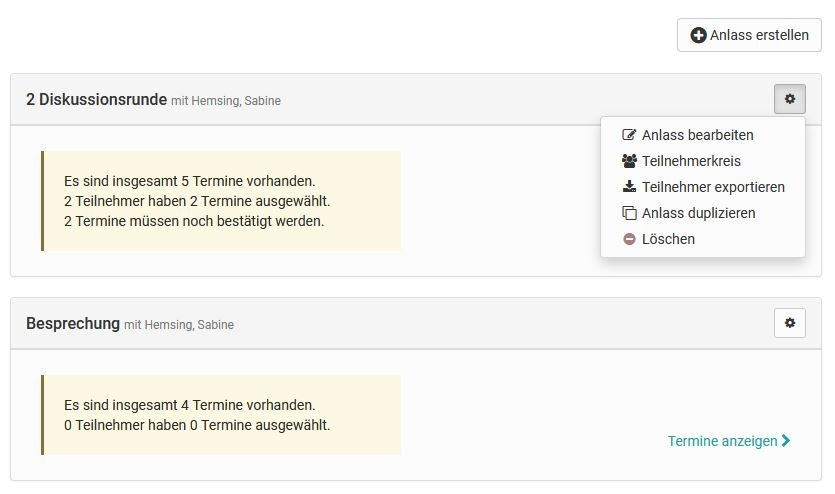
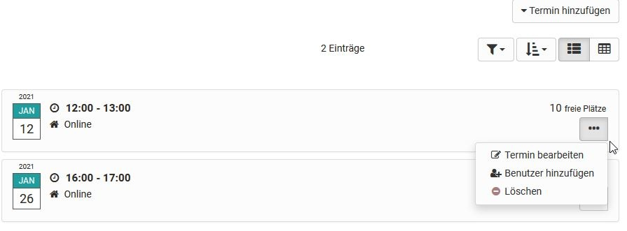

# Administration and Organisation

  * 1 Administration and Organisation 
    * 1.1 Course Element: Enrolment
    * 1.2Course Element: Notifications
    * 1.3 Course Element: E-Mail
    * 1.4 Course Element: Calendar
    * 1.5 Course Element: Appointment scheduling

##  Course Element: Enrolment

The course element "Enrolment" is used to let course participants enroll in
one or more groups. You can also define the order of the groups in the
selection list.

To do this, define in the "Configuration" tab in which and how many **groups**
course participants can enroll. You can also define the order of the groups in
the selection list. If you have not yet created any groups or need more, you
can do so directly in the "Configuration" tab by clicking on "Select" and
"Create". Existing and newly created groups can be edited in the [member
management](../course_operation/Members_management.md).

Use the field " **Allow multiple enrolments** " in order to allow course
participants to enrol in more than one, and if so how many, groups.

In the field " **Delisting allowed** " you can decide if a registered course
participant should have the possibility to delist from a group. In the group
management you can determine while editing groups if there should be a waiting
list and if moving up automatically from that list should be possible.

If you have previously created one or more learning areas in the
administration and assigned groups here, you can also access these learning
areas in the "Configuration" tab of the enrollment course element.

## Course Element: Notifications

This course element allows you to embed notifications in your course
structure. These notifications will be visible in your course as well as in
the notifications section of each single user. The message can either be a
short info text or an extensive information which is added as attachment (max.
5 MB). During the creation of the notification it can be defined, if the
message should be sent by email to certain user groups of the course
(subscribers, course owners, coaches, members, groups) additionally.

 **Display:** The maximum number of days determines how long notifications
shall be displayed in your course (in days). The maximum number of messages
determines how many messages shall be displayed simultaneously in your course.

 **Subscribe automatically:** By default this course element will be
automatically subscribed. This option can be deactivated here so that course
participants will be able to subscribe to notifications manually.

Messages from notifications course elements can be viewed using the
subscriptions tool in the personal menu. Course authors (in a course) can
determine the amount of notifications that should be displayed in a course.

By default only course authors and moderators are allowed to create messages.
However, all course participants may read messages. In the tab "Notification
configuration" you can adjust this setting according to your wishes.

The number of characters for the message is limited to 32,000. You will
receive information about the number of characters already used in the lower
right corner of the message editor. If the permitted number of characters is
exceeded, a corresponding message is displayed. Note: The number of actual
characters specified differs from the number of visible characters, as the
actual number of HTML code is used.

An element with similar functions, but without specific configuration, can
also be found in the toolbar. This is the "[Participant
Info](../course_operation/Using_Additional_Course_Features.md)".

##  Course Element: E-Mail

By means of the course element "E-Mail" you provide your course participants
with the possibility to send an e-mail to pre-defined recipients.

There are two possibilities to send messages. You can either select the pre-
defined groups of recipients you want to send a message to in the tab
"Recipients" or you directly indicate your e-mail addresses. You can select
whether you wish to address owners, coaches and /or participants of either
course, groups or both.

In order to enter several addresses in the field "E-mail addresses" you have
to separate them by line breaks, i.e. each e-mail address has to be put into
one separate row.

 **Distribution to owners/coaches/participants:** By checking this box you
those member groups you would like to send a message. When selecting coaches
or participants, chose in a second step whether you wish to address all
members, or either course or group members. (if no box is checked, no mail is
sent).

In the fields "Subject (form)" and "Message (form)" you can optionally pre-
define default values to be edited later on by your course participants when
sending e-mails.

In addition, the message / subject can be designed with the use of variables
personal and course-related.

 Use of variables

The following variables can be used in the subject and text of the e-mail:

    
    
    $firstname

| The users first name  
---|---  
      
    
    $lastname

| The users last name  
      
    
    $fullName

| The users full name  
      
    
    $username

| The users user name  
      
    
    $email

| The users email adress  
      
    
    $courseurl

| The internet address of the course  
      
    
    $coursename

| The name of the course as defined in the course info page  
      
    
    $coursedescription

| The description of the course as defined in the course info page  
  
The user variables refer to the person who triggers and sends the e-mail via
the "Send" button.

By means of a suitable short title for the course element "E-mail" you can
provide your course participants with information to whom they can send
messages. For privacy reasons they will not be able to see the recipients'
addresses in your e-mail form.

An element "E-mail" with similar functions, but without specific
configuration, can also be found in the
[toolbar](../course_operation/Using_Additional_Course_Features.md).

  

##  Course Element: Calendar

By means of the course element "Calendar" you can embed a course calendar in
the course structure. It is also possible to add several instances of the same
calendar to the course.

This course element offers an alternative view on the course calendar to be
found in the course toolbar (see "[Using additional course
features](../course_operation/Using_Additional_Course_Features.md)"). Only course authors and
moderators are allowed to create calendar entries by default. However, all
course participants are able to read entries.

In the tab "Calendar configuration" you can define whether participants and
tutors of a course may also set and edit calendar entries. Also you can decide
which date should be displayed when a course calendar is activated from the
course structure. Course calendars will automatically be added to the
[personal calendars](../personal/Calendar.md) of the course members.

When displaying a certain semester week in your calendar and inserting links
on course elements, that calendar will serve as a kind of overview showing all
events and tasks of that week.

Check whether the course element "Calendar" is really the optimal choice for
you. In many cases, especially with [learning path
courses](../course_create/Learning_path_course.md), it makes more sense to activate the
calendar in the [toolbar](../course_operation/Using_Additional_Course_Features.md) in the
settings.

If you can't find the "Calendar" course element in the course editor, it was
disabled by a system administrator.

##  Course Element: Appointment scheduling

The course element Appointment Scheduling can be used to organize enrollments
for specific appointments as well as to find appointments. In general, you can
configure whether multiple appointments can be selected, whether there is a
limit to the number of participants, whether participants can see who has
registered and whether a BigBlueButton room should be assigned.

In the course editor, the course element is added and it can be determined
whether coaches can also edit occasions and appointments or whether this is
only possible by the course owners. If the choice of appointments should only
be possible within a certain time window, the time specifications in the
course editor must be specified accordingly in the tab "Learning path" or, in
the case of conventional courses, the visibility or access must be configured
appropriately.

However, the actual configuration and setup of the dates is done in the course
run with the editor closed. For this purpose, a new enrollment or appointment
is first created via the button "Create occasion" and the basic configuration
is carried out as well as appointments are entered.

Via the button "Add appointment" you can also add further appointments to this
voting later.  Also, already created appointments can be revised again via the
three-point link.

**Appointments: create & edit**

Menu "Create occasion"

 How to configure an enrollment or scheduling:

 **Title:** Enter the name of the appointment here, e.g. "Reconciliation
closing meeting", "Kick-off meeting" etc.. The entry is required (mandatory
field).

 **Description:** Explain the appointment selection in more detail.

 **Type:** Decide if it is a date determination for a common date or an
enrollment for one or more dates from a selection, e.g. lab dates.

 **Configuration:** Decide whether the participants are allowed to select only
one or several appointments and whether the names of the participants are
visible for other participants. In the case of "Enrollment", you can also
define whether the coach must confirm the appointment.

 **Organizer:** Define here who will be displayed as the organizer of the
event.

 **Location:** Enter the location of the event here.

 **Max. Participants:** You can limit the number of members for an appointment
(only for "Enrollment").

 **Type of appointment: **You can create appointments based on duration, based
on a start and end date, or recurring by specific days of the week. The
selection makes it easier for you to create additional appointments.

If "Duration" is selected, when adding further appointments, the appointments
will be preconfigured on the same day and the clock times will be adjusted
according to the duration.

If Start/End is selected, the selected times are retained and you only need to
adjust the date for new entries.

 **Appointments:**  The concrete election dates are entered here. Click on the
"+ sign" to add new dates. By clicking on the "- sign", dates are deleted
again.

 **Online meeting:  **The options are: No, no online appointment or one
directly selects the desired tool BigBlueButton or Teams, provided that
Virtual Classrooms have been activated by the administrator.

If BigBlueButton or Teams is activated, a BigBlueButton or Teams room can be
added and further configured for the selected appointments. In this case,
"online" is automatically displayed for the location.

A created "occasion" can later be edited, duplicated or deleted by clicking on
the cogwheel. The number of participants for the event can also be restricted
to certain groups. An export of the participants for an event is also
possible.

The specific dates of already created schedules can be viewed in more detail
via the "View appointments" link and edited by the course owner or coach. Here
you can add, delete, rebook participants, adjust the description, change
appointments or confirm appointments.

Participants can use the "Select appointments" link to see and select the
appointments they want. If an appointment has been confirmed, this is also
visible.

  

