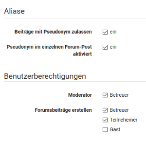
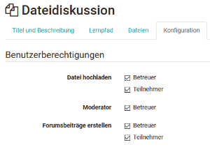

# Kommunikation und Kollaboration

Mehr Informationen zu [Virtuelle Klassenzimmer](Virtual_classrooms.de.md)

## Kursbaustein „Wiki“ {: #wiki}

Verwenden Sie ein Wiki, um auf einfache Weise mit Kursteilnehmenden gemeinsam
Inhalte zu erstellen. Ein Wiki kann für Gruppenarbeiten, als
Dokumentationswerkzeug oder als Wissensbasis für Ihre Studien- oder
Projektarbeit verwendet werden.

Mit dem Kursbaustein „Wiki“ binden Sie eine Lernressource Wiki in Ihren Kurs ein. Klicken Sie
im Tab „ **Wiki-Lerninhalt** “ auf „Wiki wählen, erstellen oder importieren“,
ordnen ein bereits erstelltes Wiki zu oder erstellen ein neues. Eine Schritt-
für-Schritt-Anleitung zu Ihrem Wiki finden Sie im Kapitel [„Wiki
erstellen"](../resource_wiki/index.de.md). Wenn Sie noch kein Wiki ausgewählt haben,
erscheint beim Titel **Gewähltes Wiki** die Meldung _Kein Wiki ausgewählt_.

Wenn Sie schon ein Wiki hinzugefügt haben, erscheint dessen Name. Um die Zuordnung eines Wikis
nachträglich zu ändern, klicken Sie im Tab „Wiki-Lerninhalt“ auf „Wiki
auswechseln“ und wählen anschliessend ein anderes Wiki.

Im Tab "Wiki-Lerninhalt" konfigurieren Sie die Benutzerberechtigungen des
Wikis. Hier können Sie einstellen, dass neben den Besitzern auch Betreuer und
Teilnehmer Wiki-Artikel bearbeiten dürfen. Standardmässig haben alle
Kursteilnehmer Lese- und Schreibrechte in einem Wiki. Nur derjenige OpenOlat-
Benutzer, der die Seite erstellt hat oder OpenOlat-Benutzer, welche beim Wiki
als Besitzer eingetragen sind, dürfen Wiki-Seiten löschen.

Im Kapitel „Lernaktivitäten im Kurs“ finden Sie unter dem Punkt
[„Wiki"](../learning_activities/Working_with_Wiki.de.md) Informationen dazu, wie die Wiki-Navigation angepasst werden
kann, wie Sie neue Seiten erstellen und wie Sie die verschiedenen Versionen
einer Seite betrachten können.

!!! warning "Achtung"

    Wenn Sie in Ihrer OpenOlat Instanz keinen Kursbaustein "Wiki" finden können, so wurde dies systemweit von einem Administrator ausgeschaltet.

## Kursbaustein „Forum“ {: #forum}

Mit dem Kursbaustein „Forum“ können Sie in Ihrem Kurs auf einfache Weise
asynchrone Online-Diskussionen für unterschiedliche Zwecke ermöglichen.
Beispielsweise könnten Kursteilnehmende Beiträge mit Fragen zum Inhalt des
Kurses verfassen und gegenseitig beantworten oder Sie initiieren eine
Fachdiskussion oder setzen spezifische Foren basierte Online-Methoden um. Im
Kapitel „Lernaktivitäten im Kurs“ finden Sie unter dem Punkt
[„Forum"](../learning_activities/Working_with_Forums.de.md) Informationen dazu, wie Forumsbeiträge erstellt und beantwortet
werden. Standardmässig haben alle Kursteilnehmer Lese- und Schreibrechte in
einem Forum.

Sie können das Forum auch als Alternative für den Mitteilungsbaustein für
Ankündigungen von Seiten der Kursautoren verwenden, besonders wenn Rückfragen
von den Lernenden erwünscht sind.

!!! tip "Tipp"

    Empfehlen Sie den Kursteilnehmenden, das Forum zu abonnieren, um bei neuen Beiträgen benachrichtigt zu werden.

### Tab Konfiguration

Hier können die Benutzerberichtigungen des Forums eingestellt und definiert
werden welche OpenOlat Rechte-Rollen Forenbeiträge erstellen dürfen. Zur Wahl
stehen Betreuer, Teilnehmer und Gäste. Auch wird hier eingestellt, ob Betreuer
das Forum moderieren dürfen und ob in dem Forum pseudonymisierte Postings
erlaubt sind. Bei pseudonymisierten Foren können sich die Beitragsersteller
selbst ein Pseudonym auswählen. Ein einmal erstelltes Pseudonym bleibt im
Forum immer aktiviert, kann aber je nach Bedarf geändert oder ausgeschaltet
werden. Das Pseudonym kann von Benutzer mit einem Passwort geschützt werden,
damit nur dieser Benutzer dieses Pseudonym verwenden kann. Ohne Passwortschutz
kann dasselbe Pseudonym von mehreren Benutzern verwendet werden. Weiter kann
eingestellt werden, dass die Verwendung eines Pseudonyms standardmässig
eingeschaltet ist. Wählen Sie dazu die Checkbox "Pseudonym im einzelnen Forum-
Post aktiviert".

**Moderationsrechte**

Alle Kursbesitzer und [Betreuer ](../access_roles_rights/coach.de.md)verfügen über folgende weitere
Moderationsrechte. Sie können:

  * Alle Forumsbeiträge editieren, löschen und Dateien anhängen.
  * Threads priorisieren (sticky): So erscheint das Diskussionsthema immer zuoberst auf der Liste.
  * Diskussionsthemen beenden: Antworten auf Beiträge zu diesem Diskussionsthema sind nicht mehr möglich.
  * Diskussionsthemen verbergen: Das Thema erscheint nicht mehr in der Liste der Diskussionsthemen.
  * Diskussionsthemen anzeigen: Verborgene Themen werden wieder angezeigt.
  * Personenfiltern nutzen: Auf der Forumsübersichtsseite können Forumsbeiträge eines einzelnen Kursteilnehmers angezeigt werden.
  * Foren archivieren: Forumsbeiträge (im MS Word-Format) und angefügte Dateien werden in eine ZIP-Datei verpackt und in Ihrem persönlichen Ordner gespeichert.

Personen mit Moderationsrechten können auch Forumsthemen oder einzelne
Beiträge verschieben. Zum einen können die Beiträge in ein anderes Thema
desselben Forums verschoben werden, zum anderen können ganze Forumsthemen oder
Beiträge in ein anderes Forum verschoben werden. Dabei werden jeweils alle
darunter liegenden Forumsbeiträge mit verschoben und sind anschliessend im
Ursprungsforum nicht mehr sichtbar. Eine Verschiebung von Themen und Beiträgen
in ein anderes Forum ist sowohl im selben Kurs als auch in andere Kurse
möglich. Der verschobene Thread kann als neuen Diskussionsfaden angelegt
werden. Im letzten Schritt der Verschiebung kann zudem ein E-Mail an alle vom
Verschieben betroffenen Benutzer geschickt werden, mit der Information, wohin
das Forum nun verschoben wird.

!!! warning "Achtung"

    Forumsbeiträge können auch in Foren verschoben werden, in welchen der Ersteller des Beitrages keinen Zugriff hat.

   
Neben dem Kursbaustein "Forum" gibt es auch die Möglichkeit ein zentrales
Forum für den gesamten Kurs in der [Kurs
Toolbar](../course_operation/Using_Additional_Course_Features.de.md) anzeigen zu lassen. Das bietet sich häufig an, wenn der Kurs nur ein Forum umfasst, das permanent zur Verfügung stehen soll.
Hier können jedoch keine weiteren Einstellungen wie Pseudonymisierung oder
Vergabe von Moderationsrechten vorgenommen werden.

## Kursbaustein „Dateidiskussion“ {: #file_dialog}

Der Kursbaustein Dateidiskussion kann als eine Kombination aus Forum und
Ordner verstanden werden. Startpunkt ist jedoch anders als bei Foren immer ein hochgeladenes Dokument, das die Diskussionsbasis für die weitere, dem Dokument zugeordnete Forendiskussion, bildet. 

Setzen Sie die Dateidiskussion beispielsweise ein, wenn Sie  möchten, dass Ihre Lernenden sich gezielt zu einem Artikel, eine Grafik oder einen sonstigen Text äussern und die Inhalte diskutieren sollen. 

Sowohl bei geschlossenem Editor als auch bei geöffneten (im Tab „**Dateien**
“) ist es möglich, mit einem Klick auf „Datei hochladen“, Dokumente in die
Ablage der Dateidiskussion hochzuladen, die anschliessend von allen
Kursteilnehmenden angesehen und heruntergeladen werden können. Das zugehörige
Diskussionsforum wird automatisch erstellt und kann mit Klick auf "Anzeigen"
aufgerufen werden. Durch die Auswahl der entsprechenden Spalten ist erkennbar
wer wann welche Datei hochgeladen hat und wie der Diskussionsstand ist.

Wer neben dem Kursbesitzer noch welche Aktionen vornehmen kann, wird im
Kurseditor in den Benutzerberechtigungen des Tabs "Konfiguration" definiert.

!!! warning "Achtung"

    Eine Diskussion kann erst beginnen, wenn eine entsprechende Startdatei hochgeladen wurde.

##  Kursbaustein "Teilnehmer Ordner" {: #participant_folder}

Der Kursbaustein "Teilnehmer Ordner" ermöglicht einen Dateiaustausch zwischen einzelnen
Teilnehmenden und Betreuenden. Dafür stehen zwei Ordner zur Verfügung. Zum
einen ist dies der "Teilnehmer Abgabeorder", über den Teilnehmende Dateien an
Betreuer abgeben können. Zum anderen der "Betreuer Rückgabeorder", in welchem
die Betreuer Dateien an alle Teilnehmer gleichzeitig oder individuell
zurückgeben können. Im Prinzip verbergen sich hinter diesem Kursbaustein zwei (Kursbaustein) Ordner einmal mit Schreibberechtigung und einmal ohne, die jedoch nur für Betreuende und einen einzelnen Teilnehmer sichtbar sind. 

!!! info "Hinweis"

    Eine ähnliche Konfiguration der Abgabe von Dateien + Dateirückgabe durch
    Betreuer kann auch mit dem [Kursbaustein "Aufgabe"](../task/index.de.md)
    umgesetzt werden, nur dass die Möglichkeiten des Aufgabenbausteins deutlich
    umfangreicher und komplexer sind und hier auch eine Bewertung bzw. Punktevergabe
    vorgenommen werden kann.

### Tab "Ordner Einstellungen"

In dem Tab "Ordner Einstellungen" im Kurseditor können Konfigurationen zum
Abgabe- und Rückgabeordner vorgenommen werden. Standardmässig sind beide
Ordner aktiviert und das Löschen und Überschreiben von Dateien ist den
Teilnehmenden gestattet.

Ist der Teilnehmer Abgabeordner aktiviert, können die Teilnehmenden Dateien hochladen oder direkt in OpenOlat erstellen. Wurden vom Administrator der OpenOlat Instanz weitere Dokumenteneditoren aktiviert, ist auch die Erstellung von weiteren Dateiformaten wie Word, Excel oder PowerPoint Dateien möglich.

Für den Teilnehmer Abgabeordner können weitere Konfigurationen
vorgenommen werden. So können das Löschen und Überschreiben deaktiviert werden. Dies bedeutet, dass die Teilnehmer keine Dokumente mehr löschen können
sobald sie diese hochgeladen bzw. erstellt haben. Alle Dokumente bleiben zwingend im Abgabeordner. Weiter kann ein Zeitfenster für die Abgabe festgelegt werden, so dass die Abgabe nur in diesem Zeitraum möglich ist. Ausserhalb des Zeitraumes können Dokumente aber noch heruntergeladen werden.

Zudem kann die Anzahl Dokumente, welche abgegeben werden können, eingeschränkt
werden. Sobald diese Zahl erreicht ist, stehen keine Schreibwerkzeuge mehr zur
Verfügung. Das heisst, die Dokumente können nicht mehr verschoben, kopiert,
gezippt oder entzippt werden. Sie können jedoch weiterhin gelöscht werden. Falls gewünscht kann auch nur der Abgabe-
oder nur der Rückgabeordner aktiviert werden.

!!! warning "Achtung"

    Für den Teilnehmer Ordner existiert wie für alle Upload Bereiche eine Speicherbegrenzung. Die vom Administrator eingestellte Begrenzungen für den Upload der Datei und die Begrenzung des gesamten Ordners wird angezeigt, wenn man versucht eine Datei hochzuladen.

### Tab Template Einstellungen

Im Tab "Template Einstellungen" können sowohl für den Abgabe- als auch den Rückgabeordner Unterordner angelegt und so eine durchgehende Ordner-Struktur für alle Teilnehmenden angelegt werden. Zum Beispiel könnte ein Rückgabeordner einen Unterordner für inhaltliche Feedbacks und einen für ergänzende Dateien umfassen, oder ein Abgabeordner könnte eine gewisse gewünschte Struktur für die Abgaben widerspiegeln. 

!!! warning "Achtung"

    Die hier angelegten Unterordner können später nicht umbenannt werden. Lediglich ein löschen und neuanlegen ist möglich. Im Kursrun werden beim Versuch diese Unterordner umzubenennen Kopien der Unterordner mit neuem Namen erstellt.

## Kursbaustein „Teilnehmerliste“  {: #participant_list}

In der Teilnehmerliste können die Mitglieder des Kurses für alle sichtbar
gemacht werden. Im Gegensatz zum Kurswerkzeug
[Mitgliederverwaltung](../course_operation/Members_management.de.md), das nur für Besitzer sichtbar ist, werden mit dem
Kursbaustein "Teilnehmerliste" alle Teilnehmer des Kurses, für jene OpenOlat-
Benutzer die den Kurs öffnen können, sichtbar. Die Mitglieder werden sortiert
nach ihrer Kursrolle nach "Kursadministratoren", "Betreuer" und "Teilnehmer"
mit Foto nach ihrer "höchsten" Rolle aufgelistet. In der Konfiguration können
Sie festlegen, welche Benutzergruppen in der Teilnehmerliste angezeigt werden
sollen.

Durch die Verlinkung auf die OpenOlat-Visitenkarte sowie der Möglichkeit aus
dem Kursbaustein heraus eine OpenOlat-Mail an jedes gewünschte Mitglied des
Kurses zu schreiben, ermöglicht dieser Kursbaustein weitere Kursteilnehmende
einfach und problemlos zu kontaktieren. Im Kurseditor können Sie festlegen ob
die E-Mailfunktion für alle Teilnehmer oder nur für Besitzer und Betreuer
verfügbar sein soll. Mails an einzelne oder mehrere Personen(-gruppen) werden
in der Kursansicht über die Schaltfläche "E-Mail versenden" verschickt. Im
Formular können nach Bedarf auch externe Mailadressen hinzugefügt werden.

Neben der Mailfunktion ist in der Kursansicht auch die Chatfunktion in der
Teilnehmerliste verfügbar. Der Online-Status eines jeden Teilnehmers ist neben
dem Namen sichtbar. Ein Klick darauf öffnet das Chatfenster (Instant
Messenger).

Zum Schluss kann definiert werden, wer die Teilnehmerliste als Excel
herunterladen oder als Übersicht ausdrucken darf. Wiederum wird unterschieden
zwischen Betreuer und Administrator oder allen Benutzern.

!!! info 

    In der Toolbar steht mit dem Werkzeug "Liste der Teilnehmer*innen" eine ähnliche Funktion zur Verfügung. Allerdings können hier keine weitere Konfigurationen vorgenommen werden. 

