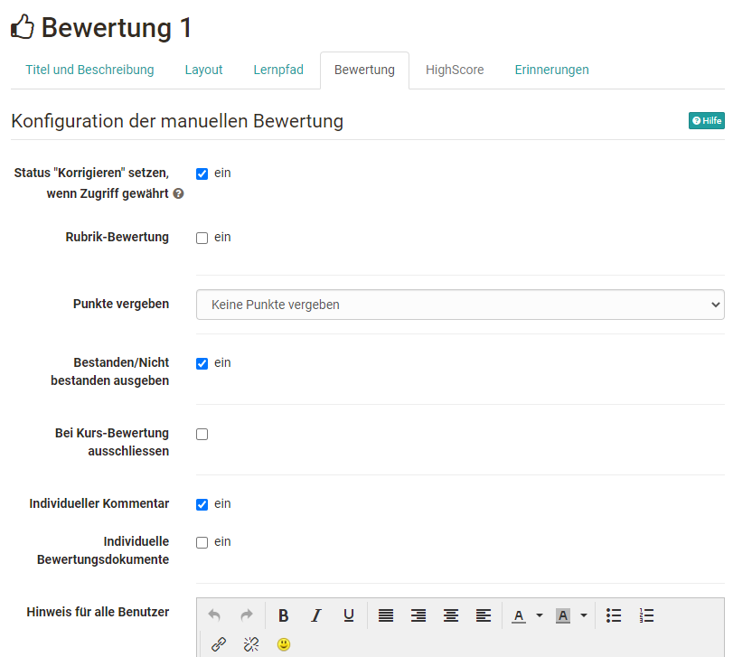
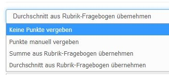
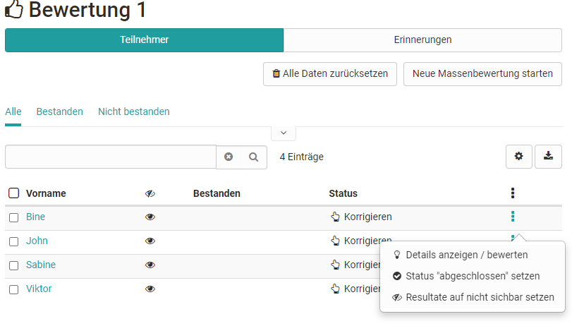
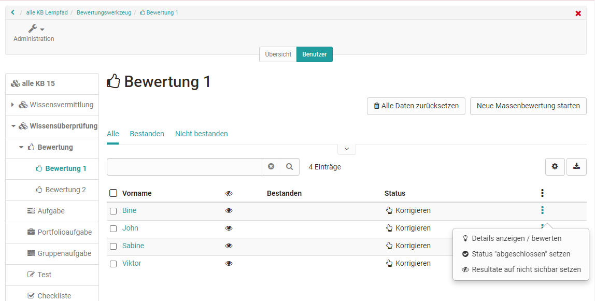

# Kursbaustein "Bewertung"

Bewertung im Kurseditor erstellen und einrichten

Die Konfiguration des Kursbausteins Bewertung nehmen Sie im Kurseditor im Tab
„Bewertung“ vor. Hier können Sie die Bewertung so konfigurieren, dass

  * Ein [Rubrik ](../display/OO161DE/Rubrik.html)als Basis für die Bewertung verwendet wird
  * Punkte vergeben werden (oder nicht)
  * Bestanden/nicht bestanden angezeigt wird
  * Ein individueller Kommentar hinzugefügt werden kann
  * Ein individuelles Dokument hinzugefügt werden kann

Darüber hinaus kann über den Korrektur-Status definiert werden welche Anzeige
der User und auch der Lehrende erhält. Bei aktivierter Option erscheint für
den Lehrenden beim Status "Korrigieren" und für den Teilnehmer "in Korrektur"
bzw. bei nicht Auswahl "Nicht gestartet" und für den User "Information nicht
verfügbar". Je nach Art der Verwendung des Kursbausteins macht die eine oder
andere Einstellung Sinn.

Bei Lernpfad Kursen gibt es auch noch eine weitere Konfigurationsoption. So
kann zusätzlich der Kursbaustein "Bewertung" auch bei der Gesamtpunktzahl
(Bewertung) des Kurses ausgeschlossen werden. Das bedeutet, dass in der
Anzeige des Fortschritts des Kurses der Kursbaustein zwar beim Prozentwert des
Fortschritts berücksichtigt wird, nicht aber bei der Gesamtpunktzahl des
Kurses, die unter der Prozentanzeige erscheint und auch im Leistungsnachweis
zum Kurs enthalten ist.

Zusätzlich können noch spezielle Hinweise für alle Benutzer und für andere
Betreuer, die grundsätzlich angezeigt werden, ergänzt werden.

Die Einstellungen haben Einfluss auf die späteren Bewertungsoptionen und den
für die Teilnehmenden sichtbaren Informationen.

Achtung: Sobald eine Bewertung eines Kursteilnehmers stattgefunden hat, können
Sie die Konfiguration im Kurseditor nicht mehr verändern.

  

## Tab "Bewertung" konfigurieren

### Rubrik-Bewertung

Eine interessante Möglichkeit der Kriterien basierten Bewertung mit Hilfe des
Kursbausteins "Bewertung" bietet die Rubrik-Bewertung. Dafür wählen Sie eine
zuvor erstellte Lernressource Formular aus. Alternativ können Sie auch per
Button „Rubrik-Formular auswählen“ -> ein neues Formular mit Bewertungsraster
(Rubrik) erstellen.  Wählen Sie in der Konfiguration der Punkte „Summe aus
Rubrik Formular übernehmen“ oder „Durchschnitt aus Rubrik-Formular
übernehmen“, dann werden die Punkte, die sich aus der Struktur des Rubriks
ergeben, automatisch übernommen. Bei der Wahl der "Summe" werden die Punkte,
die pro Zeile vergeben werden, aufaddiert. Bei der Wahl "Durchschnitt" wird
die Durchschnittsumme aller Rubrik-Zeilen ermittelt. Alternativ kann auch eine
manuelle Punktevergabe gewählt oder ganz auf Punkte verzichtet werden.

### Punkte vergeben

Folgende Optionen stehen zur Wahl:

Die Rubrik-bezogenen Punkte erscheinen nur, wenn auch ein Rubrik-Formular für
die Bewertung gewählt wurde.

Sollen Punkte vergeben werden, muss noch die minimale und die maximale
Punktzahl definiert werden.

### Bestanden / Nicht bestanden ausgeben

Wenn Sie die Checkbox markieren, wird dem Kursteilnehmer ein _Bestanden_ resp.
_Nicht bestanden_ angezeigt. Wenn Sie die Checkbox nicht ankreuzen, wird
nichts angezeigt.

 **Art der Ausgabe:**

Sie haben die Möglichkeit mit "Manuell durch Betreuer" zu bestimmen, ob das
_Bestanden_ resp. _Nicht bestanden_ aufgrund einer Punkteschwelle automatisch
vergeben wird oder ob der Betreuer dies manuell für die zu bewertenden
Benutzer vergeben soll. Diese Auswahl können Sie nur machen, wenn Sie die
Checkbox **Bestanden/Nicht bestanden ausgeben:** markiert haben.

 **Punkteschwelle für Bestanden:** Geben Sie hier die Anzahl Punkte ein, die
minimal notwendig ist, damit ein Kursteilnehmer ein _Bestanden_ erhält.
Unterhalb dieser Schwelle erhält der Teilnehmer ein _Nicht bestanden_. Diese
Eingabe können Sie nur machen, wenn Sie im Feld **Art der Ausgabe:**
"Automatisch durch Punkteschwelle" gewählt haben. Ebenso, wenn **Punkte
vergeben** ausgewählt ist.

### Individueller Kommentare und Dokumente:

Aktivieren Sie die gewünschte Checkbox um den Lernenden individuelle
Kommentare und/oder Dokumente z.B. als Feedback bereitzustellen.

  

# Bewertung durchführen

Die Bewertung der Kursteilnehmenden wird vom Kursbesitzer oder Kursbetreuer
entweder im Kursrun bei geschlossenem Kurseditor oder im
[Bewertungswerkzeug](https://confluence.openolat.org/display/OO161DE/Bewertungswerkzeug)
durchgeführt. In der Übersicht erscheinen alle Kursteilnehmende und je nach
Konfiguration der Spalten weitere Informationen wie die erreichte Punktzahl,
der Status usw. Ferner kann hier auch eine Massenbewertung erfolgen oder die
Daten aller Teilnehmenden zurückgesetzt werden.

 **Im Kursrun:**

 **Im Bewertungswerkzeug:**

  

Nun wird der entsprechende Kursteilnehmer ausgewählt und die angezeigten
Felder ausgefüllt bzw. bei Rubrikbewertungen die Rubrik-Felder ausgefüllt.

Der User hat nach der Bewertung direkt Zugriff auf seine Bewertung inklusive
Bewertungsrubrik bei einer Rubrik-Bewertung.

