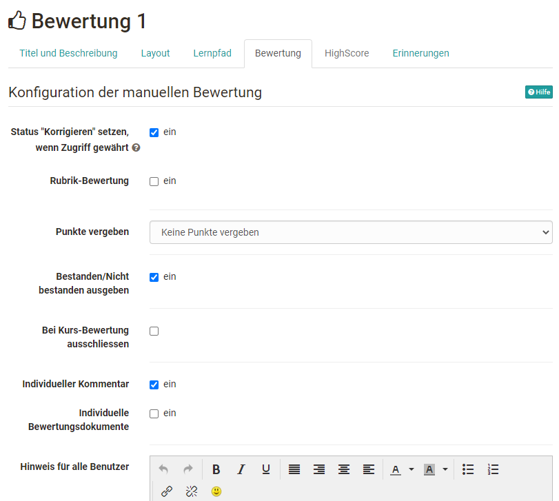
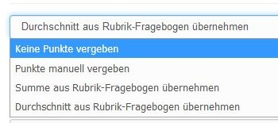
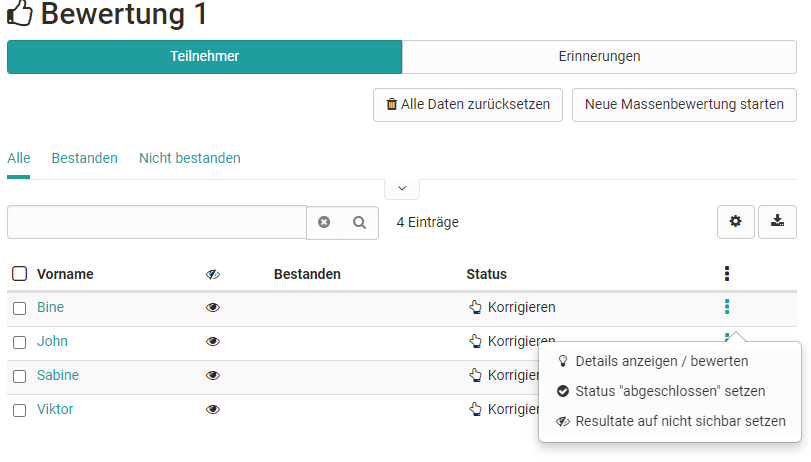
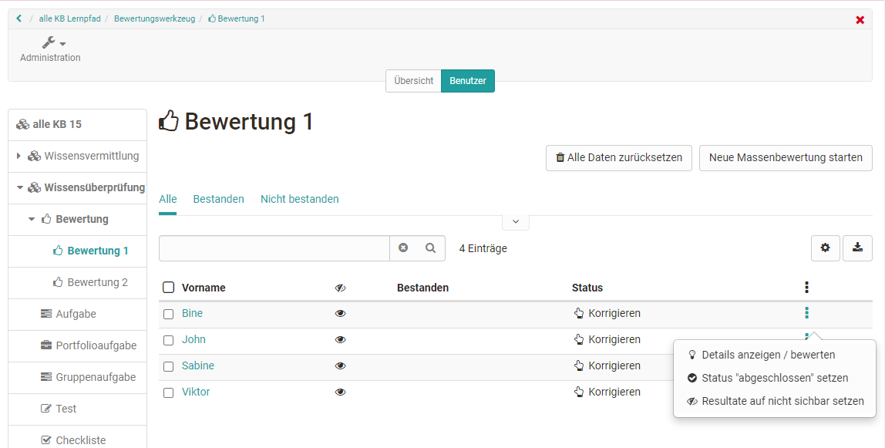
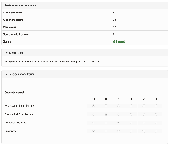

# Course Element: Assessment

##

Create and set up Assessment

You configure the assessment module in the course editor in the tab
"Assessment". Here you can configure the evaluation in such a way that

  * A [rubric](Rubric.html) is used as the basis for the evaluation
  * Points are awarded (or not)
  * An individual comment can be added to
  * An individual document can be added

In addition, the correction status can be used to define which display the
user and also the instructor receive. If this option is activated, the status
"Correcting" appears for the teacher and "In correction" for the participant,
or "Not started" if not selected and "Information not available" for the user.
Depending on how the course element is used, one or the other setting makes
sense.

For learning path courses there is another configuration option. In this way,
the course element "Assessment" can also be excluded from the total score
(assessment) of the course. This means that in the display of the progress of
the course, the course element will be taken into account in the percentage
value of the progress, but not in the total score of the course, which appears
below the percentage display and is also included in the performance record
for the course.

In addition, special notes can be added for all users and for other coaches,
which are always displayed.

The settings influence the subsequent evaluation options and the information
visible to the participants.

Attention: As soon as an assessment has taken place, you will not be able to
change that configuration anymore.

## Tab "Assessment" - Configuration

### Rubric assessment

An interesting possibility of criteria-based assessment with the help of the
course element "Assessment" is offered by the rubric assessment. To do this,
select a previously created learning resource form or create a new form using
the button "Choose form" -> Create, to which you can sensibly add a rubric
element. Select in the configuration of the items "Transfer sum from rubric
form" or "Transfer average from rubric form", the items resulting from the
rubric structure will then be automatically transferred. If you choose the
"Sum" option, the points awarded per line will be added together. If "Average"
is selected, the average sum of all column lines is determined. Alternatively,
a manual scoring system can be selected or no points at all can be awarded.

### Assigning points

The following options are available:

The rubric-related points only appear if a rubric form has also been selected
for the evaluation.

If points are to be awarded, the minimum and maximum number of points must
still be defined.

### Display Passed / Failed:

If you check this box a _Passed_ or _Failed_ will be displayed. If you do not
check it nothing will be displayed.

 **Type of display:** By means of _«Automatic (using cut value)»_ or
_«Manually by tutor»_ you have the possibility to decide if _Passed_ or
_Failed_ is allocated either automatically based on a cut value or if the
tutor should allocate it manually. You cannot do this if you have not checked
the box **Display passed/failed:** .

 **Passed cut value:** Please enter the minimum number of points necessary to
get a _Passed_ . Below this cut value participants get a _Failed_ . You cannot
do this if you have selected _«Manually by tutor»_ in the field **Type of
display :** , or chose not to select the option **Score granted**.

### Individual comment:

When checking this box you have the possibility to make an individual comment
regarding your assessment.

  

# Perform assessment

The assessment of course participants is carried out by the course owner or
course coach either in the course run with the course editor closed or in the
assessment tool. All course participants appear in the overview and, depending
on the configuration of the columns, additional information such as the score
achieved, the status, etc. Furthermore, a bulk assessment can also be carried
out here or the data of all participants can be reset.

 **In the course run:**

 **In the assessment tool:**

  

Now the corresponding course participant is selected and the displayed fields
are filled in or, in the case of rubric assessments, the rubric fields are
filled in.

The user now has direct access to his assessment including the assessment
rubrics.

  

