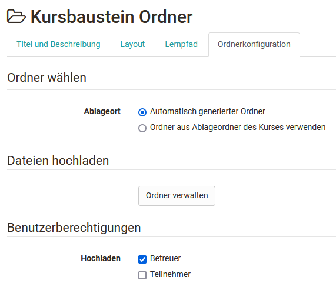
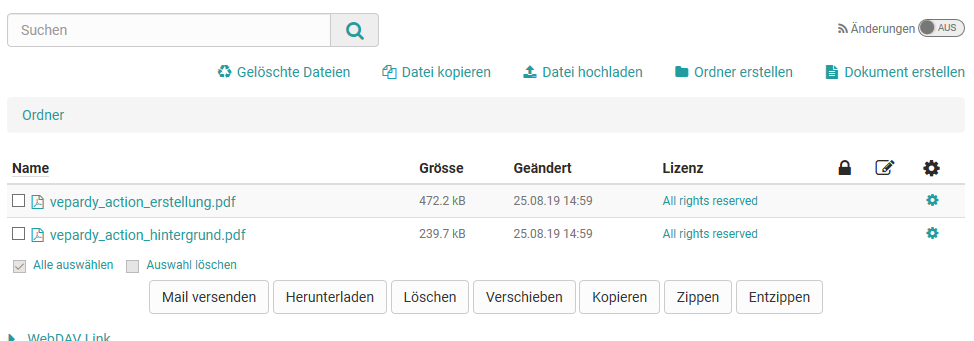

# Kursbaustein "Ordner"

Im Kursbaustein „Ordner“ können Dateien zum Download abgelegt und für die
Lernenden bereitgestellt werden. Häufig wird der Kursbaustein "Ordner" dazu
verwendet, Kursmaterialien wie Folien oder Skripte zur Verfügung zu stellen.
Darüber hinaus kann der Kursbaustein im Tab "Ordnerkonfiguration auch so
konfiguriert werden, dass Lernende Dateien hochladen und bearbeiten können.

  

Bitte beachten: Die Reihenfolge der Dateien ist nicht fix. Der User kann sich
die Dateien entsprechend der Spalten nach Namen, Grösse und Änderungsdatum
sortieren.

##  Tab Ordnerkonfiguration

Im Tab "Ordnerkonfiguration" des Kursbausteins legen Sie fest wo genau die
Dateien dieses Ordners im Ablageordner des Kurses abgelegt werden sollen.
Hierfür kann OpenOlat entweder automatisch einen Ordner (=Ablagebereich)
generieren oder Sie wählen einen spezifischen Ordner aus dem Ablageordner des
Kurses aus.

Wird die Option "Automatisch generierter Ordner" gewählt legt OpenOlat den
Unterordner _ _courselementdata   _inklusive eines Unterordners mit dem Namen
des jeweiligen Kursbaustein "Ordners" an _._ Alle Dateien des Kursbausteins
werden nun hier gespeichert.

Wählt man "Ordner aus Ablageordner des Kurses verwenden" kann ein bereits
existierender Ordner aus dem Ablageordner des Kurses ausgewählt werden. Das
bietet sich besonders an, wenn Sie die Dateien, die Sie bereitstellen wollen,
bereits sinnvoll im Ablageordners des Kurses strukturiert hochgeladen haben.
Wählen Sie im nächsten Schritt einen existierenden Ordner des Ablageordners
aus oder erstellen Sie im Ablageordner einen neuen Unterordner. Über den
Ablageordner können Sie, sofern in den 
[Kurseinstellungen](../course_create/Course_Settings.de.md)entsprechend konfiguriert, auch
auf einen verknüpften Ressourcenordner zugreifen.

Anschließend können sie im Bereich "Dateien hochladen" über den Link "Ordner
verwalten" Dateien an die zuvor definierte Stelle hochladen bzw. sich die
bereits hochgeladenen Dateien anzeigen lassen.

Ein Zugriff auf diesen Dateibereich ist auch bei geschlossenem Editor möglich.

Ferner kann im Bereich "Benutzerberechtigungen" definiert werden ob auch
Betreuer und/oder Teilnehmer Dateien in den Ordner hochladen und bearbeiten
dürfen. Standardmäßig dürfen neben den Besitzern auch Betreuer, aber nicht die
Teilnehmer Dateien hochladen.

## Einstellungen bei geschlossenem Editor

Im Kursrun können Kursbesitzer und Personen mit der entsprechenden
Berechtigung

  * Dateien hoch- und runterladen
  * Dateien löschen, verschieben und kopieren
  * neue Dokumente erstellen
  * je nach Dateityp auch Dateien bearbeiten (siehe unten)
  * neue Unterordner innerhalb des Kursbausteins erstellen. So kann ein Kursbaustein "Ordner" mehrere Unterordner enthalten. Die Verwendung von mehreren Kursbausteinen Ordnern sind nur notwendig, wenn die Ordner an unterschiedlichen Stellen in der Kursstruktur eingebunden werden sollen oder die Ordner mit unterschiedlichen selektiven Freigaben verbunden sind.

Um das Hoch- und Herunterladen von mehreren Dateien zu erleichtern können die
Dateien gezippt zw. entzippt werden. Darüber hinaus empfiehlt sich für den
Upload von umfangreicheren Materialien die Verwendung von
[WebDAV](../supported_tech/Using_WebDAV.de.md).

Ferner können alle User ...

  * Dateien des Ordners per E-Mail an registrierte OpenOlat User verschicken
  * die Dateien des Ordners nach Stichworten durchsuchen
  * den Ordner abonnieren und so schnell informiert über Änderungen informiert werden

###  Metadaten

Über das Zahnradsymbol können die 
[Metadaten ](../personal/Full-Text_Search.de.md#Volltextsuche-_metadata)einer Datei
konfiguriert werden und so diverse Informationen hinzugefügt werden. Neben der
Beschreibung und Sperreigenschaften sind besonders die Lizenzangaben relevant.
Über die Lizenzangaben können Sie eine konkrete Lizenz für das Dokument
hinterlegen, z.B. eine der existierenden Creative Commons Lizenzen verwenden,
den Lizenzgeber eintragen sowie weitere Informationen zum Herausgeber, zur
Quelle, zum Erscheinungsdatum usw. hinterlassen. Die Lizenz wird im
Ordnerbaustein in einer separaten Spalte angezeigt. Mit Klick auf die Lizenz
erhält der User die hinterlegten Informationen zur jeweiligen Lizenz.

In den Metadaten wird auch angezeigt, wie häufig eine Datei aufgerufen wurde.
Ferner gibt es einen Link mit dem Sie die jeweilige Datei direkt verlinken
können. Ob auch externe Personen auf die Datei zugreifen können, ist von den
Zugangseinstellungen des Kurses abhängig.

### Dateien bearbeiten

Je nach Dateityp und Aktivierung in der OpenOlat 
[Administration ](../../manual_admin/administration/External_Tools_-_Administration.de.md)ist es möglich
Dateien, die sich im Kursbaustein "Ordner" befinden, zu bearbeiten. Sofern
eine Bearbeitung möglich ist, erscheint in der Tabelle das Bearbeitungsicon
. Bei
Klick auf das Icon öffnet sich der jeweilige Bearbeitungseditor, z.B. Only
Office. Durch die Verwendung dieser externen, kooperativen
Bearbeitungswerkzeuge, kann der Kursbaustein "Ordner" auch für das
kollaborative Arbeiten der Lernenden verwendet werden.
