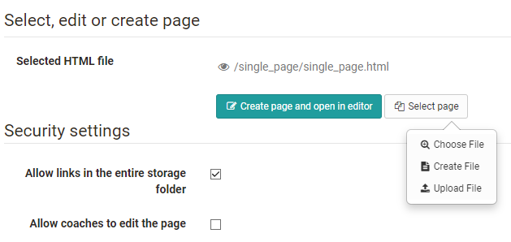

# Course Element: Single Page

##

In the course element "Single page" you can insert various files in your
course. In this way you can, for example, provide central information, the
course schedule or literature tips for your course or place content such as
pictures or videos precisely in the course. The files themselves are created
in the storage folder of the course.

For integrating Office documents please use the course element
"[Document](Knowledge_Transfer.md)".

  

Tab Page content

There are three possibilities to embed a page's content in your course:

  * Create new HTML page online
  * Select any file from the storage folder
  * Upload file in storage folder

For further editing of HTML pages you can use the OpenOlat Editor. It works
similar to a word processing program. The automatically created file when you
create a page for the first time already has the name of the course element.
Once created, open the file with the link "Open file in editor" and you will
get to the OpenOlat HTML Editor.

In the HTML editor you can insert links to pictures, videos, the individual
course elements of the course and to the tools in the
[toolbar](../course_create/Using_additional_Course_Editor_Tools.md) in addition to the
different formatting.

You can also upload files that you have previously created to the storage
folder of the course and link them with the help of the course element. The
link "Select file" shows you all files in the folder. Then you can link these
files via the course element "Single page" and integrate them into your
course. This method is recommended if you want to influence the structure of
the folder yourself.

All file formats (e.g. doc, xsl, pdf, jpg, mp3, mp4) can be uploaded. If a
file type is not supported by the browser used, a download link is displayed
for this file. However, it is recommended to use web-specific files such as
HTML files, which can also be displayed directly.

With the "Single page", videos and audios can be integrated into the course in
various ways. Detailed information can be found
[here](../../pages/viewpage.action%EF%B9%96pageId=108600564.html).

The Files can also be swapped later using the link "Replace page".

Avoid opening or saving HTML pages that have been created by means of an
external editor with the OpenOlat HTML editor; part of your formatting could
be lost. The OpenOlat HTML editor contains only the <body> area of an HTML
page. If entries are to be made in HTML <head>, this must be done in an
external editor.

Under "Security Settings" you can specify whether references in your HTML
pages are only possible to files in the same folder and its subfolders, or
whether all files in the storage folder can be referenced. This is necessary,
for example, if your HTML page contains graphics, CSS files, or scripts
located in other folders.

Furthermore, you can define under "Security Settings" whether coaches are
allowed to edit the stored HTML file. The coaches do not need any coach rights
or access to the course editor.

## Tab Layout

In the " **Layout** " tab you can define the settings for the display of page
contents. Here you determine whether the page should be displayed unaltered,
or optimized for OpenOlat. The display mode "Optimized for OpenOlat" allows
you to e.g. apply the course layout to the page content, or to enable the
course glossary.

  

 Display options

* * *

 **Display mode:** Select the mode "Standard" to display the resource
unmodified. This mode is useful for resource that encounter render issues when
using the mode "Optimized for OpenOlat", usually content not created with the
OpenOlat editor, such as HTML5 content. Use the mode "Optimized for OpenOlat"
when you want to embed the course layout, a JavaScript library, the OpenOlat
glossary or when you want to use the automatic height detection of the page.
In case of SCORM modules the mode "Standard" is recommended.

* * *

 **Embed Javascript library:** To use the features of the display mode
"Optimized for OpenOlat" the JavaScript library "jQuery" must be activated.
The option "Prototype" should only be used in case your content requests this
library. Select no JavaScript library if you have display issues with your
content within OpenOlat.

 **Embed glossary terms:** Select this option to activate the glossary terms
embedding on that page if you have a glossary configured for this course. This
option requires the JavaScript library "jQuery".

 **Display height:** By means of the drop-down menu you can determine the
height of your content. You have the possibility to set them via "Automatic"
to the respective window height or to a certain value of your choice.

 **Adapt layout:** Select the option "OpenOlat stylesheets" to embedd the
OpenOlat and course layout into this page (font type, colors, sizes etc.). If
you do not want this option select "None".

* * *

 **Content character set:** OpenOlat tries to detect a character set
automatically. If the option "Automatic" is not successful it is possible to
configure the content coding by means of a predefined character set (should
there be no coding the character set ISO-8899-1 will be used by default).

 **Javascript character set:** This permits the coding of Javascript by means
of a predefined character set (by default the same set will be used for
content and Javascript).

  

As a rule, no changes are necessary in the "Layout" tab. The default settings
are suitable for 90% of the courses.

## Multiple single pages

With this option you can easily add and organize single pages in the course
and quickly make the files visible in the course structure. Clicking on
"Multiple Single Pages" opens the folder with all available files for the
course. You can now select all files at once that you want to add directly as
a single page. You can also decide whether the selected files should be
inserted after or as subfolders of the current course element. The order can
be changed afterwards.

This function is useful if you have already created several HTML files or
complex hypermedia files externally and stored them in the storage folder of
the course. For complex pages with various links to graphics, etc., make sure
to activate the option "Allow links in the entire storage folder". Furthermore
you should name the file names as they should appear later in the course,
because the file name is used as course element title.

Several individual pages can also be bundled very well with a [course element
"Structure"](Course+Element%EF%B9%95+Structure.html). This way, overview pages
can be created automatically for the respective contents and the individual
pages can be better structured.

