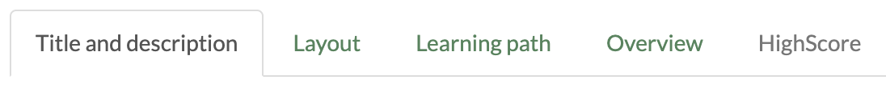
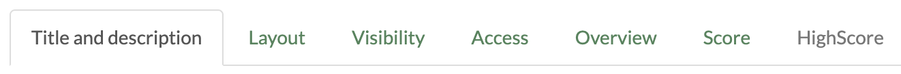
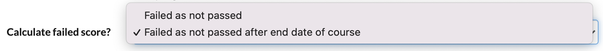

# Course Element: Structure

The course element Structure is primarily used to structure the course. The
concrete setting options depend on whether the course element is used in
conventional or in learning path courses.

 **Tabs in learning path courses**

 ****

 **Tabs in conventional courses**

 ****

  

## Tab Overview

You can choose between four display modes for the course element "Structure"
in the tab Overview and thus generate an automatically generated overview,
integrate your own HTML page or simply display the first subordinate course
element.

  * If you select the button  _«Automatic overview»_ , a list of the subordinate course elements generated by OpenOlat will be displayed.
  * By selecting the radio button  _«Automatically generated overview incl. preview»_  you can choose up to ten subordinate course elements whose preview will appear in one or two columns (preview generated by OLAT).
  * If you select the button  _«Your HTML page »_ , a file of your choice will be displayed from the storage folder (*.html, *.htm, *pdf, *jpg, *png, *.mp4). Saving it will extend the tab by the field  _«Select, edit or create page »._  In OpenOlat there is even an integrated HTML editor at your disposal if you want to design a HTML page according to your needs (e.g. a welcome page). _  
_

  * If you select the button   _«No overview, activate first visible child node»_ , no overview will be displayed, but this structure node will delegate to it's first visible and accessible child-node.

 **Display in two columns:**  Please select the check box  _Display in two
columns_  to display the automatically generated table of contents or the
preview in two columns.

If you have chosen your own HTML page and this contains links to graphics or
other files stored in OpenOlat, you must select the option "Allow links in the
entire storage folder" under "Security settings". You can also allow coaches
to edit the HTML page without access to the course editor.

##  Tab Score (only with conventional courses)

By means of this field you can process results of course elements of the type
_Structure_ ,  _Assessment_ ,  _Group_  /  _Task, SCORM learning content,
Checklist, LTI page, Portfolio task_  and  _Test_. The summarized results will
appear when clicking on the course element  _Structure_  in the ongoing
course.

The following settings are possible:

 **Calculate score?:  **An overview of the assessable elements of your course
will appear, which you can take into account when calculating the points.
Select either all or specific course elements and OpenOlat adds the respective
points. It is also possible to calculate an average value instead of a total.
This makes sense, for example, if all course elements have the same maximum
number of points. Course elements that do not (yet) contain a rating are not
taken into account in the calculation. The calculated value is displayed to
the user after the evaluation under "Score".

 **Calculate passing score?:  **If you select  _«As of minimum score»_ , you
can enter the minimum score in another field. This refers to the course
elements selected above, i.e. on the course element  _Structure_  a
_«Passed»_  is displayed, if the total score is greater or equal to the
selected minimum score.  
If you select  _«Adopt from course element»_ , assessable course elements of
your course are displayed by means of  **Passed by**  . You can now select
those whose "passed" value should result in the "passed" value of the course
element  _Structure_  with a boolean AND-link. I.e. if the course element
_Structure_  should show a  _«Passed»_ , all selected course elements have to
have a  _«Passed»._

 **Calculate failed score?:  **It is also possible to calculate "Failed".
Therefore 3 options are available.

  * Failed as not passed: As long as the conditions for passed are not reached, the structure is shown as "Failed". 
  * Failed as not passed after end date of course: As long as the conditions for passed are not reached, the structure is shown as "Failed". This calculation is only done after the end date of the course is reached. Before the end date is reached no status or Passed is shown when the conditions are reached. 

  

In case you wish to utilize an evidence of achievement or be able to check the
Passed status in the coaching tool, you must check the option  **Calculate
passing score?**  in the course root node.

Use explicit short titles for all of your assessable course elements to be
able to clearly distinguish them in the tab "Score."

By means of the button "Display  [expert
mode](Access+Restrictions+in+the+Expert+Mode.html)" an entry field will appear
in order to be able to make a more complex configuration according to your
needs.

The course element structure and all its sub-elements can be protected with a
password. Open the tab "Access" to activate the password protection and set
the password.

An exception to this is the course root node. It cannot be deleted or moved,
and you can't set a password. If you wish to issue an evidence of achievements
for users for this course, the settings in the
"[Score](Knowledge+Transfer.html#KnowledgeTransfer-_displayscore)" tab need to
be configured accordingly.

## Settings for learning path courses

The settings in the tab "Learning path" basically differ from the settings in
other course elements. For learning path courses, the course element structure
defines whether the sequence of learning steps is sequential (one after the
other) or not. There is no specific completion criterion for structure
elements.

  

